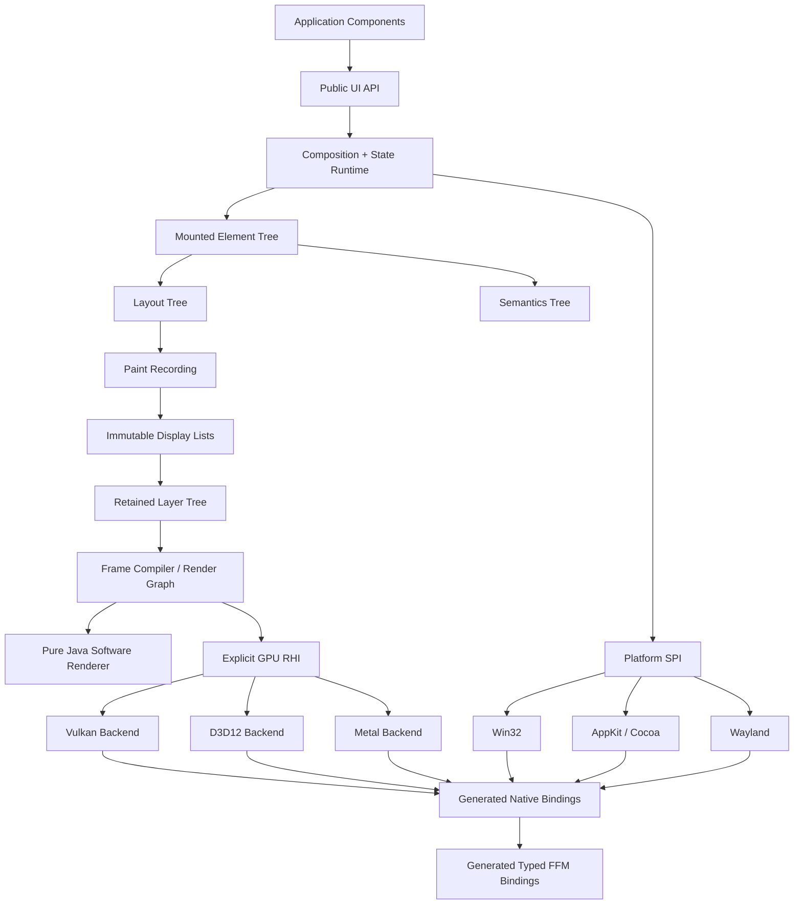

# HimariUI Implementation Plan

> Status: Draft 0.2  
> Runtime baseline: Java 25  
> Initial platforms: Windows, macOS, Linux, and Headless  
> Primary distribution constraint: the core and official platform backends must not ship project-built or third-party CPU-native libraries  
> Last reviewed: 2026-08-14

---

## 0. How to Use This Plan

This file is the repository-level execution plan for HimariUI. It is not a product vision or a collection of optional ideas. Convert its milestone IDs, work-package IDs, and exit criteria directly into issues, project-board items, and CI gates.

Use the following rules when executing the plan:

- Treat accepted ADRs and the non-negotiable constraints in this file as fixed until a replacement ADR is accepted.
- Do not start the next default milestone until the current milestone satisfies every exit criterion.
- Give every issue an executable acceptance command or a reproducible manual procedure.
- Keep reference implementations available while optimized implementations are developed and validated.
- Record source versions, licenses, generated data, and accepted behavioral differences as repository artifacts rather than relying on task history.

Terms used throughout this plan:

- **Pure-Java core**: all implementation code is Java; published core JARs contain no `.dll`, `.so`, `.dylib`, `.jnilib`, `.a`, `.lib`, or `.o` CPU-native artifacts and have no runtime dependency that transitively ships them.
- **System library**: a library supplied by the operating system or system graphics stack, such as `user32.dll`, `d3d12.dll`, AppKit, Metal, `libwayland-client.so`, or `libvulkan.so.1`. HimariUI may call these libraries through FFM but must not repackage them.
- **Test/tool dependency**: JNA, LWJGL, and similar dependencies used only by Oracle runners, tests, or development tools. They must not become production backends or enter the standard runtime dependency graph.
- **Optional integration**: a non-core feature such as an FFmpeg binding. It must use a separate artifact, remain non-transitive by default, and stay outside the strict pure-Java distribution.
- **Reference implementation**: a correctness-first, readable, scalar Java implementation suitable for differential validation.
- **Optimized implementation**: a SIMD, parallel, GPU, cache-aware, or otherwise optimized implementation added only after the reference path passes its conformance gates.
- **Oracle**: a native or external reference implementation used by tests, such as FreeType, HarfBuzz, SDL, Skia, Impeller, a platform text API, or LWJGL. Oracles may be test dependencies but must not enter the published runtime graph.

---

## 1. Outcome and Execution Strategy

### 1.1 Target outcome

Deliver a modern declarative GUI framework whose runtime, layout engine, text stack, software renderer, GPU abstraction, platform backends, and generated native bindings are implemented in Java 25. Standard artifacts must contain no project-built or third-party CPU-native libraries. Desktop platforms must be reached through generated, strongly typed FFM bindings to system APIs.

The first stable release must support deterministic Headless execution, software fallback, modern GPU backends, complete input and accessibility paths, a practical control set, JVM execution, and GraalVM Native Image packaging.

### 1.2 Execution order

Execute the project in this order:

1. Prove the distribution and ABI model with repository guards, Headless execution, and platform/FFM feasibility spikes.
2. Build the state, composition, layout, display-list, software-rendering, and basic-text reference paths.
3. Complete one end-to-end desktop slice, provisionally Linux Wayland plus Vulkan.
4. Complete Windows/D3D12 and macOS/Metal without introducing native shims.
5. Expand complex text, controls, accessibility, tooling, performance, Native Image packaging, and release hardening.

Correctness gates precede optimization at every stage. A visible demo does not replace ABI, corpus, differential, lifetime, or accessibility evidence.

### 1.3 Fixed top-level decisions

1. **Use Java 25 as the minimum runtime.** FFM is final and is the only native-access mechanism on both the JVM and Native Image. The Vector API remains incubating and may appear only in optional optimization modules.
2. **Do not require a compiler plugin.** The declarative runtime uses explicit `Composer`/`UiScope` semantics, stable keys, a slot table, and phase-aware state-read tracking. Annotation processors or `javac` plugins may add diagnostics and optimizations, but correctness must not depend on them.
3. **Use several purpose-specific trees.** Keep the component/element, layout, layer/display-list, and semantics structures separate.
4. **Make the software renderer normative.** Add every path, blend, filter, and glyph-raster operation to the pure-Java scalar path before accepting Vulkan, D3D12, or Metal implementations.
5. **Use an explicit RHI.** Model resources, pipelines, passes, command buffers, synchronization, and ownership directly. Do not introduce an OpenGL-style implicit global state machine.
6. **Implement production text processing in Java.** ICU4J may supply Unicode data, Bidi, and boundary analysis. Implement OpenType parsing, GSUB/GPOS, script shaping, TrueType/CFF interpretation, hinting, and glyph rasterization in Java. Use system text APIs, FreeType, and HarfBuzz only for discovery or testing.
7. **Generate strongly typed FFM bindings.** The canonical ABI schema generates layouts, downcalls, upcalls, error capture, metadata, and verification code. Do not define a runtime FFI provider SPI or a generic `Object...` invocation layer.
8. **Share the same FFM path between the JVM and Native Image.** Generate reachability and downcall/upcall registration metadata at build time. Do not maintain SVM- or JNA-based system-call backends.
9. **Prove infrastructure before building controls.** Complete Headless, software rendering, and ABI feasibility work before investing in a broad widget catalog.
10. **Port in four stages.** Every port follows specification, Oracle runner, Java reference implementation, and optimized implementation. AI-generated screenshots are never sufficient evidence.
11. **Use the accepted Himari naming scheme.** Maven coordinates use `org.glavo.himari:himari-*`; JPMS modules and Java packages use `org.glavo.himari.*`.

### 1.4 Default technology choices

| Area | Default | Constraint or rationale |
|---|---|---|
| Language/runtime | Java 25 | Stable public APIs must not expose preview or incubator types |
| Native access | FFM only | Enable native access per JPMS module; no runtime provider selection |
| Native Image | Shared FFM bindings plus generated metadata | No separate SVM system-call backend |
| Unicode | ICU4J | Isolate it behind the `org.glavo.himari.unicode` SPI |
| Coordinates | `org.glavo.himari` and `himari-*` | Follow ADR-013 for Maven, JPMS, and packages |
| UI model | Declarative, incrementally composed, unidirectional data flow | No mandatory compiler plugin |
| Layout | Downward constraints, upward sizes, one measure per child by default | Treat intrinsic measurement as explicit and expensive |
| Drawing | Immutable display lists plus a retained layer tree | Support partial repaint and caching |
| CPU rendering | Tile-based pure-Java rasterizer | Scalar normative path plus optional Vector API acceleration |
| GPU rendering | Vulkan, D3D12, and Metal | Use a backend-neutral explicit RHI |
| Text | Pure-Java OpenType, shaping, and rasterization | Differentially validate against FreeType and HarfBuzz |
| Testing | JUnit 5, jqwik/Jazzer, JMH, native Oracle runners | LWJGL/JNA/system libraries are test-only |
| Build | Gradle multi-project plus JPMS | Publish a Maven BOM and modular JARs |

---

## 2. Non-Negotiable Constraints and CI Gates

### 2.1 Runtime distribution constraints

Apply these constraints to `himari-ui`, `himari-runtime`, `himari-render-*`, `himari-text`, `himari-platform-*`, `himari-rhi-*`, `himari-ffi`, and their aggregated internal implementation modules:

- Ship no JNI C/C++ source and no precompiled native bridge.
- Do not call `System.load` or `System.loadLibrary` for framework-owned files.
- Do not extract native files from JARs into temporary directories.
- Do not depend on AWT, Swing, Java2D, JavaFX, or SWT.
- Keep core modules free of `java.desktop` and `jdk.unsupported`.
- Do not use `sun.misc.Unsafe` or other internal JDK APIs.
- Do not add JNA, LWJGL, Skija, JavaCV, or FFmpeg bindings as default or transitive runtime dependencies.
- Allow ICU4J, pure-Java compression/codecs, and other dependencies only after pure-Java allowlist review.
- Treat shader bytecode, Unicode tables, and test-font data as data resources rather than CPU-native libraries, but record their source, version, hash, and license.

### 2.2 Required CI gates

Create `build-logic/pure-java-guard` and implement at least these gates:

1. `verifyNoNativeEntries`: reject CPU-native file formats in every publishable JAR and runtime dependency JAR.
2. `verifyDependencyAllowlist`: lock runtime dependencies and compare them with the approved pure-Java allowlist; use separate allowlists for optional modules.
3. `verifyNoDesktopModule`: use `jdeps` to reject `java.desktop` from the core dependency graph.
4. `verifyNoUnsupportedJdkApi`: run `jdeps --jdk-internals` and static scans for internal JDK APIs.
5. `verifyNoNativeKeyword`: reject Java `native` methods in runtime modules; Oracle test modules are the only exception.
6. `verifyNoExtractionPattern`: scan for `System.load*`, temporary native-file writes, and common native classifier patterns.
7. `verifyNativeLoadTrace`: run platform smoke tests with JVM library-load logging and compare loaded libraries with the system-library allowlist.
8. `verifyReproducibleArtifacts`: build the same commit twice and require identical artifact hashes.
9. `verifyLicenseManifest`: require provenance records for generated tables, ports, shader blobs, and test fonts.
10. `verifyTestRuntimeIsolation`: allow Oracle, LWJGL, and JNA dependencies only on `testRuntimeClasspath` or isolated `oracle-*` configurations.
11. `verifySingleFfmPath`: reject JNA, GraalVM SVM interop, and handwritten JNI in production modules. Permit creation of `FunctionDescriptor` values and calls to `Linker.downcallHandle` or `Linker.upcallStub` only in generated bindings or allowlisted `himari-ffi` support code.

### 2.3 Published artifacts and user entry points

Use these public coordinates; keep the complete mapping in ADR-013:

```text
org.glavo.himari:himari-bom
org.glavo.himari:himari-desktop
org.glavo.himari:himari-ui
org.glavo.himari:himari-runtime
org.glavo.himari:himari-layout
org.glavo.himari:himari-graphics
org.glavo.himari:himari-render-software
org.glavo.himari:himari-render-gpu
org.glavo.himari:himari-text
org.glavo.himari:himari-controls
org.glavo.himari:himari-platform-windows
org.glavo.himari:himari-platform-macos
org.glavo.himari:himari-platform-linux-wayland
org.glavo.himari:himari-platform-linux-x11
org.glavo.himari:himari-platform-headless
org.glavo.himari:himari-testing
```

`himari-render-gpu` contains the backend-neutral frame compiler and render graph. Keep Vulkan, D3D12, and Metal implementations in `himari-rhi-vulkan`, `himari-rhi-d3d12`, and `himari-rhi-metal`.

`himari-ffi` contains shared FFM support and internal facilities required by generated bindings. It defines no provider SPI and is not a dependency applications should declare directly. Do not publish a JNA production artifact or include one in the BOM.

---

## 3. Release Scope

### 3.1 First stable release

Deliver all of the following:

- Windows, macOS, and Linux Wayland backends, with Linux X11 as a compatibility backend.
- x86-64 and arm64 processes only.
- Multiple windows, DPI/scaling, mouse, touch, pen, keyboard, IME, clipboard, and drag-and-drop support.
- A first-class Headless platform and deterministic software rendering.
- Declarative UI, state, layout, animation, scrolling, virtualized lists, and common controls.
- An extensible complete Unicode text pipeline, with stable-release coverage for common complex scripts, Bidi, font fallback, variable fonts, and major color-font formats.
- Accessibility bridges for Windows UI Automation, macOS Accessibility, and Linux AT-SPI2.
- Vulkan, D3D12, and Metal GPU backends plus CPU fallback.
- JVM and GraalVM Native Image distribution paths.
- Inspector, frame trace, deterministic replay, and golden-test tooling.

### 3.2 Explicit non-goals for the first stable release

- Browser DOM/CSS compatibility.
- Swing or JavaFX control interoperability as a core architectural requirement.
- Arbitrary user shaders; expose only a controlled set of brushes, filters, and effects initially.
- General video codecs or media-container parsing as a release blocker.
- Pixel-identical output between software and GPU backends. Require semantic agreement for geometry, coverage, color, and blending, with bounded GPU tolerances.
- Bundling MoltenVK, ANGLE, SwiftShader, Mesa, FreeType, HarfBuzz, or similar native components to fill platform gaps.
- Requiring application developers to understand FFM, COM, the Objective-C runtime, or Wayland protocols.

### 3.3 Later extensions

- **Android**: reuse runtime, layout, text, and render-core modules; call Android Java APIs and Vulkan from the platform layer.
- **iOS**: reuse portable subsystems through a suitable AOT Java runtime and Objective-C/Metal/UIKit system APIs.
- **Web/Wasm**: add WebGPU/Canvas and browser-event adapters without changing the desktop RHI contract.
- **Media**: add a pure-Java `himari-media` API, WAV/PCM baseline implementations, and optional FFmpeg, GStreamer, or platform-codec providers.

---

## 4. Architectural Decisions

Create or maintain an ADR for each decision below. Accepted ADRs live in `adr/`; this section records the execution-level summary.

### ADR-001: Keep the core independent of `java.desktop`

Define HimariUI image, font, color, input, and window types. Java2D may appear in tests as an Oracle but never in production modules.

### ADR-002: Use FFM as the only FFI and generate typed bindings

Use generated, fixed-signature Java calls or `MethodHandle.invokeExact`. Do not define an FFI provider SPI, runtime provider selection, reflection-based calls, or `Object[]` invocation.

### ADR-003: Keep compiler plugins optional

Runtime correctness must not depend on bytecode rewriting. Optional tooling may provide stable source keys, stability diagnostics, debug source maps, static skip optimization, or development-time hot reload.

### ADR-004: Track state reads by execution phase

Invalidate only the phase that read a state value and its required successors:

```text
COMPOSE -> MEASURE -> PLACE -> PAINT -> SEMANTICS
           PLACE   -> PAINT
                     PAINT
                               SEMANTICS
```

Allow measure and placement to use separate restart scopes.

### ADR-005: Make the software renderer normative

Add each drawing operation to the scalar software renderer and golden corpus first. A GPU implementation becomes eligible as a default only after passing differential gates.

### ADR-006: Use an explicit RHI resource model

Represent resource creation, lifetime, synchronization, pass boundaries, and pipeline state explicitly. Do not leak OpenGL-style implicit state into the higher-level Canvas API.

### ADR-007: Keep FFM memory types out of public APIs

Confine `MemorySegment`, `Arena`, `Linker`, and low-level method handles to interop/internal packages. An explicit interop escape hatch may expose framework-defined typed native handles, but ordinary component APIs must not expose FFM types.

### ADR-008: Prefer verifiable correctness over porting speed

Require a readable reference implementation, Oracle runner, fixed corpus, and fuzz target before algorithmic rewrites, SIMD, parallelism, or GPU acceleration.

### ADR-009: Lay out in logical pixels

Use `float` logical pixels for layout. Resolve DPI, fractional scaling, pixel snapping, and subpixel placement during layer compilation and rendering.

### ADR-010: Use UTF-16 public indices with explicit grapheme and cluster maps

Keep public ranges compatible with Java `String` offsets. Route caret, selection, and deletion through grapheme boundaries, and preserve UTF-16 cluster start/end offsets in shaping results.

### ADR-011: Exclude preview and incubator types from stable APIs

Keep the Vector API inside optional implementations such as `himari-render-vector` in `modules/render/vector-jdk25`. Do not expose structured concurrency or other preview APIs in stable signatures.

### ADR-012: Report capability loss and fallback explicitly

When GPU, IME, color-font, accessibility, or platform extensions are unavailable, emit a structured capability report and select a documented fallback. Never silently drop input or substitute semantically incorrect behavior.

### ADR-013: Use consistent coordinates, module names, and packages

Use `org.glavo.himari` as the Maven group, `himari-<area>` as artifact IDs, and `org.glavo.himari.<area>` for JPMS modules and exported packages. Keep repository modules fine-grained while presenting coarse user entry points such as `himari-desktop` and `himari-ui`. Do not introduce a `gui-*` prefix.

---

## 5. Target Architecture

### 5.1 Logical layers



### 5.2 Frame flow

```text
OS events
  -> normalized event queue
  -> input routing / gesture / focus / IME
  -> state transaction
  -> composition invalidation
  -> incremental composition
  -> incremental measure/place
  -> paint invalidation and display-list recording
  -> layer diff + damage
  -> immutable SceneSnapshot
  -> render mailbox
  -> frame compiler / render graph
  -> CPU tiles or GPU command buffers
  -> present + timing feedback
```

### 5.3 Initial threading model

- **Platform/UI thread**: use the operating-system-required main thread for window messages, composition, layout, input, and semantics updates.
- **Render thread**: own the GPU device, queue, and most GPU resources; consume immutable `SceneSnapshot` values.
- **Worker pool**: run font parsing, image decoding, CPU tile rasterization, expensive filters, and I/O. Use a bounded platform-thread pool for CPU work and virtual threads for blocking I/O where appropriate.
- **No user callbacks on the render thread**: never run application callbacks, component code, or state writes there.
- **Latest-frame mailbox**: allow scene snapshots to use latest-wins replacement; keep resource creation, upload, and destruction on an ordered non-droppable queue.
- **Explicit frame ownership**: submit only immutable values or objects with documented ownership transfer.

Do not parallelize component execution in the first version. Still require components to be fast, reentrant, and free of implicit side effects so future composition may be parallelized or cancelled safely.

---

## 6. Repository and Module Layout

### 6.1 Target directory structure

```text
/
├─ PLANS.md
├─ README.md
├─ CONTRIBUTING.md
├─ ARCHITECTURE.md
├─ THIRD_PARTY.md
├─ NOTICE
├─ adr/
├─ build-logic/
│  ├─ pure-java-guard/
│  ├─ abi-codegen/
│  ├─ shader-codegen/
│  └─ benchmark-conventions/
├─ modules/
│  ├─ ui/
│  ├─ runtime/
│  ├─ state/
│  ├─ layout/
│  ├─ input/
│  ├─ semantics/
│  ├─ animation/
│  ├─ graphics/
│  │  ├─ api/
│  │  └─ path/
│  ├─ render/
│  │  ├─ core/
│  │  ├─ software/
│  │  ├─ gpu/
│  │  └─ vector-jdk25/
│  ├─ rhi/
│  │  ├─ api/
│  │  ├─ vulkan/
│  │  ├─ d3d12/
│  │  └─ metal/
│  ├─ text/
│  │  ├─ api/
│  │  ├─ shaper/
│  │  └─ layout/
│  ├─ unicode/
│  │  ├─ api/
│  │  └─ icu4j/
│  ├─ font/
│  │  ├─ sfnt/
│  │  ├─ truetype/
│  │  ├─ cff/
│  │  └─ raster/
│  ├─ image/
│  │  ├─ api/
│  │  └─ codec-png/
│  ├─ platform/
│  │  ├─ api/
│  │  ├─ headless/
│  │  ├─ windows/
│  │  ├─ macos/
│  │  ├─ linux-wayland/
│  │  └─ linux-x11/
│  ├─ ffi/
│  ├─ controls/
│  │  └─ core/
│  ├─ theme/
│  │  └─ default/
│  ├─ inspector/
│  ├─ testing/
│  └─ desktop/
├─ tools/
│  ├─ abi-generator/
│  ├─ shader-compiler/
│  ├─ font-inspector/
│  ├─ scene-replay/
│  └─ golden-reviewer/
├─ oracles/
│  ├─ freetype-runner/
│  ├─ harfbuzz-runner/
│  ├─ sdl-runner/
│  ├─ platform-text-runner/
│  └─ lwjgl-render-runner/
├─ corpus/
│  ├─ fonts/
│  ├─ unicode/
│  ├─ paths/
│  ├─ images/
│  ├─ scenes/
│  └─ events/
└─ samples/
   ├─ hello-window/
   ├─ controls-gallery/
   ├─ text-lab/
   ├─ render-lab/
   └─ native-image-demo/
```

### 6.2 Dependency direction

Allow dependencies only in the following direction:

```text
controls/theme
    -> ui/runtime/layout/input/semantics/animation/text/graphics
runtime
    -> state + platform/api
layout
    -> graphics value types only
text/layout
    -> unicode + text/shaper + font modules
render/core
    -> graphics + text glyph data
render/software
    -> render/core
render/gpu
    -> render/core + rhi/api
rhi backends
    -> rhi/api + ffi/generated bindings
platform backends
    -> platform/api + ffi/generated bindings
ffi
    -> java.base FFM API only
```

Reject all of the following:

- Reverse dependencies such as `runtime -> platform/windows`.
- `text -> java.desktop`.
- `graphics/api -> Vulkan/D3D12/Metal`.
- `controls/core -> theme/default`.
- Platform or RHI modules that bypass generated bindings and construct arbitrary downcalls.
- Production dependencies on JNA, LWJGL, GraalVM SVM interop, or `oracles/*`.

### 6.3 JPMS rules

- Give every published artifact an explicit `module-info.java` named `org.glavo.himari.<area>`.
- Request native access only from `org.glavo.himari.ffi` and concrete platform/RHI modules that invoke restricted FFM methods.
- Use `uses`/`provides` for platform, renderer, and feature SPIs. Generate statically analyzable registries for Native Image when required. Do not define an FFI provider SPI.
- Do not export `org.glavo.himari.*.internal`; use narrow SPIs for cross-module internal access instead of `--add-exports`.

### 6.4 Naming rules

Repository directories may be short, but Maven artifacts, JPMS modules, and Java packages must use the complete isomorphic naming scheme defined by ADR-013. BUILD-001 must not introduce an alternative convention.

---

## 7. Declarative Runtime Workstream

### 7.1 Public execution model

Design the public model around these concepts:

```text
Component.compose(UiScope)
UiScope.component(key, content)
UiScope.remember(initializer)
UiScope.rememberInt(initialValue)
UiScope.node(spec, children)
UiScope.effect(key, effect)
```

An optional static DSL may shorten application syntax, but the runtime contract must remain explicit `UiScope` composition.

### 7.2 Runtime structures

Implement these structures:

- **SlotTable**: store remembered values, effects, keys, source information, parameter summaries, and dependencies by group.
- **MountedElement**: connect component declarations to persistent nodes and hold lifecycle plus local invalidation state.
- **NodeApplier**: apply composition results incrementally to layout and semantics nodes.
- **StateDependencyIndex**: map state versions to phase restart scopes.
- **CompositionTransaction**: build temporary changes and commit atomically; cancellation must leave no effects behind.
- **EffectRegistry**: define deterministic `mount`, `update`, and `dispose` ordering and aggregate failures for reporting.

### 7.3 State requirements

Provide object and primitive state types, including `State<T>`, `MutableState<T>`, `IntState`, `LongState`, `FloatState`, and `BooleanState`. Add `DerivedState<T>`, batched `StateTransaction.run(...)`, a safe background-thread commit queue, consistent snapshot/version reads, and debug checks for illegal composition side effects or reentrant writes.

Enforce these write rules:

1. Coalesce repeated writes within one event-loop tick.
2. Publish off-UI-thread writes as commits; do not compose directly on the writer thread.
3. Keep every state version read by a composition transaction stable for that transaction.
4. Cancel and retry on conflict; never commit a partial tree.
5. Start effects only after a successful commit.

### 7.4 Identity and keys

- Derive structural-position keys for built-in widget calls.
- Require business keys for loops, conditional movement, and reorderable lists.
- Treat `component(key, ...)` as a custom restart-group boundary.
- Record source locations in debug builds; an annotation processor may generate stable source tokens.
- Diagnose duplicate keys, unkeyed reordering, and remembered-slot type changes with actionable errors.

### 7.5 Phase invalidation

Maintain independent node flags:

```text
NEEDS_COMPOSE
NEEDS_MEASURE
NEEDS_PLACE
NEEDS_PAINT
NEEDS_SEMANTICS
NEEDS_HIT_TEST_INDEX
```

Track state reads in their phase context. Reads from component, measure, placement, paint, and semantics callbacks set the corresponding flag. A scroll offset should therefore be able to invalidate placement and paint without rebuilding the component subtree.

### 7.6 Effects and lifecycle

- Require composition functions to be externally side-effect free.
- Start committed effects from parent to child and dispose them from child to parent.
- Dispose the old effect before starting a replacement when its key changes.
- Catch effect failures at the runtime error boundary; never let them escape through a native callback.
- Register timers, subscriptions, and resources as effects. Do not rely on finalization.

---

## 8. Layout Workstream

### 8.1 Layout protocol

Implement a constraints-down, sizes-up protocol with a separate placement phase. By default, permit each child to be measured once per layout pass. Make intrinsic measurement explicit, cache it, and identify it as expensive in profiling data.

Treat measurement and placement as separate restart scopes. Make baselines and alignment lines first-class results. Use `float` logical pixels throughout layout; packed integer-range optimizations may remain internal.

### 8.2 Primitive implementation order

Implement layout primitives in this order:

1. `Box` and `Stack`.
2. `Row` and `Column`.
3. Padding, size, min/max, aspect ratio, and alignment.
4. `ScrollViewport`.
5. `LazyList` and `LazyGrid`.
6. `Flex`.
7. `Grid`.
8. Flow/wrap.
9. Custom layout.
10. Overlay, popup, and portal placement.

### 8.3 Modifier and behavior chain

Use immutable, typed modifier chains and flatten them when mounted. Each modifier must declare the phases it participates in so an input or semantics modifier does not automatically invalidate layout and paint.

### 8.4 Virtualization requirements

`LazyList` and related primitives must provide stable item keys, viewport-based composition, overscan/prefetch, variable-height estimation and correction, anchor-preserving updates, internal-node reuse without state-identity leakage, logical accessibility information for unmounted items, and deterministic Headless scrolling tests.

### 8.5 Hit testing

- Generate a spatial index from the layout tree.
- Include transforms, clips, z-order, and pointer behavior in hit testing.
- Update the index only when position, transform, or clip state changes.
- Make exact path hit testing an explicit cost; use bounds plus a shape policy by default.

---

## 9. Graphics and Display-List Workstream

### 9.1 Framework-owned value types

Implement framework types for points, sizes, rectangles, rounded rectangles, matrices, colors, color spaces, transfer functions, paths, brushes, strokes, paints, blend modes, images, pixel buffers, text blobs, glyph-run lists, and filters. Do not reuse `java.awt.*` types.

### 9.2 Recording Canvas

The Canvas records immutable drawing commands; it never renders directly to a GPU. Support save/restore, transforms, rectangle/path clips, rectangles, rounded rectangles, paths, images, glyph runs, and save-layer operations.

### 9.3 Display-list format

Use a compact primitive-buffer format that can be scanned sequentially:

```text
Header:
  version
  bounds
  opCount
  resourceCount

Operations:
  opcode:u16
  flags:u16
  payloadLength:u32
  payload:aligned bytes

Side tables:
  immutable paths
  images
  text blobs
  filters
  nested display lists
```

Require reusable builders that freeze on completion, no per-command Java object allocation, hashing and serialization, trace/replay support, conservative bounds for culling and damage, debug source/resource labels, and explicit format versioning. Do not promise permanent compatibility across major versions.

### 9.4 Retained layer tree

Support transform, clip, opacity, picture, texture, backdrop-filter, explicit interop surface, and repaint-boundary layers. Implement subtree diffing, display-list reuse, raster caching, dirty regions, occlusion culling, offscreen-pass merging, opacity folding, and clip simplification.

---

## 10. Software Renderer Workstream

### 10.1 Responsibilities

The software renderer must serve as:

1. The production fallback when GPU rendering is unavailable.
2. The normative definition of drawing semantics.
3. The Headless golden-test backend.
4. The Oracle used to minimize and diagnose GPU differences.

### 10.2 Pipeline

```text
geometry normalization
  -> curve flattening / stroke expansion
  -> primitive binning
  -> tile scheduling
  -> coverage rasterization
  -> brush sampling
  -> blending / filters
  -> color transform
  -> pixel output
```

### 10.3 Scalar reference implementation

Build the first implementation as a single-threaded readable scalar path. Include fixed-point edge coverage, non-zero/even-odd filling, quadratic/cubic/conic curves, cap/join/miter/dash stroke semantics, premultiplied alpha, common Porter-Duff and blend modes, nearest/bilinear sampling, solid and linear/radial/sweep gradients, grayscale glyph masks, clip stacks, basic blur, and color matrices.

Avoid opaque bit-level micro-optimizations in this path. It must remain debuggable and suitable for field-by-field differential comparison.

### 10.4 Optimized implementation

After the scalar path is stable, add 32x32 or 64x64 tiles, primitive-bounds binning, work-stealing execution, structure-of-arrays edge data, allocation-free hot loops, optional `himari-render-vector` acceleration, scalar/vector differential mode, cache-aware samplers, and tiled large filters with halo management.

The Vector module must be removable without changing functionality or correctness.

### 10.5 Path-rendering progression

- **R0**: pure-Java scanline coverage as the specification.
- **R1**: pure-Java tessellation with GPU triangle/stencil rendering.
- **R2**: analytic edge antialiasing and GPU tile/path rendering.
- **R3**: compute acceleration for large paths, complex clips, and blur.

Any referenced or ported tessellator must retain upstream mapping, licensing, and a differential corpus.

### 10.6 Software presentation

- Use `wl_shm` buffers on Wayland.
- Use a DIB or shared upload surface on Windows without Java2D.
- Upload CPU buffers to Metal textures or use an appropriate public system bitmap/display API on macOS.
- Emit `PixelBuffer` values or PNG files directly in Headless mode.

---

## 11. GPU and RHI Workstream

### 11.1 RHI object model

Define explicit device, queue, buffer, texture, texture-view, sampler, shader-module, pipeline-layout, graphics-pipeline, compute-pipeline, command-buffer, render-pass, compute-pass, transfer-pass, fence/timeline, swapchain/surface, resource-state/barrier, and debug-label abstractions.

### 11.2 Capability tiers

Use stable capability tiers instead of scattered platform checks:

- **Tier S**: software rendering with complete semantics and limited performance.
- **Tier G0**: render passes, textures, uniform/storage buffers, stencil, and MSAA.
- **Tier G1**: compute, storage images, timestamp queries, and pipeline caches.
- **Tier G2**: optional advanced blend, descriptor indexing, and modern synchronization features.

The frame compiler selects algorithms from capabilities, never from checks such as `isVulkan()`.

### 11.3 Frame compiler responsibilities

Implement culling, clip-strategy selection, save-layer/offscreen planning, transient-texture lifetime, draw batching, pipeline keys, upload coalescing, glyph/image-atlas updates, resource barriers, GPU-resource retirement, and damage-aware presentation. Emit a backend-neutral render graph; backend modules only encode and submit it.

### 11.4 Shader toolchain

1. Define a typed pure-Java shader IR.
2. Maintain a small fixed shader set for built-in brushes, clips, glyphs, images, and filters.
3. Generate SPIR-V in Java.
4. Generate HLSL and MSL source in Java.
5. Use official platform tools in release CI to produce DXIL/DXBC and metallib data artifacts.
6. Generate a common reflection manifest.
7. Load shaders and create pipelines during initialization; never compile in the frame path.
8. Permit an initialization-time MSL source fallback with system compilation and caching.
9. Record source hashes, tool versions, targets, and bindings for every shader binary.
10. Keep external compilers in build/verification tooling, not GUI runtime dependencies.

Do not expose arbitrary user shaders in the first stable release.

### 11.5 Backend deliverables

#### Vulkan

- Generate constants, structures, functions, and extension metadata from the official registry XML.
- Resolve functions through `vkGetInstanceProcAddr` and `vkGetDeviceProcAddr`.
- Select broadly available modern capabilities through runtime capability checks rather than hard-coded version assumptions.
- Use validation layers only in tests/development and never bundle them.
- Keep Wayland and X11 WSI adapters separate.

#### D3D12

- Generate Win32 typedefs, structures, enums, GUIDs, and COM vtable bindings.
- Create devices through `D3D12CreateDevice`, DXGI factories, and swapchains.
- Use typed COM handles with explicit `AddRef`/`Release` ownership.
- Manage command allocators/lists, descriptor heaps, barriers, and fences explicitly.
- Load offline-generated DXIL/DXBC resources.

#### Metal

- Resolve classes and selectors through the Objective-C runtime and generate typed `objc_msgSend` downcalls per signature.
- Create delegate/callback classes with `objc_allocateClassPair`, `class_addMethod`, and FFM upcalls.
- Use AppKit windows, `CAMetalLayer`, and Metal devices/queues.
- Manage autorelease pools on every thread entering Cocoa.
- Prefer delegates, selectors, and `dispatch_*_f`; require a separate ABI feasibility spike before using Objective-C blocks.

### 11.6 GPU resource lifetime

- Create and destroy GPU resources on the render thread that owns the device, or enqueue those operations there.
- Treat `close()` as logical release and delay native destruction until the relevant fence completes.
- Use `Cleaner` only for leak reporting, never for correct release.
- Emit structured device-lost events and retain source descriptors/upload sources for rebuildable resources.
- Attach debug labels, optional sampled creation stacks, and memory estimates to resources.

---

## 12. FFM, ABI, and Binding-Generation Workstream

### 12.1 Binding architecture

Do not implement a generic reflective `invoke` abstraction. It would introduce boxing in hot paths, defer signature failures to runtime, weaken Native Image analysis, complicate callbacks and value-struct ABIs, and make layout mistakes difficult to detect.

Use one fixed generation path:

```text
Canonical ABI schema
  -> generated typed FFM bindings
  -> platform/RHI implementation
  -> system library
```

There is no runtime FFI provider selection. Platform-neutral modules depend on narrow HimariUI interfaces; concrete platform and RHI modules depend on the relevant generated bindings.

### 12.2 Canonical ABI schema

The schema must represent:

- Primitive widths and signedness.
- Pointers and handles.
- Structures, unions, bitfields, alignment, and packing.
- Enums and flags.
- Functions and calling conventions.
- Callbacks and function pointers.
- Variadic boundaries.
- `errno` and `GetLastError` policies.
- COM interface inheritance and vtables.
- Objective-C classes, selectors, and signatures.
- Ownership, nullability, thread restrictions, availability, and platform versions.

Generate schema input from the Vulkan registry XML, Wayland protocol XML, Windows SDK metadata or curated definitions, and legally usable Apple SDK declarations plus reviewed descriptors. Maintain ownership and threading metadata explicitly where source formats do not provide it.

### 12.3 Generated outputs

For each system API, generate artifacts equivalent to:

```text
FooApi.java                         # concrete internal typed facade
FooTypes.java                       # records, enums, typed opaque handles
FooLayouts.java                     # canonical layouts and assertions
FooFfmBindings.java                 # FFM downcalls and upcalls
FooAbiTests.java                    # layout and signature tests
foo-reachability-metadata.json
foo-provenance.json
```

Concrete platform code may depend on `FooApi` and `FooTypes`. `FooApi` is an internal concrete facade, not a provider-neutral SPI. Do not propagate low-level FFM types into platform-neutral modules or public APIs.

### 12.4 FFM implementation rules

- Use `Linker.nativeLinker()` and `SymbolLookup.libraryLookup` through generated support.
- Generate `FunctionDescriptor` values as `static final` constants.
- Cache downcall handles statically or by extension function pointer.
- Invoke fixed signatures with `invokeExact`.
- Generate all upcall stubs.
- Give every arena an explicit lifetime.
- Immediately associate returned pointers with a known size or keep them as opaque typed handles.
- Capture `errno` or `GetLastError` immediately after the native call.
- Generate launcher documentation for the required `--enable-native-access=org.glavo.himari.ffi,org.glavo.himari.platform...` options.

### 12.5 Native Image path

- Reuse the JVM FFM bindings unchanged.
- Generate downcall/upcall registration and reachability metadata.
- Avoid runtime creation of signatures unknown at build time.
- Generate statically analyzable registries for platform and renderer SPIs when required.
- Build and execute a Native Image smoke test on each supported platform.

Do not generate `@CFunction`, `CFunctionPointer`, or GraalVM native-interop views as a second system-call implementation. The JVM and Native Image paths must run the same binding and ABI test suites.

If a future C/C++ host needs to create a Java isolate and call HimariUI through the Native Image C API, place that reverse-direction capability in a separate embedding extension. It must not implement or replace the framework FFI path.

### 12.6 Boundary for non-FFM interop libraries

- Production modules must not depend on JNA, LWJGL, or GraalVM SVM interop APIs.
- Oracle runners, ABI probes, and tests may use JNA or LWJGL.
- Confine those dependencies to `oracles/`, `testRuntimeClasspath`, or explicitly isolated development-tool configurations.
- Verify that standard samples and published runtime graphs contain none of them.

### 12.7 ABI verification

Compile non-published C/C++ probes in platform CI and compare machine-readable JSON results with generated Java layouts. Cover `sizeof`, `alignof`, `offsetof`, enum/constant values, function-pointer calls, callback round trips, variadic calls, structure returns, COM vtable indices, Objective-C method encodings, pointer width, and endianness.

Require explicit review for every difference introduced by an SDK upgrade.

### 12.8 Native callback safety

- Catch `Throwable` at every callback boundary.
- Publish failures to a lock-free error queue; never unwind through native code.
- Tie callback-object lifetime to upcall-stub lifetime.
- Copy or enqueue events from OS callback threads; never run user components there.
- Guard callbacks that may reenter the UI loop.
- Let the `himari-ffi` support layer manage required JVM/Native Image attachment and upcall lifetime.

---

## 13. Text and Font Workstream

### 13.1 End-to-end pipeline

```text
styled UTF-16 text
  -> paragraph segmentation
  -> bidi resolution
  -> script/language segmentation
  -> font-fallback segmentation
  -> OpenType shaping
  -> glyph runs + clusters
  -> line-break opportunities
  -> line fitting / hyphenation / justification
  -> line boxes + caret map
  -> glyph raster/vector/color paint
```

### 13.2 Unicode layer

Define `org.glavo.himari.unicode` in `modules/unicode/api` for Bidi, grapheme/word/sentence/line boundaries, script properties, normalization, locale/language tags, and Unicode-property lookup.

Use `himari-unicode-icu4j` as the default provider. Keep ICU types behind the SPI so future builds may use trimmed data or specialized implementations.

### 13.3 Font data model

Implement these internal concepts:

- **FontData**: immutable bytes or a read-only segment.
- **SfntDirectory**: validated table index.
- **FontFace**: immutable, thread-safe face with lazy table caches.
- **FontInstance**: face, size, variation coordinates, features, and synthesis.
- **GlyphCacheKey**: face, variation, ppem, hinting mode, and subpixel phase.
- **FontCollection**: application fonts, system fonts, and fallback policy.

The public font API must expose metadata, code-point-to-glyph mapping, metrics, and outline loading without leaking parser storage.

### 13.4 OpenType implementation order

Implement and independently test tables in this order:

1. SFNT/TTC directories and checked big-endian readers.
2. `head`, `maxp`, `hhea`, `hmtx`, `vhea`, `vmtx`, `OS/2`, `name`, and `post`.
3. Common `cmap` formats.
4. `loca`/`glyf`, including simple and composite glyphs.
5. Legacy `kern` compatibility.
6. A general GDEF/GSUB/GPOS lookup engine.
7. `fvar`, `avar`, `gvar`, HVAR, VVAR, and MVAR.
8. CFF/CFF2 Type 2 charstrings.
9. COLR/CPAL v0.
10. COLR v1.
11. CBDT/CBLC and sbix.
12. Optional SVG glyphs.
13. WOFF.
14. WOFF2 with pure-Java Brotli.

Give every table parser its own valid-input tests, malformed corpus, and upstream comparison.

### 13.5 Shaping engine

Design a Java-oriented `TextShaper` contract rather than copying the HarfBuzz public API. Keep Unicode buffers and clusters, direction/script/language, feature collection, normalization, nominal glyph mapping, GSUB, positioning, mark/cursive attachment, script-specific reordering, cluster preservation, and unsafe-to-break flags as separately testable stages.

Implement script support in this order:

1. Default, Latin, Greek, and Cyrillic.
2. Arabic.
3. Hebrew.
4. Hangul.
5. Thai and Lao.
6. Indic.
7. Universal Shaping Engine scripts.
8. Khmer.
9. Myanmar.
10. Tibetan.
11. Remaining upstream shapers.

Convert HarfBuzz-generated tables with tools. Do not manually transcribe them with AI.

### 13.6 FreeType capability ports

Split the work into independently accepted units for the TrueType outline loader, composite transforms, TrueType VM (`fpgm`, `prep`, glyph programs, CVT, storage, twilight zone), fixed-point arithmetic, CFF/CFF2 charstrings, CFF hinting, outline decomposition, mono/grayscale/LCD coverage, auto-hinting, bitmap strikes, and color glyphs.

Keep a faithful reference path that follows FreeType stages and numeric formats where practical. Do not replace it with the shared optimized GUI path renderer unless a differential corpus proves equivalence.

### 13.7 Paragraph layout

Produce immutable paragraph layouts containing line boxes, visual/logical run order, baseline/ascent/descent/leading, caret stops, selection rectangles, hit testing, ellipsis, alignment, justification, tabs, soft-hyphen behavior, and locale tailoring. Treat vertical text as a later capability.

Use ICU/Unicode for break opportunities and glyph advances plus available width for line fitting. Keep Bidi, line breaking, and shaping as separate testable stages.

### 13.8 Font fallback and system discovery

Do not call DirectWrite, CoreText, or Pango for production shaping or rasterization. Platform APIs may enumerate and locate system font files or public descriptors.

- On Windows, use font directories, registry data, and public enumeration information.
- On macOS, use CoreText/AppKit only to enumerate or locate files/descriptors.
- On Linux, parse XDG/fontconfig configuration in a pure-Java catalog; a system fontconfig adapter may be transitional or optional.
- Give application fonts priority over system fonts.
- Cache fallback by Unicode block, script, locale, and emoji preference.
- Diagnose missing glyphs and prevent recursive fallback loops.

### 13.9 Glyph caching

- Rasterize small glyphs on the CPU into atlases by default.
- Draw large or heavily transformed glyphs as vectors when appropriate.
- Partition atlases by format, font instance, and subpixel phase.
- Keep GPU atlases separate from CPU mask caches.
- Apply explicit memory budgets and fence-aware eviction.
- Enable LCD subpixel rendering only when pixel layout, opacity, transform, and platform policy permit it; otherwise use grayscale.

---

## 14. Platform Workstream

### 14.1 Platform SPI

Define a platform backend contract for capabilities, event loop, window creation, clipboard, cursors, system fonts, and accessibility. A platform window must expose logical/physical size, scale factor, visibility/title/state, a native-surface descriptor, redraw requests, cursor/IME/drag-and-drop controls, frame-timing callbacks, and explicit close.

Do not expose `HWND`, `NSWindow*`, or `wl_surface*` from core APIs. Make typed native handles available only through explicit interop modules.

### 14.2 Headless

Treat Headless as a first-class platform, not a testing shortcut. Implement a deterministic clock, virtual displays and scale factors, programmable event injection, software surfaces, frame capture, accessibility-tree capture, zero OS-library loading, and complete component/layout/text execution without a display server.

### 14.3 Linux Wayland

Implement:

- `libwayland-client` as the system transport.
- Generated typed proxies and event bindings from Wayland XML.
- xdg-shell, presentation timing/frame callbacks, pointer/keyboard/touch/tablet protocols, data-device clipboard/drag-and-drop, text-input-v3, fractional-scale/viewporter, `wl_shm`, and Vulkan WSI.

For keyboard handling, consume compositor-provided XKB keymaps, implement a pure-Java parser/state machine, and differentially test it against `libxkbcommon`. A system xkbcommon adapter may be transitional but must not remain the only implementation.

Prefer Wayland text-input for IME. Add pure-Java D-Bus adapters for IBus/Fcitx where required. Normalize composition text, selection, surrounding text, and delete-surrounding operations through `TextInputSession`.

### 14.4 Linux X11

Implement X11 as a compatibility backend that does not block the Wayland-first release. Prefer XCB to Xlib. Cover XKB, XInput2, XIM, selection/clipboard, XDnD, Vulkan XCB surfaces, and software-image upload. Confine X11-specific behavior to the backend.

### 14.5 Windows

Implement:

- User32 window classes, generated `WndProc` upcalls, message pumps, per-monitor DPI, DWM/window state, multiple windows, modal loops, clipboard, and OLE drag-and-drop.
- Unified mouse/touch/pen input through `WM_POINTER`, raw keyboard plus logical mapping, separate key and text events, TSF as the target IME, IMM32 as a transitional fallback, pointer capture, cursors, and high-resolution wheels.
- DXGI plus D3D12, frame-latency waitable objects/present feedback, and software-buffer upload fallback.
- A UI Automation provider whose COM vtables/callbacks are generated and whose TextPattern/TextRange implementation maps to the HimariUI text model.

### 14.6 macOS

Implement:

- Objective-C runtime access, NSApplication/NSWindow/NSView, dynamically registered delegate classes, main-thread enforcement, autorelease pools, backing-scale handling, and multiple displays.
- NSEvent, tracking areas, gestures/tablets, `NSTextInputClient`, NSPasteboard, and dragging.
- `CAMetalLayer`, Metal device/queue/command buffers, display timing, and CPU-buffer upload fallback.
- NSAccessibility roles/actions/values, text markers/ranges, and main-thread marshaling.

Validate Objective-C block ABI, method-return ABI, selector signatures, and dynamic-class lifetime during M0. Prefer block-free APIs until the spike establishes a safe contract.

---

## 15. Input, Focus, IME, and Accessibility Workstream

### 15.1 Normalized event model

Preserve monotonic timestamp, device ID/type, physical/logical position, pressure, tilt, buttons, physical key, logical key, repeat state, modifiers, native sequence ID, and synthetic/real origin. Route events through:

```text
capture -> target -> bubble
```

Use reusable primitive storage internally and expose immutable views to applications.

### 15.2 Gesture arena

Implement Java-oriented recognizers for tap, double-tap, long press, drag, scale, rotation, and scroll. Support competition, teams, cancellation, pointer capture, velocity tracking, and replaceable platform scroll physics. Test gesture behavior with deterministically replayed event traces.

### 15.3 Focus

Keep the focus tree separate from layout. Model keyboard focus, text-input focus, and accessibility focus independently. Provide traversal policies, focus scopes/traps, popup/dialog restoration, focus-visible policy, and cross-window transfer.

### 15.4 Text input

Define a common text-input client model for current value, range replacement, selection updates, caret geometry, and composing range. Support marked/composing text, candidate-window placement, surrounding text, delete-surrounding, reconversion, password mode, attributed rich-text selection, and IME-aware undo coalescing.

### 15.5 Semantics tree

Maintain an independent incremental tree containing role, label/value/hint, state, actions, bounds/transform, reading order, live regions, text-range providers, descendant merge/clear behavior, and virtualized collection metadata.

Include semantics acceptance criteria from the first implementation of every control. Accessibility is never a final stabilization add-on.

---

## 16. Controls, Themes, and Animation Workstream

### 16.1 Layering

```text
interaction primitives
  -> unstyled controls
  -> behavior/state machines
  -> theme tokens
  -> default themed controls
  -> optional Material/Cupertino/etc. design packs
```

Do not hard-code one visual design into core controls.

### 16.2 Control implementation order

1. Text, Image, Canvas, and Spacer.
2. Button and IconButton.
3. Checkbox, Radio, and Switch.
4. Scrollbar and ScrollView.
5. TextField and TextArea.
6. Slider and Progress.
7. List/Tree/Table primitives.
8. Menu, Popup, and Tooltip.
9. Dialog.
10. Tabs and SplitPane.
11. Date/time and other advanced controls later.

Every control must implement pointer and keyboard behavior, focus, disabled/read-only states, semantics, theme tokens, high contrast, reduced motion, RTL, and golden/interaction/accessibility tests.

### 16.3 Text editing structures

Use a gap buffer for small single-line fields and a piece table or rope for large documents. Store selection and composition as UTF-16 ranges, but perform operations on grapheme boundaries. Support undo/redo transactions, clipboard flavors, Bidi caret motion, and Unicode/locale-aware word and line selection.

### 16.4 Animation

Implement a `FrameClock`, tween/keyframe/spring/decay models, implicit and explicit animation, transition state machines, phase-aware state reads, visibility/lifecycle behavior, reduced-motion policy, replayable traces, and zero or near-zero steady-state per-frame allocation.

---

## 17. Image, Color, and Media Workstream

### 17.1 Image baseline

- Keep `PixelBuffer` independent of `BufferedImage`.
- Define premultiplied/unpremultiplied semantics, stride, planes, and formats explicitly.
- Implement a pure-Java PNG codec first.
- Add BMP or QOI as simple debug formats if useful.
- Add JPEG, GIF, WebP, and AVIF through independent codec providers.
- Enforce image-size, memory, decompression-ratio, and incremental-input limits.

### 17.2 Color

- Associate internal color calculations with explicit color spaces.
- Default to sRGB and support linear-sRGB plus Display-P3.
- Document the space in which blending and filters execute.
- Let output surfaces perform the final transform.
- Implement common pure-Java ICC v2/v4 profile parsing and transforms; defer unusually complex profiles.
- Fix the color profile used by golden tests so system color management cannot perturb results.

### 17.3 Later media SPI

Define media contracts for timestamps/timebases, PCM audio buffers, video planes and color metadata, subtitles, backpressure, seeking, and texture/pixel interop. Start with pure-Java WAV/PCM, simple containers, or image sequences. Keep FFmpeg bindings in optional artifacts.

---

## 18. Verification Plan

### 18.1 Test layers

1. **Pure unit tests**: load no system GUI or GPU libraries.
2. **Conformance tests**: cover Unicode, OpenType, ABI, and layout invariants.
3. **Differential tests**: compare with FreeType, HarfBuzz, SDL, platform APIs, and LWJGL.
4. **Golden tests**: require exact software output and bounded GPU differences.
5. **Property/fuzz tests**: target parsers, geometry, state, and events.
6. **Integration tests**: exercise real windows, input, IME, accessibility, and presentation.
7. **Native Image tests**: build and run on every platform.
8. **Performance tests**: use JMH plus full-frame harnesses.
9. **Long-running tests**: cover resource leaks, device loss, and repeated window creation/destruction.

### 18.2 Differential matrix

| Subsystem | Java reference | External Oracle | Comparison |
|---|---|---|---|
| SFNT/OpenType parser | Checked parser | FreeType/fonttools runner | Tables, metrics, outlines |
| TrueType VM | Faithful Java VM | FreeType | Points, CVT, advances, bitmaps |
| CFF/CFF2 | Java charstrings | FreeType | Outlines, hint masks, bitmaps |
| Shaping | Java shaper | `hb-shape`/HarfBuzz runner | Glyph IDs, clusters, advances, offsets, flags |
| Bidi/segmentation | ICU4J adapter | Unicode conformance data | Exact boundaries and order |
| Path rasterization | Scalar software path | Skia/FreeType/Impeller runner | Coverage masks and goldens |
| Blending/filters | Scalar formulas | Reference image runner | Exact pixels or bounded tolerance |
| Layout | Invariants/reference policies | Curated Compose/Flutter cases | Size, position, baseline |
| Event normalization | Recorded model | SDL/LWJGL/platform traces | Sequence, timestamp class, buttons |
| Vulkan/D3D12/Metal | CPU-rendered scene | GPU backend plus reference tooling | Frame image and resource diagnostics |
| Accessibility | Semantics snapshot | OS inspection harness | Role, name, value, actions, ranges |

### 18.3 Unicode corpus

Pin and run official Bidi, grapheme, word, sentence, line-break, normalization, emoji-sequence, and script-specific shaping data, including `BidiTest.txt`, `BidiCharacterTest.txt`, `GraphemeBreakTest.txt`, `WordBreakTest.txt`, `SentenceBreakTest.txt`, and `LineBreakTest.txt`.

Submit a dedicated data-change report whenever Unicode or ICU is upgraded.

### 18.4 Font corpus

Maintain separate groups for minimal synthetic fonts, open-source Latin/CJK/Arabic/Indic fonts, variable fonts, malformed/truncated fonts, color fonts, upstream regressions, and minimized fuzz cases. Record license, source, hash, and purpose for each file. Do not commit proprietary system fonts.

### 18.5 Golden policy

- Use fixed seeds, fonts, and color profiles for exact software hashes.
- Store reference images, diff images, maximum error, mean error, and edge-mask error for GPU goldens.
- Compare glyphs, clusters, and outlines numerically before relying on screenshots for text.
- Require reviewer inspection for every golden update; never mass-accept new output automatically.
- Provide a `golden-reviewer` that shows before/after, blink, and heatmap views.

### 18.6 Fuzzing and parser safety

Target font tables, charstrings, TrueType bytecode, image headers/compressed streams, paths/dashes/transforms, display-list deserialization, Wayland/X11 message decoding, ABI string/array marshaling, and text-editing operations.

Use Jazzer and property-based tests, import relevant OSS-Fuzz corpora, run differential fuzzers, enforce time/allocation/recursion limits, minimize crashes into regression fixtures, and use checked `long` arithmetic for parser offsets.

### 18.7 ABI-test isolation

Oracle probes may depend on C compilers, SDKs, LWJGL, or JNA only if they live under `oracles/`, are not published to Maven, run in an isolated CI profile, produce JSON reports, and block only the corresponding platform release when they fail.

### 18.8 Performance baseline

Create fixed end-to-end benchmark scenes for:

- 10,000 mounted nodes with a 1% state change.
- A 100,000-item virtualized list scroll.
- Paragraph shaping/layout at 10,000 and 100,000 characters.
- Complex Arabic and Indic editing.
- 10,000 paths.
- Large sets of rounded rectangles and shadows.
- Image grids and blur/backdrop effects.
- Multiple windows.
- Software rendering at 1080p and 4K.
- GPU presentation at 60 Hz and 120 Hz.

Initial engineering targets:

- Do not request frames continuously while idle.
- Avoid objects whose count scales with draws, glyphs, or events in steady animation hot paths.
- Do not traverse the entire UI tree for one local state change.
- Design 120 Hz frame work around an 8.33 ms budget.
- Measure input-to-present latency in frames as well as CPU time.
- Record p50/p95/p99, allocation, GC, native memory, and GPU memory.

Set absolute regression thresholds on M3 baseline machines and enforce them thereafter.

---

## 19. Porting Plan

### 19.1 Port units

Never create a task named only "Port FreeType," "Port HarfBuzz," or "Port Impeller." Split work into independently testable port units with this issue template:

```text
Port ID:
Upstream project/version/commit:
Upstream files/symbols:
License/provenance:
Behavioral responsibility:
Inputs/outputs:
Numeric representation:
Known edge cases:
Oracle command/API:
Corpus subset:
Reference implementation target:
Optimization deferred:
Exit criteria:
```

### 19.2 Four required stages

#### Stage 1: Behavioral specification

- Read upstream documentation, tests, and implementation.
- Specify inputs, outputs, and invariants.
- Identify undefined and platform-dependent behavior.
- Collect minimal fixtures.
- Map upstream symbols to Java classes and methods.

#### Stage 2: Oracle runner

- Build the smallest useful CLI or test binding around the upstream implementation.
- Emit stable JSON or binary fixtures.
- Run it over corpus subsets in batch.
- Record upstream versions and build options.

#### Stage 3: Java reference implementation

- Keep it scalar, direct, and readable.
- Preserve correspondence with upstream stages where practical.
- Defer parallelism, SIMD, and cache tricks.
- Test every branch.
- Compare fields individually with the Oracle.

#### Stage 4: Optimized implementation

- Demonstrate the bottleneck with an independent benchmark.
- Support reference/optimized dual execution.
- Run differential fuzzing.
- Require a separate ADR before deleting a reference path; retain it by default.

### 19.3 Independent review roles

Use at least two independent roles for every port unit. Available roles include a specification agent, implementation agent, adversarial reviewer, and test generator. The adversarial review must look specifically for overflow, signedness, off-by-one behavior, lifetime errors, and failure paths.

An implementation plus tests generated by the same agent is not sufficient merge evidence.

### 19.4 Traceability files

Maintain:

- `UPSTREAM_MAP.md`: Java symbols mapped to upstream symbols.
- `PORT_STATUS.yaml`: feature and version status.
- `PROVENANCE.json`: source, license, and hashes.
- `ORACLE_FORMAT.md`: fixture protocol.
- `DIFFERENCE_POLICY.md`: accepted differences and rationale.
- `UPSTREAM_SYNC.md`: upgrade procedure.

### 19.5 Upstream upgrades

- Let automation report new versions or commits, but never rewrite ports automatically.
- Upgrade the Oracle first.
- Run the existing Java implementation and produce a difference inventory.
- Update one port unit at a time.
- Retain a report of behavior changes, fixes, performance effects, and license changes.

### 19.6 License policy

- License original framework code under the selected project license, provisionally Apache-2.0.
- Preserve upstream licenses, copyright notices, and notices for translations or derivative ports.
- Do not treat AI rewriting as a way to avoid license obligations.
- When clean-room work is required, separate specification and implementation roles and retain process records.
- Review the legal status of Apple SDK-derived metadata, test fonts, and shader-tool output separately.

---

## 20. Observability and Developer Tools

### 20.1 Runtime diagnostics

Emit a structured startup report containing:

```text
Java runtime/version
Selected platform backend
Native access mechanism: FFM
Native access status
Loaded system libraries
Selected renderer
GPU adapter/capabilities
Color space
Font catalog summary
IME/accessibility capability
Fallback reasons
```

### 20.2 Inspector

Inspect component, element, layout, layer, and semantics trees; state dependencies; recomposition counts; measure/place/paint invalidations; bounds, clips, and hit testing; frame timelines; display lists; render graphs; GPU resources/caches; font fallback and shaping runs; and accessibility properties.

Use a versioned pure-Java protocol. The inspector UI may be built with HimariUI or exposed through WebSocket/JSON to an external tool.

### 20.3 Capture and replay

Record normalized input events, state-transaction summaries, scenes/display lists, resource hashes, frame timing, platform scale/configuration, and renderer capabilities in `FrameTrace`.

Replay traces with Headless and the software renderer so platform or GPU failures can become deterministic repository fixtures.

---

## 21. Security, Robustness, and Resource Limits

### 21.1 Untrusted input

Treat fonts, images, clipboard data, drag-and-drop data, and protocol messages as untrusted.

- Use checked arithmetic for every length and offset.
- Configure limits for table count, glyph count, outline points, recursion depth, image dimensions, and decompression ratio.
- Avoid single large allocations whose size is controlled by input.
- Return structured parser failures.
- Budget memory before operations that could trigger OOM.
- Limit TrueType VM instructions, calls, and loops.

### 21.2 FFI failure handling

- Validate required symbols during startup.
- Convert optional symbols into capability flags.
- Capture native error codes immediately.
- Never let callbacks throw across the native boundary.
- Fail fast on ABI mismatch in debug builds.
- Do not attempt to recover from detected native-memory corruption.
- Permit direct downcall construction only in generated bindings.

### 21.3 Resource leaks

- Make native, GPU, window, font, and image resources explicitly `AutoCloseable`.
- Document ownership in types and API contracts.
- Provide a debug leak tracker.
- Soak-test repeated window and device creation/destruction.
- Test shutdown order.
- Validate lifetime behavior separately on the JVM and Native Image.

---

## 22. Milestone Plan

The milestones are dependency-ordered, not calendar-bound. Do not advance the default development path past a milestone until all of its exit criteria pass.

### M0 — Repository baseline and shim-free feasibility

**Objective:** Prove that Java plus FFM can call the required system APIs on all three desktop platforms without a project-built native shim.

**Deliverables:**

- **GOV-001**: Select the project license, contribution rules, and ADR template. Do not reopen the coordinates and naming accepted by ADR-013.
- **BUILD-001**: Create the Gradle multi-project build, JPMS setup, Java 25 toolchain, and dependency locking according to ADR-013.
- **GUARD-001**: Implement all `pure-java-guard` gates.
- **FFI-001**: Implement the minimum canonical ABI schema.
- **FFI-002**: Implement the minimum shared FFM binding infrastructure.
- **SPIKE-LINUX-001**: Open a Wayland window, receive events, clear a software surface, and present it.
- **SPIKE-VK-001**: Create a Vulkan device and swapchain and present a clear.
- **SPIKE-WIN-001**: Open a Win32 window, receive `WndProc` callbacks, and present a D3D12 clear.
- **SPIKE-MAC-001**: Open an NSWindow with `CAMetalLayer` and present a Metal clear.
- **SPIKE-NI-001**: Build and run at least one platform spike with Native Image and FFM.
- **ABI-001**: Compare C-probe output with generated Java layouts.

**Exit criteria:**

- All three platforms run without a project-built native library.
- Generated FFM bindings are the only system-call path; no runtime FFI provider registry exists.
- JAR and dependency scans pass.
- Each platform can open a window, receive close/resize/input events, and present a solid color.
- Native callbacks remain stable under repeated execution and reentrancy tests.
- Native Image uses the same FFM bindings as the JVM and has reproducible run evidence.
- The macOS block-ABI spike produces an ADR that either avoids blocks or defines a verified use policy.

### M1 — Headless, state, composition, and scheduling

**Deliverables:**

- **PLATFORM-HEADLESS-001**: Virtual display, window, event loop, and clock.
- **STATE-001**: Primitive/object state, transactions, and versions.
- **COMPOSE-001**: Slot table, groups, remembered values, and keys.
- **COMPOSE-002**: Mounted elements and incremental apply.
- **EFFECT-001**: Effect lifecycle.
- **SCHED-001**: UI scheduling and frame-request coalescing.
- **TRACE-001**: Initial deterministic trace format.

**Exit criteria:**

- Conditional, loop, and keyed-reordering tests pass.
- Cancelled composition leaks no effects.
- Local state changes invalidate only local work.
- A Headless sample runs deterministically.
- Runtime-core execution loads no native library.

### M2 — Layout, input, focus, and semantics skeleton

**Deliverables:**

- **LAYOUT-001**: Constraints, measurement, and placement.
- **LAYOUT-002**: Box, Row, Column, and modifiers.
- **LAYOUT-003**: Baselines, intrinsic measurement, and transforms.
- **INPUT-001**: Normalized events and capture/target/bubble routing.
- **FOCUS-001**: Focus tree and traversal.
- **SEM-001**: Semantics tree and snapshots.
- **HIT-001**: Hit testing and spatial indexing.

**Exit criteria:**

- Single-measure rules and violation diagnostics pass.
- Placement-only invalidation works.
- Basic RTL layout works.
- Deterministic pointer and keyboard tests pass.
- Semantics bounds match layout bounds.

### M3 — Software graphics MVP

**Deliverables:**

- **GFX-001**: Geometry, color, `Path`, and `PathBuilder`.
- **DL-001**: Display-list encoding and replay.
- **SW-001**: Solid rectangle, rounded-rectangle, and path filling.
- **SW-002**: Clip, transform, and blend operations.
- **SW-003**: Images and gradients.
- **SW-004**: Tile scheduler.
- **CODEC-001**: PNG encoding and decoding.
- **GOLDEN-001**: Golden infrastructure and reviewer.

**Exit criteria:**

- A Headless control prototype renders to PNG.
- Display lists serialize and replay.
- Path/property fuzz tests produce no crash.
- Scalar and tiled outputs agree.
- Exact goldens remain stable for core scenes.

### M4 — Fonts and basic text

**Deliverables:**

- **FONT-001**: Checked SFNT reader and directory.
- **FONT-002**: Metrics, `cmap`, and `name`.
- **FONT-003**: `glyf`, `loca`, and composite outlines.
- **SHAPE-001**: Shaping buffer, clusters, and default shaper.
- **OT-001**: Baseline general GDEF/GSUB/GPOS engine.
- **TEXT-001**: Styled runs, line breaking, and paragraph layout.
- **RASTER-GLYPH-001**: Grayscale glyph rasterization and atlas.
- **ORACLE-FT-001 / ORACLE-HB-001**: FreeType and HarfBuzz runners plus corpora.

**Exit criteria:**

- Latin, Greek, and Cyrillic glyph IDs, clusters, and positions compare successfully with HarfBuzz.
- Outlines and metrics compare successfully with FreeType.
- Unicode boundary corpora pass.
- Basic selection and caret behavior work.
- Text rendered with fixed fonts has stable goldens.

### M5 — First complete desktop vertical slice

Use Linux Wayland plus Vulkan by default because both expose explicit C ABIs. Change the order only if M0 evidence justifies an ADR.

**Deliverables:**

- **WAYLAND-001**: Generated protocol bindings and registry.
- **WAYLAND-002**: Window lifecycle, scaling, and frame callbacks.
- **WAYLAND-003**: Pointer, keyboard, and touch.
- **XKB-001**: Pure-Java keymap parser and state machine.
- **WAYLAND-004**: Clipboard and drag-and-drop.
- **VULKAN-001**: Registry generator, loader, and device.
- **VULKAN-002**: Swapchain, passes, pipelines, and resources.
- **RHI-001**: RHI API and render-graph MVP.
- **GPU-DIFF-001**: CPU/GPU scene comparison.

**Exit criteria:**

- The controls demo runs in a real Wayland session.
- Users can select software or Vulkan rendering.
- Resize, DPI/scaling, and presentation behavior are correct.
- Continuous scrolling does not grow resource usage.
- Vulkan validation reports no errors.
- JVM and Native Image FFM smoke tests pass.

### M6 — Complete Windows backend

**Deliverables:**

- **WINABI-001**: Win32 and COM generator.
- **WIN-001**: Windows, DPI, and message loop.
- **WIN-002**: Pointer, keyboard, cursor, and clipboard.
- **D3D12-001**: Device, swapchain, queue, and fences.
- **D3D12-002**: Resources, pipelines, and descriptors.
- **WIN-IME-001**: TSF with IMM32 fallback.
- **WIN-A11Y-001**: UI Automation.
- **WIN-DND-001**: OLE drag-and-drop.

**Exit criteria:**

- Multiple windows, per-monitor DPI, and move/resize modal loops behave correctly.
- D3D12 validation/debug layers report no errors.
- IME composition and candidate rectangles are correct.
- The UI Automation inspection corpus passes.
- The Native Image sample runs.

### M7 — Complete macOS backend

**Deliverables:**

- **OBJC-001**: Class, selector, and typed `objc_msgSend` generator.
- **COCOA-001**: NSApplication, NSWindow, and NSView.
- **METAL-001**: Device, layer, and swapchain-equivalent presentation.
- **MAC-INPUT-001**: NSEvent, gestures, and tablet input.
- **MAC-IME-001**: `NSTextInputClient`.
- **MAC-A11Y-001**: NSAccessibility.
- **MAC-DND-001**: Pasteboard and dragging.

**Exit criteria:**

- arm64 and x86-64 CI pass.
- Scaling and multi-display behavior are correct.
- Metal validation/capture reports no material errors.
- IME and accessibility corpora pass.
- Autorelease and native-resource soak tests pass.
- The Native Image path has a documented, evidence-backed status.

### M8 — Complex text and font completeness

**Deliverables:**

- **SHAPE-ARABIC-001 / SHAPE-INDIC-001 / SHAPE-USE-001** and other script modules.
- **TT-VM-001**: TrueType interpreter.
- **CFF-001**: CFF and CFF2.
- **VARFONT-001**: Variation tables.
- **COLORFONT-001**: COLR, CPAL, CBDT, and sbix.
- **TEXT-BIDI-001**: Complete visual caret and selection behavior.
- **TEXT-JUSTIFY-001**: Justification and hyphenation policy.
- **FONT-FALLBACK-001**: System catalog and fallback.

**Exit criteria:**

- The HarfBuzz upstream shaping corpus reaches the defined pass rate, with every difference recorded.
- The FreeType outline, hinting, and raster corpus reaches the defined pass rate.
- Arabic, Indic, and Bidi editing scenarios pass.
- Variable- and color-font goldens pass.
- Malformed-font fuzzing is a release gate.

### M9 — Controls, IME, accessibility, and themes

**Deliverables:**

- **CTRL-001**: Unstyled interaction primitives.
- **CTRL-002**: Buttons, toggles, and sliders.
- **CTRL-003**: Scrolling, lazy-list, and table primitives.
- **EDIT-001**: TextField, TextArea, and undo.
- **POPUP-001**: Popup, menu, dialog, and tooltip.
- **THEME-001**: Tokens, default theme, and high contrast.
- **A11Y-CORE-001**: Semantics actions, ranges, and live regions.
- **GESTURE-001**: Gesture arena.

**Exit criteria:**

- The controls gallery behaves consistently on all three platforms.
- Every control is usable with only a keyboard.
- Basic screen-reader flows pass.
- Multilingual IME editing passes.
- RTL, high-contrast, and reduced-motion modes pass.
- Control accessibility tests are required merge gates.

### M10 — Performance, tools, and Native Image productization

**Deliverables:**

- **PERF-001**: Baseline machines and regression dashboard.
- **CACHE-001**: Raster, glyph, and pipeline cache budgets.
- **VECTOR-001**: Optional `himari-render-vector` renderer.
- **INSPECT-001**: Tree, frame, and render inspector.
- **REPLAY-001**: Scene and event replay.
- **NI-001**: Reachability generator and static platform/renderer backend registries.
- **PACK-001**: jlink and Native Image packaging plugin.
- **DIAG-001**: Capability and fallback report.

**Exit criteria:**

- Regression budgets are fixed and enforced.
- Idle, scrolling, animation, and large-text scenarios meet their targets.
- JVM and Native Image sample matrices pass.
- The inspector can localize composition, layout, and render faults.
- Every pure-Java release-artifact gate passes.

### M11 — Beta and stabilization

**Deliverables:**

- **API-REVIEW-001**: Public API compatibility review.
- **DOC-001**: Tutorials, architecture, platform limits, and migration guidance.
- **SECURITY-001**: Parser and FFI threat review.
- **SOAK-001**: Long-running, multi-window, device-lost, sleep, and wake tests.
- **RELEASE-001**: BOM, SBOM, NOTICE, signing, and reproducible release build.
- **COMPAT-001**: OS, JDK, and GPU compatibility matrix.

**Exit criteria:**

- All P0 and P1 defects are closed.
- The API compatibility checker passes.
- Documentation covers every core user path.
- License and provenance audits pass.
- Core artifacts contain no native payload or dependency.
- Public limitations and accepted differences are complete.

---

## 23. Initial Issue Backlog

These issues are sufficient to begin implementation without waiting for visual control design:

1. **GOV-001**: Select the license, contribution rules, and ADR template. Naming is already accepted by ADR-013.
2. **BUILD-001**: Create the Java 25 Gradle multi-project and JPMS sample according to ADR-013.
3. **GUARD-001**: Scan JARs for native entries.
4. **GUARD-002**: Enforce the dependency allowlist plus `java.desktop` and JDK-internal gates.
5. **FFI-SCHEMA-001**: Define primitive, pointer, structure, function, and callback schema elements.
6. **FFI-FFM-001**: Generate typed bindings for `strlen` and a simple callback and execute them.
7. **ABI-PROBE-001**: Define the C-probe JSON protocol and layout comparator.
8. **WAYLAND-GEN-001**: Generate interface/opcode/event decoding from minimal Wayland XML.
9. **WIN-GEN-001**: Generate Win32 structures, functions, and `WndProc` bindings.
10. **OBJC-GEN-001**: Generate typed selector and `objc_msgSend` bindings.
11. **SPIKE-WAYLAND-001**: Create a surface through FFM and process configure/close events.
12. **SPIKE-WIN-001**: Register a window class through FFM and receive `WM_*` messages.
13. **SPIKE-MAC-001**: Create NSApplication and NSWindow through FFM.
14. **SPIKE-VK-001**: Load Vulkan through FFM, create a device, and present a clear.
15. **SPIKE-D3D12-001**: Create a COM device/swapchain through FFM and present a clear.
16. **SPIKE-METAL-001**: Create a Metal device and `CAMetalLayer` through FFM and present a clear.
17. **NI-FFM-001**: Prototype Native Image downcall/upcall metadata.
18. **STATE-001**: Implement versioned primitive state and transactions.
19. **COMPOSE-001**: Implement a slot table and keyed groups.
20. **HEADLESS-001**: Implement virtual windows, event loops, and clocks.
21. **LAYOUT-001**: Prototype constraints and single-measure enforcement.
22. **DL-001**: Define the primitive-buffer display-list format.
23. **PATH-001**: Implement `PathBuilder`, bounds, and reference flattening.
24. **RASTER-001**: Implement scalar rectangle and path coverage.
25. **PNG-001**: Implement a pure-Java PNG writer for golden output.
26. **FONT-READER-001**: Implement a checked big-endian font reader.
27. **FONT-SFNT-001**: Implement table directories, metrics, and `cmap`.
28. **HB-ORACLE-001**: Build a HarfBuzz JSON runner.
29. **FT-ORACLE-001**: Build a FreeType outline/bitmap JSON runner.
30. **UNICODE-001**: Add the ICU4J provider and Unicode conformance-data harness.
31. **GOLDEN-001**: Define the exact image/hash fixture format.
32. **FUZZ-001**: Add starter Jazzer targets for fonts and paths.
33. **TRACE-001**: Define the normalized event-trace format.
34. **PROVENANCE-001**: Define `PROVENANCE.json` and its CI validator.
35. **SAMPLE-001**: Build a Headless counter sample and golden.

Every issue must use the standard work-package template or Port Unit template and include an executable acceptance command.

---

## 24. Definition of Done

### 24.1 General feature

- Specification and non-goals are explicit.
- Unit tests cover success and failure paths.
- No native dependency is implicit or undocumented.
- Public APIs have accurate Javadoc.
- Debug diagnostics expose relevant state.
- No sustained hot-path allocation regression is introduced.
- The feature is testable in Headless where applicable.
- Platform capabilities and fallbacks are documented.
- Relevant ADR and architecture documentation is updated.

### 24.2 Ported feature

Meet the general DoD and all of the following:

- Pin the upstream version or commit.
- Record license and provenance.
- Make the Oracle runner reproducible.
- Complete upstream symbol mapping.
- Meet the differential-corpus threshold.
- Record every accepted difference with rationale and a fixture.
- Add a fuzz target.
- Retain the reference implementation.
- Allow the optimized path to be disabled and run both paths in differential mode.

### 24.3 Platform or FFM feature

- ABI probes pass.
- Native callbacks are exception-safe.
- Ownership and lifetime tests pass.
- Missing-symbol and older-OS fallbacks are defined.
- JVM and Native Image reuse the same generated FFM bindings and pass separate smoke tests.
- No runtime FFI provider registry or second system-call implementation exists.
- Loaded system libraries are reported.
- No native payload is shipped.
- Repeated create/destroy soak tests pass.

### 24.4 Rendering feature

- A software reference implementation exists.
- Display-list bounds and culling tests pass.
- Exact software goldens pass.
- GPU differential tests and a tolerance policy exist.
- Resource-lifetime and fence tests pass.
- Debug labels are present.
- A benchmark scene exists.
- Device-lost and fallback behavior are defined.

### 24.5 Control

- Pointer, keyboard, and focus behavior are complete.
- IME behavior is complete where applicable.
- Semantics and accessibility are complete.
- RTL, high contrast, and reduced motion are covered.
- Theme tokens are used.
- Interaction tests and goldens pass.
- Disabled, read-only, and error states are defined.

---

## 25. Risk Register

| Risk | Impact | Early signal | Mitigation |
|---|---|---|---|
| macOS Objective-C ABI or block APIs cannot be covered safely without a shim | Platform blocker | Unstable M0 callbacks or completion handlers | Generate typed message sends and dynamic delegates; prefer `_f`/selector APIs; isolate block ABI in its own spike |
| D3D12 shader tooling becomes too heavy | Windows GPU delay | Runtime DXC becomes necessary | Keep a fixed shader set, compile offline in release CI, ship versioned blobs, and define HLSL/MSL source fallback policy |
| Native Image FFM registrations are incomplete | AOT execution failure | `MissingForeignRegistrationError` | Generate metadata from the schema, test the full signature set, and generate static backend registries |
| JNA/LWJGL Oracle dependencies leak into production | Distribution constraint violation | They appear in a standard sample or published runtime graph | Isolate test configurations, ban dependencies in CI, and audit release graphs |
| Wayland protocol fragmentation creates inconsistent behavior | Linux feature gaps | Required extensions are missing on compositors | Model capabilities, prefer stable protocols, document fallbacks, and test a real compositor matrix |
| XKB or IME complexity is underestimated | Incorrect keyboard/text behavior | Non-US layouts or compose keys fail | Port XKB in Java, compare with xkbcommon, and build IME corpora early |
| Large AI-assisted HarfBuzz/FreeType ports drift semantically | Broken text | Screenshots appear plausible while clusters or metrics differ | Use small port units, field-level Oracles, official corpora, reference paths, and fuzzing |
| CPU and GPU rendering semantics drift | Cross-platform graphics differences | Clip/blend edge differences accumulate | Keep software normative, compare complete scenes and individual operations, and enforce difference budgets |
| Optimization starts before behavior is verifiable | Long-term maintenance cost | Dense bit tricks or parallel code appear without a reference path | Require reference-first gates and benchmark evidence |
| `java.desktop` enters accidentally | Headless/pure-Java goal failure | Utility code imports ImageIO or Color | Enforce JPMS and `jdeps` gates and use framework-owned types |
| The ABI schema is wrong | JVM crash or memory corruption | Intermittent platform crashes | Run C probes, generator tests, SDK matrices, and debug fail-fast checks |
| Native callbacks reenter the UI runtime | State-tree corruption | Nested dispatch during resize, IME, or modal loops | Add reentrancy guards, queue events, and commit through transactions |
| Font or image parsers permit denial of service | Security failure | Extreme memory or CPU use | Enforce resource limits, checked arithmetic, fuzzing, and timeouts |
| Required system libraries are absent | Linux startup failure | Vulkan or Wayland libraries cannot be resolved | Report capabilities and fall back to software, Headless, or X11 where documented |
| Java syntax makes the API too verbose | Poor usability | Samples require excessive boilerplate | Keep runtime semantics explicit but add optional code generation or DSLs; review through samples |
| Published modules are too granular | Dependency confusion | Users must understand internal module boundaries | Use ADR-013, the BOM, and `himari-desktop`; keep fine-grained artifacts out of the default user surface |

---

## 26. Decision Register and Working Defaults

The entries below must not block M0 unless marked accepted. Use the working default until the relevant ADR deadline.

| Decision | Status/default |
|---|---|
| Coordinates and module naming | **Accepted:** ADR-013 (`org.glavo.himari` / `himari-*`) |
| Project license | Apache-2.0 for original modules; preserve upstream licenses and NOTICE files for ports |
| Build system | Gradle multi-project with Kotlin DSL or Java convention plugins |
| Minimum OS versions | Decide after M0 capability spikes; do not hard-code them into public APIs |
| First complete platform | Linux Wayland plus Vulkan, subject to M0 evidence |
| Unicode provider | ICU4J |
| Default renderer | GPU when available, otherwise software; allow explicit override |
| Native-access mechanism | FFM only; no provider SPI |
| Native Image system calls | Reuse the JVM FFM bindings and ABI tests |
| JNA | Oracle/test tooling only; no production backend or artifact |
| Public coordinate precision | `float` logical pixels |
| Text indices | UTF-16 offsets plus grapheme/cluster APIs |
| Compiler plugin | Optional; never a correctness dependency |
| Arbitrary user shaders | Defer until after the stable release |
| Linux keyboard | Pure-Java XKB target; system xkbcommon is transitional or an Oracle only |
| X11 | Compatibility backend; Wayland first |

---

## 27. First Visible Increment

The first demonstrable release must validate the architecture rather than show only a GPU triangle or static mockup. It is complete when:

1. The same `CounterApp` runs on Headless, Linux, Windows, and macOS.
2. Headless produces a deterministic PNG through the pure-Java software renderer.
3. Desktop execution can select software or GPU rendering.
4. The button responds to pointer input, receives keyboard focus, and exposes semantics.
5. Text uses HimariUI's SFNT parser, basic shaper, and glyph rasterizer.
6. Every desktop platform reaches system APIs only through FFM.
7. Native Image runs on at least one platform.
8. JAR and dependency scans prove that no native library is bundled.
9. The same scene has a CPU/GPU golden comparison.
10. The inspector displays component, layout, layer, and semantics trees.

This increment is the earliest credible proof that the architecture works end to end.

---

## 28. Primary References

Use these sources to confirm API status, derive behavioral specifications, and build Oracles. A referenced design is not permission to copy its public abstractions.

### Java and GraalVM

- [JEP 454: Foreign Function & Memory API](https://openjdk.org/jeps/454)
- [Java 25 Foreign Function and Memory API Guide](https://docs.oracle.com/en/java/javase/25/core/foreign-function-and-memory-api.html)
- [Java 25 Restricted Methods and Native Access](https://docs.oracle.com/en/java/javase/25/core/restricted-methods.html)
- [JEP 508: Vector API (Tenth Incubator)](https://openjdk.org/jeps/508)
- [GraalVM Native Image Reachability Metadata](https://www.graalvm.org/latest/reference-manual/native-image/metadata/)
- [GraalVM Native Image C API](https://www.graalvm.org/latest/reference-manual/native-image/native-code-interoperability/C-API/)

### Compose, Flutter, and Impeller

- [Thinking in Compose](https://developer.android.com/develop/ui/compose/mental-model)
- [Compose UI Architecture](https://developer.android.com/develop/ui/compose/architecture)
- [Jetpack Compose Phases](https://developer.android.com/develop/ui/compose/phases)
- [Compose Layout Basics](https://developer.android.com/develop/ui/compose/layouts/basics)
- [Flutter Architectural Overview](https://docs.flutter.dev/resources/architectural-overview)
- [Impeller Rendering Engine](https://docs.flutter.dev/perf/impeller)

### Text, fonts, and Unicode

- [FreeType Documentation](https://freetype.org/freetype2/docs/documentation.html)
- [FreeType Glyph Outlines](https://freetype.org/freetype2/docs/glyphs/glyphs-2.html)
- [FreeType Outline Processing](https://freetype.org/freetype2/docs/reference/ft2-outline_processing.html)
- [HarfBuzz Manual](https://harfbuzz.github.io/)
- [HarfBuzz Shaping Concepts](https://harfbuzz.github.io/shaping-concepts.html)
- [ICU4J Documentation](https://unicode-org.github.io/icu/userguide/icu4j/)
- [ICU Boundary Analysis](https://unicode-org.github.io/icu/userguide/boundaryanalysis/)
- [Unicode Bidirectional Algorithm](https://www.unicode.org/reports/tr9/)
- [Unicode Line Breaking Algorithm](https://www.unicode.org/reports/tr14/)
- [Unicode Text Segmentation](https://www.unicode.org/reports/tr29/)

### SDL, platforms, and GPU APIs

- [SDL3 Event Queue](https://wiki.libsdl.org/SDL3/CategoryEvents)
- [SDL3 GPU API](https://wiki.libsdl.org/SDL3/CategoryGPU)
- [Win32 API Reference](https://learn.microsoft.com/en-us/windows/win32/api/)
- [Direct3D 12 Programming Guide](https://learn.microsoft.com/en-us/windows/win32/direct3d12/directx-12-programming-guide)
- [Apple Objective-C Runtime](https://developer.apple.com/documentation/objectivec)
- [Apple Metal](https://developer.apple.com/documentation/metal)
- [Wayland Architecture](https://wayland.freedesktop.org/docs/book/Architecture.html)
- [Wayland Message Definition Language](https://wayland.freedesktop.org/docs/book/Message_XML.html)
- [Vulkan Specification](https://registry.khronos.org/vulkan/specs/latest/html/vkspec.html)
- [Vulkan Registry](https://registry.khronos.org/vulkan/specs/latest/registry.html)

### Test tooling

- [JNA Project](https://github.com/java-native-access/jna)

---

## 29. Final Acceptance Statement

At the stable release, automated evidence must support the following public statement:

> HimariUI's core, text engine, software renderer, GPU abstraction, platform backends, and sole FFM binding path are implemented in Java. Standard artifacts contain no project-built or third-party CPU-native libraries. The framework calls operating system and system graphics APIs through generated, strongly typed FFM bindings and defines no FFI provider SPI. FreeType, HarfBuzz, SDL, Impeller, JNA, and LWJGL are used only as design references, test Oracles, or development tools and do not enter the core runtime graph. Every critical port pins its upstream version, records provenance and symbol mapping, retains a pure-Java reference implementation, and has reproducible differential-corpus evidence.
