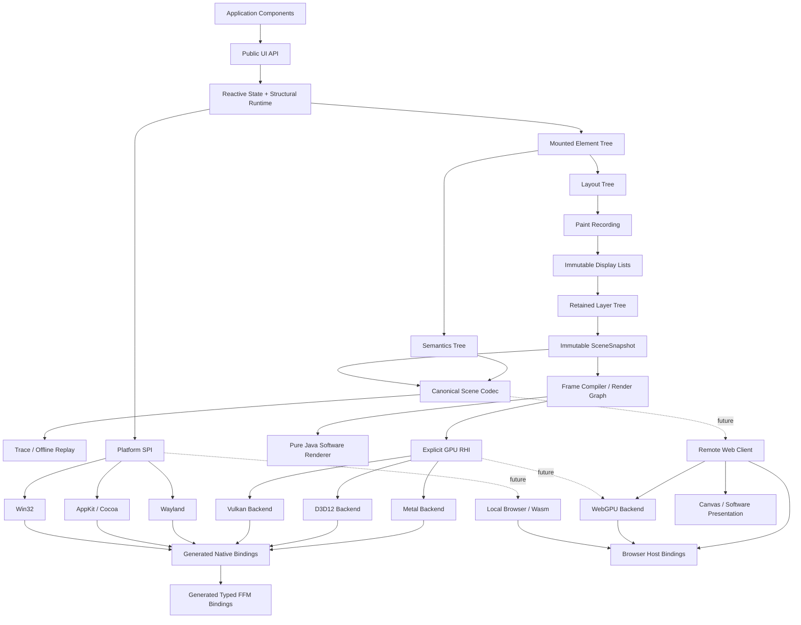

# HimariUI Implementation Plan

> Status: Draft 0.4<br>
> Runtime baseline: Java 25<br>
> Initial platforms: Windows, macOS, Linux, and Headless<br>
> Future mobile policy: Android and iOS are post-stable Java 25 AOT targets and do not define the core compatibility baseline<br>
> Future remote policy: the scene boundary is transport-ready, while networking and remote-session products remain post-stable extensions<br>
> Primary distribution constraint: published core and desktop artifacts must not ship project-built or third-party CPU-native libraries; future mobile bundles may contain only declared target-generated AOT code and host glue<br>
> Last reviewed: 2026-08-14

---

## 0. How to Use This Plan

This file is the repository-level execution plan for HimariUI. It is not a product vision or a collection of optional ideas. Convert its milestone IDs, work-package IDs, and exit criteria directly into issues, project-board items, and CI gates.

Use the following rules when executing the plan:

- Treat accepted ADRs and the non-negotiable constraints in this file as fixed until a replacement ADR is accepted.
- Do not start the next default milestone until the current milestone satisfies every exit criterion.
- Give every issue an executable acceptance command or a reproducible manual procedure.
- Keep reference implementations available while optimized implementations are developed and validated.
- Record source versions, licenses, generated data, and accepted behavioral differences as repository artifacts rather than relying on task history.

Terms used throughout this plan:

- **Pure-Java core**: all implementation code is Java; published core JARs contain no `.dll`, `.so`, `.dylib`, `.jnilib`, `.a`, `.lib`, or `.o` CPU-native artifacts and have no runtime dependency that transitively ships them.
- **System library**: a library supplied by the operating system or system graphics stack, such as `user32.dll`, `d3d12.dll`, AppKit, Metal, `libwayland-client.so`, or `libvulkan.so.1`. HimariUI may call these libraries through FFM but must not repackage them.
- **Test/tool dependency**: JNA, LWJGL, and similar dependencies used only by Oracle runners, tests, or development tools. They must not become production backends or enter the standard runtime dependency graph.
- **Optional integration**: a non-core feature such as an FFmpeg binding. It must use a separate artifact, remain non-transitive by default, and stay outside the strict pure-Java distribution.
- **Target-generated mobile artifact**: AOT application code, launcher code, or narrowly generated platform glue produced only while packaging a future Android or iOS application. These files may enter the final mobile application bundle but must not enter published core or desktop JARs, become a general native backend, or introduce a third-party graphics stack.
- **Reference implementation**: a correctness-first, readable, scalar Java implementation suitable for differential validation.
- **Optimized implementation**: a SIMD, parallel, GPU, cache-aware, or otherwise optimized implementation added only after the reference path passes its conformance gates.
- **Oracle**: a native or external reference implementation used by tests, such as FreeType, HarfBuzz, SDL, Skia, Impeller, a platform text API, or LWJGL. Oracles may be test dependencies but must not enter the published runtime graph.

---

## 1. Outcome and Execution Strategy

### 1.1 Target outcome

Deliver a modern declarative GUI framework whose runtime, layout engine, text stack, software renderer, GPU abstraction, platform backends, and generated native bindings are implemented in Java 25. Published Java artifacts and first-stable desktop distributions must contain no project-built or third-party CPU-native libraries. Desktop platforms must be reached through generated, strongly typed FFM bindings to system APIs.

The first stable release must support deterministic Headless execution, software fallback, modern GPU backends, complete input and accessibility paths, a practical control set, JVM execution, and GraalVM Native Image packaging.

### 1.2 Execution order

Execute the project in this order:

1. Prove the distribution and ABI model with repository guards, Headless execution, and platform/FFM feasibility spikes.
2. Build the state, declarative-runtime, layout, display-list, software-rendering, and basic-text reference paths.
3. Complete one end-to-end desktop slice, provisionally Linux Wayland plus Vulkan.
4. Complete Windows/D3D12 and macOS/Metal without introducing native shims.
5. Expand complex text, controls, accessibility, tooling, performance, Native Image packaging, and release hardening.

Correctness gates precede optimization at every stage. A visible demo does not replace ABI, corpus, differential, lifetime, or accessibility evidence.

### 1.3 Fixed top-level decisions

1. **Use Java 25 as the minimum runtime.** Core and internal implementations may use stable Java 25 language and library features. For JVM and Native Image desktop targets, FFM is the only native-access mechanism. Future Android and iOS targets must use a Java 25-capable AOT toolchain instead of imposing Android Runtime class-library compatibility on common modules. A future browser/Wasm target uses generated host bindings rather than FFM and does not reintroduce an FFI provider SPI. The Vector API remains incubating and may appear only in optional optimization modules.
2. **Do not require a compiler plugin.** Runtime correctness and the baseline application API must be usable from ordinary Java source. M1 selects the structural-reactivity model from evidence comparing explicit grouped recomposition, one-shot signal ownership, and a hybrid of fine-grained bindings with small structural scopes. Annotation processors or `javac` plugins may add diagnostics and optimizations, but correctness and acceptable baseline ergonomics must not depend on them.
3. **Use several purpose-specific trees.** Keep the reactive-owner/mounted-element, layout, layer/display-list, and semantics structures separate.
4. **Make the software renderer normative.** Add every path, blend, filter, and glyph-raster operation to the pure-Java scalar path before accepting Vulkan, D3D12, or Metal implementations.
5. **Use an explicit, backend-neutral RHI.** Model resources, pipelines, passes, command buffers, resource usages, pass dependencies, submission order, and ownership directly. Let Vulkan and D3D12 materialize native barriers from that model instead of exposing their raw barrier APIs as the cross-backend contract.
6. **Implement production text processing in Java.** ICU4J may supply Unicode data, Bidi, and boundary analysis. Implement OpenType parsing, GSUB/GPOS, script shaping, TrueType/CFF interpretation, hinting, and glyph rasterization in Java. Use system text APIs, FreeType, and HarfBuzz only for discovery or testing.
7. **Generate strongly typed desktop FFM bindings.** The canonical ABI schema generates layouts, downcalls, upcalls, error capture, metadata, and verification code for JVM and Native Image desktop targets. Do not define a runtime FFI provider SPI or a generic `Object...` invocation layer.
8. **Share the same desktop FFM path between the JVM and Native Image.** Generate reachability and downcall/upcall registration metadata at build time. Do not maintain SVM- or JNA-based desktop system-call backends.
9. **Prove infrastructure before building controls.** Complete Headless, software rendering, and ABI feasibility work before investing in a broad widget catalog.
10. **Port in four stages.** Every port follows specification, Oracle runner, Java reference implementation, and optimized implementation. AI-generated screenshots are never sufficient evidence.
11. **Use the accepted Himari naming scheme.** Maven coordinates use `org.glavo.himari:himari-*`; JPMS modules and Java packages use `org.glavo.himari.*`.
12. **Preserve browser/Wasm portability seams.** Platform startup, event delivery, rendering execution, clipboard, resource loading, font discovery, and GPU initialization must permit asynchronous, host-driven, and single-threaded implementations. Do not expose JavaScript, DOM, WebGPU, or Wasm runtime objects from platform-neutral public APIs.
13. **Treat mobile as a post-stable AOT extension.** Android and iOS support is contingent on a mobile AOT toolchain compiling the representative Java 25 core without source rewrites or a reduced Java profile. If no such toolchain is viable, defer the mobile target instead of lowering the runtime baseline, banning stable Java 25 APIs, or maintaining an ART-compatible common implementation.
14. **Make the scene boundary transport-ready without putting networking in the core.** `SceneSnapshot`, display-list, resource, semantics, and normalized-input encodings must be versioned, pointer-free, bounded, and replayable outside the producing process. The default renderer remains in-process. Authentication, encryption, discovery, congestion control, codecs, and remote-session policy belong to post-stable extensions.

### 1.4 Default technology choices

| Area | Default | Constraint or rationale |
|---|---|---|
| Language/runtime | Java 25 | Stable public APIs must not expose preview or incubator types |
| Desktop native access | FFM only | Enable native access per JPMS module; no runtime provider selection |
| Desktop Native Image | Shared FFM bindings plus generated metadata | No separate SVM system-call backend |
| Future Android/iOS runtime | Java 25-capable mobile AOT; GraalVM Native Image-derived tooling is the initial candidate | Toolchain feasibility gates the target; ART compatibility does not constrain common modules |
| Future Android/iOS host access | Generated target-specific launcher and JNI/NDK or Objective-C/C glue | Separate packaging boundary; not the desktop FFM contract or an FFI provider |
| Future local browser/Wasm host access | Generated Wasm imports and JavaScript/browser host bindings | Separate target-specific boundary; not an FFI provider |
| Unicode | ICU4J | Isolate it behind the `org.glavo.himari.unicode` SPI |
| Coordinates | `org.glavo.himari` and `himari-*` | Follow ADR-013 for Maven, JPMS, and packages |
| UI model | Declarative, signal-driven, phase-aware, unidirectional data flow | Select the structural-update strategy in M1; no mandatory compiler plugin |
| Layout | Downward constraints, upward sizes, one measure per child by default | Treat intrinsic measurement as explicit and expensive |
| Drawing | Immutable display lists plus a retained layer tree | Support partial repaint and caching |
| Scene/process boundary | Versioned `SceneSnapshot` envelopes plus content-addressed resources | In-process mailbox by default; canonical encoding supports replay, process isolation, and future transport |
| CPU rendering | Tile-based pure-Java rasterizer | Scalar normative path plus optional Vector API acceleration |
| GPU rendering | Vulkan, D3D12, and Metal | Use a backend-neutral explicit RHI |
| Future remote Web client | Scene/display-list stream rendered through WebGPU or Canvas/software | Java 25 runtime remains authoritative on the server; never stream RHI or native GPU commands |
| Text | Pure-Java OpenType, shaping, and rasterization | Differentially validate against FreeType and HarfBuzz |
| Testing | JUnit 5, jqwik/Jazzer, JMH, native Oracle runners | LWJGL/JNA/system libraries are test-only |
| Build | Gradle multi-project plus JPMS | Publish a Maven BOM and modular JARs |

---

## 2. Non-Negotiable Constraints and CI Gates

### 2.1 Runtime distribution constraints

Apply these constraints to `himari-ui`, `himari-runtime`, `himari-render-*`, `himari-text`, the first-stable desktop `himari-platform-*` and `himari-rhi-*` modules, `himari-ffi`, and their aggregated internal implementation modules. They govern published Java artifacts and the desktop runtime graph. A post-stable mobile application bundle may contain target-generated AOT code and narrowly generated host glue, but those files must remain outside standard JARs and desktop dependencies:

- Ship no JNI C/C++ source and no precompiled native bridge.
- Do not call `System.load` or `System.loadLibrary` for framework-owned files.
- Do not extract native files from JARs into temporary directories.
- Do not depend on AWT, Swing, Java2D, JavaFX, or SWT.
- Keep core modules free of `java.desktop` and `jdk.unsupported`.
- Do not use `sun.misc.Unsafe` or other internal JDK APIs.
- Do not add JNA, LWJGL, Skija, JavaCV, or FFmpeg bindings as default or transitive runtime dependencies.
- Allow ICU4J, pure-Java compression/codecs, and other dependencies only after pure-Java allowlist review.
- Treat shader bytecode, Unicode tables, and test-font data as data resources rather than CPU-native libraries, but record their source, version, hash, and license.

### 2.2 Required CI gates

Create `build-logic/pure-java-guard` and implement at least these gates:

1. `verifyNoNativeEntries`: reject CPU-native file formats in every publishable JAR and runtime dependency JAR. A future isolated Web artifact may contain `.wasm` target bytecode, and a future mobile application bundle may contain target-generated AOT code and host glue; neither may enter core or desktop JARs.
2. `verifyDependencyAllowlist`: lock runtime dependencies and compare them with the approved pure-Java allowlist; use separate allowlists for optional modules.
3. `verifyNoDesktopModule`: use `jdeps` to reject `java.desktop` from the core dependency graph.
4. `verifyNoUnsupportedJdkApi`: run `jdeps --jdk-internals` and static scans for internal JDK APIs.
5. `verifyNoNativeKeyword`: reject Java `native` methods in runtime modules; Oracle test modules are the only exception.
6. `verifyNoExtractionPattern`: scan for `System.load*`, temporary native-file writes, and common native classifier patterns.
7. `verifyNativeLoadTrace`: run platform smoke tests with JVM library-load logging and compare loaded libraries with the system-library allowlist.
8. `verifyReproducibleArtifacts`: build the same commit twice and require identical artifact hashes.
9. `verifyLicenseManifest`: require provenance records for generated tables, ports, shader blobs, and test fonts.
10. `verifyTestRuntimeIsolation`: allow Oracle, LWJGL, and JNA dependencies only on `testRuntimeClasspath` or isolated `oracle-*` configurations.
11. `verifySingleFfmPath`: for JVM and Native Image desktop production modules, reject JNA, GraalVM SVM interop, and handwritten JNI. Permit creation of `FunctionDescriptor` values and calls to `Linker.downcallHandle` or `Linker.upcallStub` only in generated bindings or allowlisted `himari-ffi` support code. Future browser/Wasm modules must use their isolated host-binding boundary and must not depend on `himari-ffi`.
12. `verifyWebHostIsolation`: activate with W0/W1; require an explicit browser-import allowlist, reject desktop/FFM dependencies from Web artifacts, validate generated linear-memory marshalling, and reject dynamic JavaScript evaluation or undeclared ambient browser access.
13. `verifyMobileAotIsolation`: activate with A0; require mobile packaging inputs to be explicit, reject mobile launchers and generated host glue from core or desktop JARs, reject target runtime types from common public APIs, and verify that the representative Java 25 core is compiled without an ART compatibility fork or source rewrite.
14. `verifySceneCodec`: round-trip canonical scene, display-list, resource-manifest, semantics, and normalized-input fixtures; reject native addresses, Java object identity, target handles, malformed lengths, unsupported required features, hash mismatches, and configured resource-limit violations; fuzz every decoder.

### 2.3 Published artifacts and user entry points

Use these public coordinates; keep the complete mapping in ADR-013:

```text
org.glavo.himari:himari-bom
org.glavo.himari:himari-desktop
org.glavo.himari:himari-ui
org.glavo.himari:himari-runtime
org.glavo.himari:himari-layout
org.glavo.himari:himari-graphics
org.glavo.himari:himari-render-software
org.glavo.himari:himari-render-gpu
org.glavo.himari:himari-text
org.glavo.himari:himari-controls
org.glavo.himari:himari-platform-windows
org.glavo.himari:himari-platform-macos
org.glavo.himari:himari-platform-linux-wayland
org.glavo.himari:himari-platform-linux-x11
org.glavo.himari:himari-platform-headless
org.glavo.himari:himari-testing
```

`himari-render-gpu` contains the backend-neutral frame compiler and render graph. Keep Vulkan, D3D12, and Metal implementations in `himari-rhi-vulkan`, `himari-rhi-d3d12`, and `himari-rhi-metal`.

`himari-ffi` contains shared FFM support and internal facilities required by generated bindings. It defines no provider SPI and is not a dependency applications should declare directly. Do not publish a JNA production artifact or include one in the BOM.

---

## 3. Release Scope

### 3.1 First stable release

Deliver all of the following:

- Windows, macOS, and Linux Wayland backends, with Linux X11 as a compatibility backend.
- x86-64 and arm64 processes only.
- Multiple windows, DPI/scaling, mouse, touch, pen, keyboard, IME, clipboard, and drag-and-drop support.
- A first-class Headless platform and deterministic software rendering.
- Declarative UI, state, layout, animation, scrolling, virtualized lists, and common controls.
- An extensible complete Unicode text pipeline, with stable-release coverage for common complex scripts, Bidi, font fallback, variable fonts, and major color-font formats.
- Accessibility bridges for Windows UI Automation, macOS Accessibility, and Linux AT-SPI2.
- Vulkan, D3D12, and Metal GPU backends plus CPU fallback.
- JVM and GraalVM Native Image distribution paths.
- Inspector, versioned transport-ready scene/frame traces, deterministic offline replay, and golden-test tooling.

### 3.2 Explicit non-goals for the first stable release

- Android or iOS product support; both belong to the post-stable AOT extension track.
- Live remote sessions, network transports, authentication, adaptive streaming, and remote-desktop product features.
- Browser DOM/CSS compatibility.
- Swing or JavaFX control interoperability as a core architectural requirement.
- Arbitrary user shaders; expose only a controlled set of brushes, filters, and effects initially.
- General video codecs or media-container parsing as a release blocker.
- Pixel-identical output between software and GPU backends. Require semantic agreement for geometry, coverage, color, and blending, with bounded GPU tolerances.
- Bundling MoltenVK, ANGLE, SwiftShader, Mesa, FreeType, HarfBuzz, or similar native components to fill platform gaps.
- Requiring application developers to understand FFM, COM, the Objective-C runtime, or Wayland protocols.

### 3.3 Later extensions

- **Android, AOT-first and feasibility-gated**: compile the unchanged Java 25 runtime, layout, text, display-list, semantics, and rendering modules with a Java 25-capable mobile AOT toolchain. Use a thin Android host shell plus generated JNI/NDK glue for lifecycle, surfaces, input, IME, accessibility, and Vulkan. The shell may execute on ART, but the HimariUI core is not required to be ART-compatible. Treat a full ART execution path as a separate future decision rather than a constraint on current code.
- **iOS, AOT-only and feasibility-gated**: compile the same unchanged Java 25 subsystems with a suitable mobile AOT toolchain and use generated Objective-C/C glue for application lifecycle, UIKit, Metal, input, IME, and accessibility. GraalVM Native Image-derived tooling, initially Gluon Substrate/GluonFX, is a candidate to validate rather than an accepted dependency or proof that the desktop FFM path works on iOS.
- **Mobile compatibility rule**: require representative mobile AOT spikes to cover stable Java 25 APIs used by the core, including `MemorySegment` and `Arena` where applicable. A toolchain failure postpones Android/iOS support; it must not cause the main source set to adopt an older Java profile, avoid stable Java 25 features, or maintain parallel ART-compatible algorithms.
- **Browser/Wasm**: compile the portable Java subsystems to WebAssembly; use generated Wasm imports and JavaScript/browser host bindings, WebGPU with a Canvas fallback, host-driven event delivery, asynchronous browser capabilities, and a DOM-backed semantics/IME bridge. Reuse the backend-neutral RHI contract without requiring FFM or runtime JPMS. This target does not provide DOM/CSS visual compatibility.
- **Remote scene rendering and Web client**: keep the authoritative Java 25 runtime, layout, text shaping, hit testing, focus, and application state on a JVM or Native Image host. Stream versioned scene/display-list envelopes, content-addressed resources, correlated semantics updates, and lifecycle/configuration changes to a browser client that presents through WebGPU or Canvas/software and returns normalized input and IME transactions. This path must not require the full Java runtime to execute in the browser and must not expose component trees, RHI commands, native GPU commands, or target handles on the wire. Pixel/video streaming may be an optional fallback, not the normative scene protocol.
- **Media**: add a pure-Java `himari-media` API, WAV/PCM baseline implementations, and optional FFmpeg, GStreamer, or platform-codec providers.

---

## 4. Architectural Decisions

Create or maintain an ADR for each decision below. Accepted ADRs live in `adr/`; this section records the execution-level summary.

### ADR-001: Keep the core independent of `java.desktop`

Define HimariUI image, font, color, input, and window types. Java2D may appear in tests as an Oracle but never in production modules.

### ADR-002: Use FFM as the only desktop FFI and generate typed bindings

For JVM and Native Image desktop targets, use generated, fixed-signature Java calls or `MethodHandle.invokeExact`. Do not define an FFI provider SPI, runtime provider selection, reflection-based calls, or `Object[]` invocation. Future mobile AOT host glue and browser/Wasm host bindings are separate target and packaging boundaries, not alternative implementations of this desktop FFI contract.

### ADR-003: Keep compiler plugins optional

Runtime correctness and the baseline application API must not depend on source rewriting, bytecode rewriting, or generated application code. Optional tooling may provide source maps, stability diagnostics, static dependency analysis, skip optimization, or development-time hot reload. Evaluate all runtime candidates through ordinary Java samples before applying optional tooling; annotation processing alone is not a substitute for method-body instrumentation.

### ADR-004: Track reactive reads by execution phase

Invalidate only the phase consumer that read a reactive value and its required successors:

```text
STRUCTURE -> {MEASURE, PLACE, PAINT, SEMANTICS, HIT_TEST_INDEX} as topology or node results require
MEASURE   -> {PLACE, PAINT, SEMANTICS, HIT_TEST_INDEX} as geometry changes require
PLACE     -> {PAINT, SEMANTICS, HIT_TEST_INDEX} as geometry changes require
PAINT
SEMANTICS
HIT_TEST_INDEX
```

`STRUCTURE` denotes the smallest callback that may change mounted-node topology; it does not imply that component functions are always rerun. Keep structure, measure, placement, paint, and semantics consumers independently restartable. A reactive property binding must declare which phases its value can affect instead of mutating a mounted node from an unclassified generic effect.

### ADR-005: Make the software renderer normative

Add each drawing operation to the scalar software renderer and golden corpus first. A GPU implementation becomes eligible as a default only after passing differential gates.

### ADR-006: Use an explicit RHI resource model

Represent resource creation, lifetime, declared usage, pass dependencies, submission order, pass boundaries, and pipeline state explicitly. The frame compiler produces logical access transitions; each backend materializes native barriers or validation as required. Do not expose Vulkan/D3D12 barrier objects or leak OpenGL-style implicit state into the higher-level Canvas API.

### ADR-007: Keep low-level memory and host-interop types out of public APIs

Core and internal implementation modules may use `MemorySegment`, `Arena`, `MemoryLayout`, and other stable Java 25 APIs when ownership and lifetime are explicit. Do not remove or replace those uses solely to preserve possible ART compatibility. Confine `Linker`, `SymbolLookup`, `FunctionDescriptor`, and low-level method handles used for desktop system calls to generated desktop interop or allowlisted `himari-ffi` support packages. An explicit interop escape hatch may expose framework-defined typed native handles, but ordinary component APIs must not expose low-level memory, FFM linker, Android, Objective-C, JavaScript, DOM, WebGPU, or Wasm runtime types.

### ADR-008: Prefer verifiable correctness over porting speed

Require a readable reference implementation, Oracle runner, fixed corpus, and fuzz target before algorithmic rewrites, SIMD, parallelism, or GPU acceleration.

### ADR-009: Lay out in logical pixels

Use `float` logical pixels for layout. Resolve DPI, fractional scaling, pixel snapping, and subpixel placement during layer compilation and rendering.

### ADR-010: Use UTF-16 public indices with explicit grapheme and cluster maps

Keep public ranges compatible with Java `String` offsets. Route caret, selection, and deletion through grapheme boundaries, and preserve UTF-16 cluster start/end offsets in shaping results.

### ADR-011: Exclude preview and incubator types from stable APIs

Keep the Vector API inside optional implementations such as `himari-render-vector` in `modules/render/vector-jdk25`. Do not expose structured concurrency or other preview APIs in stable signatures.

### ADR-012: Report capability loss and fallback explicitly

When GPU, IME, color-font, accessibility, or platform extensions are unavailable, emit a structured capability report and select a documented fallback. Never silently drop input or substitute semantically incorrect behavior.

### ADR-013: Use consistent coordinates, module names, and packages

Use `org.glavo.himari` as the Maven group, `himari-<area>` as artifact IDs, and `org.glavo.himari.<area>` for JPMS modules and exported packages. Keep repository modules fine-grained while presenting coarse user entry points such as `himari-desktop` and `himari-ui`. Do not introduce a `gui-*` prefix.

### ADR-014: Keep host integration asynchronous and target-specific

Platform-neutral contracts must support host-driven event loops, asynchronous capability acquisition, optional rendering workers, and unavailable capabilities. Desktop targets use FFM behind generated native bindings. Future mobile AOT targets use generated target launchers and JNI/NDK or Objective-C/C glue outside the desktop FFM contract. A browser/Wasm target uses generated Wasm imports and JavaScript/browser bindings in a separate host module. None of these boundaries may leak target runtime objects into common public APIs or become a generic provider SPI.

### ADR-015: Separate value reactivity from structural updates

Use a fine-grained producer/consumer graph for `State`, `DerivedState`, phase dependencies, and owned effects. Source writes push invalidation through the graph; derived values recompute lazily when pulled and publish semantic version changes only when their equality policy observes a new value. Treat conditional branches, keyed collections, mounted-node identity, and lifecycle as a separate structural-update problem.

Do not accept universal slot-table recomposition or one-shot component execution as the structural contract before M1 evidence exists. Compare explicit grouped recomposition, one-shot signal ownership with explicit reactive control flow, and a hybrid that uses fine-grained property bindings plus small structural scopes. A slot table may remain an internal implementation selected by that evidence, but it is not a fixed public-runtime requirement.

### ADR-016: Do not lower the Java baseline for speculative targets

The shared implementation may use stable Java 25 language and runtime features. Android and iOS become supported only when a mobile AOT toolchain can compile and run the representative core without source rewriting, an older common source set, or replacement of Java 25 APIs solely for target compatibility. The absence of such a toolchain defers the affected mobile target. An ART-compatible execution profile requires a future replacement or supplementary ADR and is not a current design constraint.

### ADR-017: Make scene output transport-ready without making remote rendering core policy

Define a canonical, versioned, pointer-free encoding for immutable scene/display-list data, resources, semantics snapshots, and normalized input. The encoding must survive a process and language boundary, use explicit feature negotiation and resource limits, and remain independent of Java object layout, `MemorySegment` identity, FFM handles, RHI objects, and native GPU commands. Internal implementations may continue to use Java 25 APIs and `MemorySegment`; only the encoded form is constrained. Core modules own deterministic codecs and offline replay, not sockets, TLS, authentication, discovery, congestion control, video codecs, clipboard/file redirection, or session policy. A future remote renderer is a target-specific consumer of this boundary, not a runtime renderer provider SPI.

---

## 5. Target Architecture

### 5.1 Logical layers



### 5.2 Frame flow

```text
host / OS events
  -> normalized event queue
  -> input routing / gesture / focus / IME
  -> state transaction
  -> publish one state epoch
  -> push reactive invalidation
  -> pull derived values at affected consumers
  -> run affected property bindings or structural scopes
  -> incremental measure/place
  -> paint invalidation and display-list recording
  -> layer diff + damage
  -> immutable SceneSnapshot
  -> render mailbox by default, or canonical encoded scene sink
  -> frame compiler / render graph
  -> CPU tiles or GPU command buffers
  -> present + timing feedback
```

### 5.3 Execution and threading model

- **Platform/UI execution context**: run window or host events, reactive bindings, structural updates, layout, input, and semantics updates on the main execution context required by the target. Desktop targets use the OS-required UI thread; a browser target uses the browser event loop.
- **Render execution capability**: desktop targets initially use a dedicated render thread that owns the GPU device, queue, and most GPU resources. Platform-neutral contracts must also permit rendering on the UI context or in a Web Worker.
- **Optional worker execution**: use a bounded platform-thread pool for desktop CPU work and virtual threads for blocking desktop I/O where appropriate. A target may provide no workers, limited workers, or browser workers; correctness must not depend on their presence.
- **Host-driven event loop**: platform scheduling must accept callbacks from a host event loop and must not require a blocking message-pump API.
- **No user callbacks in render execution**: never run application callbacks, component code, or state writes from the render executor, whether it is a thread, worker, or same-thread render phase.
- **Frame handoff**: when UI and rendering execute separately, scene snapshots may use latest-wins replacement while resource creation, upload, destruction, configuration, and correlated semantics updates remain ordered and non-droppable. A same-context implementation preserves the same ordering without requiring a mailbox. The logical contract must not require a shared address space even though the default implementation passes immutable Java objects in-process.
- **Explicit frame ownership**: hand off only immutable values or objects with documented ownership transfer.

Do not parallelize application component, binding, or structural-control callbacks in the first version. Require every callback that the selected runtime may rerun to be fast, reentrant, and free of implicit side effects so staged UI work can later be cancelled or executed under different target schedulers. One-shot initializers must register external work through owned lifecycle APIs rather than performing unmanaged side effects.

---

## 6. Repository and Module Layout

### 6.1 Target directory structure

```text
/
├─ PLANS.md
├─ README.md
├─ CONTRIBUTING.md
├─ ARCHITECTURE.md
├─ THIRD_PARTY.md
├─ NOTICE
├─ adr/
├─ build-logic/
│  ├─ pure-java-guard/
│  ├─ abi-codegen/
│  ├─ shader-codegen/
│  └─ benchmark-conventions/
├─ modules/
│  ├─ ui/
│  ├─ runtime/
│  ├─ state/
│  ├─ layout/
│  ├─ input/
│  ├─ semantics/
│  ├─ animation/
│  ├─ graphics/
│  │  ├─ api/
│  │  └─ path/
│  ├─ scene/
│  │  └─ codec/
│  ├─ render/
│  │  ├─ core/
│  │  ├─ software/
│  │  ├─ gpu/
│  │  └─ vector-jdk25/
│  ├─ rhi/
│  │  ├─ api/
│  │  ├─ vulkan/
│  │  ├─ d3d12/
│  │  └─ metal/
│  ├─ text/
│  │  ├─ api/
│  │  ├─ shaper/
│  │  └─ layout/
│  ├─ unicode/
│  │  ├─ api/
│  │  └─ icu4j/
│  ├─ font/
│  │  ├─ sfnt/
│  │  ├─ truetype/
│  │  ├─ cff/
│  │  └─ raster/
│  ├─ image/
│  │  ├─ api/
│  │  └─ codec-png/
│  ├─ platform/
│  │  ├─ api/
│  │  ├─ headless/
│  │  ├─ windows/
│  │  ├─ macos/
│  │  ├─ linux-wayland/
│  │  └─ linux-x11/
│  ├─ ffi/
│  ├─ controls/
│  │  └─ core/
│  ├─ theme/
│  │  └─ default/
│  ├─ inspector/
│  ├─ testing/
│  └─ desktop/
├─ tools/
│  ├─ abi-generator/
│  ├─ shader-compiler/
│  ├─ font-inspector/
│  ├─ scene-replay/
│  └─ golden-reviewer/
├─ oracles/
│  ├─ freetype-runner/
│  ├─ harfbuzz-runner/
│  ├─ sdl-runner/
│  ├─ platform-text-runner/
│  └─ lwjgl-render-runner/
├─ corpus/
│  ├─ fonts/
│  ├─ unicode/
│  ├─ paths/
│  ├─ images/
│  ├─ scenes/
│  └─ events/
└─ samples/
   ├─ hello-window/
   ├─ controls-gallery/
   ├─ text-lab/
   ├─ render-lab/
   └─ native-image-demo/
```

### 6.2 Dependency direction

Allow dependencies only in the following direction:

```text
controls/theme
    -> ui/runtime/layout/input/semantics/animation/text/graphics
runtime
    -> state + platform/api
layout
    -> graphics value types only
text/layout
    -> unicode + text/shaper + font modules
render/core
    -> graphics + text glyph data
scene/codec
    -> render/core + semantics snapshots + normalized input value types
render/software
    -> render/core
render/gpu
    -> render/core + rhi/api
rhi backends
    -> rhi/api + ffi/generated bindings
platform backends
    -> platform/api + ffi/generated bindings
ffi
    -> java.base FFM API only
future platform/web
    -> platform/api + host/web
future rhi/webgpu
    -> rhi/api + host/web
future host/web
    -> generated Wasm imports + JavaScript/browser bindings
future platform/android
    -> platform/api + host/android
future rhi/android-vulkan
    -> rhi/api + host/android
future platform/ios
    -> platform/api + host/ios
future rhi/ios-metal
    -> rhi/api + host/ios
future host/android + host/ios
    -> generated mobile launcher/host glue + target AOT entry points
future remote/server
    -> runtime + scene/codec
future remote/web-client
    -> scene/codec schema + host/web + browser presentation backend
```

Reject all of the following:

- Reverse dependencies such as `runtime -> platform/windows`.
- `text -> java.desktop`.
- `graphics/api -> Vulkan/D3D12/Metal`.
- `controls/core -> theme/default`.
- Platform or RHI modules that bypass generated bindings and construct arbitrary downcalls.
- Core or desktop production dependencies on JNA, LWJGL, GraalVM SVM interop, or `oracles/*`; future mobile toolchain-specific entry points must remain confined to `host/android` or `host/ios`.
- Browser/Wasm modules that depend on `himari-ffi` or expose host runtime objects through common APIs.
- Future mobile modules that leak Android, JNI, Objective-C, UIKit, Metal, or AOT-toolchain types into common public APIs.
- Changes to common modules whose only purpose is ART class-library or bytecode compatibility without a separately accepted ART-target ADR.
- Scene codecs that encode native addresses, Java object identity, `MemorySegment` identity, FFM/host handles, component trees, RHI resources, or native GPU commands.
- Core modules that depend on sockets, HTTP/WebSocket implementations, TLS providers, authentication, discovery, congestion control, video codecs, or remote-session policy.

### 6.3 JPMS rules

- Give every JVM-published artifact an explicit `module-info.java` named `org.glavo.himari.<area>`.
- Request native access only from `org.glavo.himari.ffi` and concrete platform/RHI modules that invoke restricted FFM methods.
- Use `uses`/`provides` for platform, renderer, and feature SPIs. Generate statically analyzable registries for Native Image when required. Do not define an FFI provider SPI.
- Do not export `org.glavo.himari.*.internal`; use narrow SPIs for cross-module internal access instead of `--add-exports`.
- A future Wasm build may link modules statically without runtime JPMS, but it must preserve the same logical dependency and encapsulation boundaries.
- Future mobile AOT builds may statically link modules and generated entry points without runtime JPMS, but they must compile the normal Java 25 source sets and preserve the same logical dependency and encapsulation boundaries.

### 6.4 Naming rules

Repository directories may be short, but Maven artifacts, JPMS modules, and Java packages must use the complete isomorphic naming scheme defined by ADR-013. BUILD-001 must not introduce an alternative convention.

### 6.5 Future local browser/Wasm boundaries

Reserve logical boundaries for `modules/platform/web`, `modules/rhi/webgpu`, and `modules/host/web`. Keep browser host bindings outside `modules/ffi`; they adapt generated Wasm imports and JavaScript/browser APIs rather than native system libraries. Defer public artifact names and the Java-to-Wasm toolchain until the post-stable feasibility milestone.

### 6.6 Future mobile/AOT boundaries

Reserve logical boundaries for `modules/platform/android`, `modules/platform/ios`, `modules/rhi/android-vulkan`, `modules/rhi/ios-metal`, `modules/host/android`, and `modules/host/ios`. Keep target launchers, AOT entry points, and generated JNI/NDK or Objective-C/C glue outside `modules/ffi` and outside all core JARs. These modules adapt platform lifecycle and services to target-neutral contracts; they do not define a runtime-selectable backend or an ART-compatible variant of the core. Defer public artifact names and the mobile AOT toolchain selection until A0 feasibility evidence exists.

### 6.7 Future remote-rendering boundaries

Keep the canonical scene codec in `modules/scene/codec` so Headless replay, inspector tooling, process isolation, and future transports share one conformance surface. Reserve `modules/remote/server`, `modules/remote/web-client`, and target-specific transport adapters for the post-stable remote track. The server adapts the authoritative runtime to encoded scene, resource, semantics, and interaction streams. The Web client adapts that protocol to the browser presentation backend and DOM-based IME/accessibility services. Transport adapters own networking, security, and session policy; the scene codec must not depend on them. A remote client is a build-time product target, not a runtime renderer provider selected from core code.

---

## 7. Declarative Runtime Workstream

### 7.1 Accepted public semantics

The ordinary Java API must express these concepts without generated application code:

```text
component or reactive owner
source state and derived state
phase-aware property binding
conditional structural scope
keyed collection scope
mounted node declaration
owned effect and cleanup
```

M1 determines the final names, callback shapes, and ownership rules. Do not accept an API merely because optional code generation makes it concise. Samples used for the decision must call the same runtime surface available through standard Java compilation without an annotation processor, compiler plugin, source generator, or bytecode transformer.

The API must preserve the point at which a reactive value is read. An eagerly evaluated argument such as a computed `String` cannot become a property-level binding: a grouped model can attribute it only to the current structural scope, while a one-shot model must reject or diagnose an uncaptured read. A deferred property getter may become a narrower phase consumer. The runtime must not claim property-level invalidation after the application has already erased the dependency by passing an eager value.

### 7.2 M1 structural-reactivity decision

Implement three bounded prototypes over the same state graph, mounted-node abstraction, and Headless host:

1. **Explicit grouped recomposition**: rerunnable structural callbacks, explicit ordinary-Java group boundaries, positional memory, and keyed reconciliation. The prototype receives no compiler-generated groups, source keys, change masks, restart lambdas, or lambda memoization.
2. **One-shot signal ownership**: initialize each component owner once, bind deferred reactive expressions to typed node properties, and express changing branches and collections through explicit control-flow primitives equivalent to `Show` and `ForEach`. Changing component inputs must remain reactive rather than becoming frozen constructor values.
3. **Hybrid structural scopes**: use fine-grained bindings for values and phase callbacks, but rerun the smallest explicit structural scope for conditional branches, keyed collections, or other topology changes.

Freeze the shared behavioral fixtures and instrumentation before prototype work begins. The three spikes may then proceed in parallel, but they must not share a structural abstraction that prejudges the result. Each candidate implements behaviorally identical applications through its own ordinary-Java API variant.

Run all three prototypes through one checked-in comparison suite:

- a counter with a derived label and event handler;
- a diamond dependency graph that would expose an intermediate-value glitch;
- conditional insertion and removal with documented local-state retention and effect disposal;
- nested components whose inputs change after mounting;
- keyed list insertion, deletion, and reorder with item-local state;
- high-frequency text, color, size, and offset changes that exercise different phase impacts;
- failed or cancelled staged work with deterministic cleanup and retry.

Record source lines of code, explicit keys, deferred getters, structural-control primitives, generic type noise, callbacks executed, nodes visited, dependency edges, steady-state allocations, retained memory, and phase invalidations. Include debug trace quality and Native Image compatibility. Performance alone cannot select a model whose ordinary-Java samples require pervasive accidental ceremony.

Accept the production structural-runtime ADR only after the comparison is reviewed. The decision may select one prototype or specify a measured hybrid, but it must define component input semantics, local state ownership, branch and list identity, failure recovery, and the boundary between value propagation and structural work.

### 7.3 Runtime structures

Implement these model-independent structures before committing to a structural representation:

- **ReactiveGraph**: maintain producer/consumer edges, value versions, dynamic dependencies, liveness, and dirty propagation.
- **ReactiveOwner**: own computations, structural scopes, effects, and cleanup independently of any particular slot representation.
- **MountedElement**: connect the selected declaration or binding model to persistent layout and semantics nodes and hold local invalidation state.
- **StructuralRuntime**: implement the M1-selected branch, collection, identity, and local-state model.
- **NodeApplier**: apply staged structural changes incrementally to mounted, layout, and semantics nodes.
- **PhaseDependencyIndex**: map reactive versions to structure, measure, placement, paint, semantics, and hit-test consumers.
- **UiCommitTransaction**: stage mounted-property and topology changes and commit atomically; cancellation must leave no nodes or effects behind.
- **EffectRegistry**: define deterministic `mount`, `update`, and `dispose` ordering and aggregate failures for reporting.

The grouped-recomposition prototype may contain a `SlotTable`; the one-shot prototype may instead use owners, anchors, and explicit collection records. Do not promote either storage layout to a production deliverable before the M1 ADR is accepted.

### 7.4 State and propagation requirements

Provide object and primitive state types, including `State<T>`, `MutableState<T>`, `IntState`, `LongState`, `FloatState`, and `BooleanState`. Add `DerivedState<T>`, batched `StateTransaction.run(...)`, a safe external-update commit queue for thread or host callbacks, and consistent snapshot/version reads.

The reactive graph must provide:

- dynamic dependency discovery and reconciliation on every consumer execution;
- synchronous dependency capture with an explicit non-tracking read operation; asynchronous continuations must establish their own consumer context;
- eager push propagation of dirtiness without running effects or recomputing derived values;
- lazy pull recomputation of invalidated derived values;
- equality policies and monotonically advancing semantic value versions so unchanged derivations do not wake downstream consumers;
- dependency-version polling before consumer execution so a dirty notification whose inputs are semantically unchanged can be skipped;
- glitch-free reads across diamond and dynamically changing dependency graphs;
- cycle detection with deterministic diagnostics;
- side-effect-free derived computations that cannot write state;
- owner disposal and liveness rules that do not retain unreachable consumers;
- defined caching, propagation, and retry behavior for failed derivations.

`StateTransaction` and `UiCommitTransaction` are distinct. A state transaction atomically publishes source values as one epoch; a UI commit transaction atomically publishes property and topology changes derived from that epoch. Neither observers nor effects may observe an intermediate source combination, a partially updated set of bound properties, or a partially applied tree.

Enforce these write rules:

1. Coalesce repeated writes to the same source within one transaction or event-loop tick before notifying consumers.
2. Give nested state transactions explicit flattening, rollback, and failure semantics.
3. Publish changes initiated outside the UI execution context through the commit queue; never execute application UI callbacks directly on the originating thread, worker, or host callback.
4. Keep every reactive version read by staged UI work stable for that attempt.
5. Cancel and retry conflicting staged work; never commit a partial tree or mixed state epoch.
6. Schedule each affected effect at most once per committed epoch and run it only after affected UI work has committed or established that the epoch requires no UI mutation.
7. Reject reentrant writes and illegal side effects from derived computations or rerunnable structural callbacks in debug mode.

### 7.5 Identity and dynamic structure

- Require application keys for semantic identity in reorderable collections or explicit reparenting, not merely to compensate for missing compiler-generated source positions.
- Make branch identity and the retain-versus-dispose policy for inactive local state explicit in the selected structural model.
- Give one-shot and hybrid control-flow scopes stable anchors, deterministic child ownership, and child-before-parent disposal.
- If grouped recomposition is selected, derive safe positional identity only inside explicit runtime scopes and require keys wherever execution order may change.
- Record source locations in debug builds when available, but never depend on generated source tokens for correctness.
- Never use stack inspection, line numbers, synthetic lambda class names, or allocation order as correctness-critical identity; they are diagnostic inputs only.
- Diagnose duplicate keys, unkeyed reorder, stale bindings, owner leaks, and local-state type changes with actionable errors.

### 7.6 Phase invalidation

Maintain independent node flags:

```text
NEEDS_STRUCTURE
NEEDS_MEASURE
NEEDS_PLACE
NEEDS_PAINT
NEEDS_SEMANTICS
NEEDS_HIT_TEST_INDEX
```

Track reactive reads in their execution context. Reads from structural, measure, placement, paint, and semantics callbacks register the corresponding consumer. A typed property binding must declare phase-impact metadata; changing text may require measure, paint, and semantics, while changing color may require only paint. Mark the earliest affected phase and its required successors rather than inferring impact from an unclassified setter.

A signal write only marks consumers dirty and requests scheduled work. It must never mutate mounted, layout, semantics, or render nodes directly. A scroll offset should therefore be able to invalidate placement, paint, and hit testing without rerunning an unrelated component or structural scope.

### 7.7 Effects and lifecycle

- Require component initialization and every rerunnable binding or structural callback to be externally side-effect free.
- Attach effects and resources to a `ReactiveOwner`; disposing the owner must sever graph edges and release all registered work.
- Start committed effects from parent to child and dispose them from child to parent.
- Dispose the old effect before starting a replacement when its identity changes.
- Coalesce effect scheduling per committed epoch and run effects only after derived values and affected staged UI work are consistent; an epoch with no UI mutation still crosses the same stabilization barrier.
- Catch effect failures at the runtime error boundary; never let them escape through a native callback.
- Register timers, subscriptions, and resources as effects. Do not rely on finalization.

---

## 8. Layout Workstream

### 8.1 Layout protocol

Implement a constraints-down, sizes-up protocol with a separate placement phase. By default, permit each child to be measured once per layout pass. Make intrinsic measurement explicit, cache it, and identify it as expensive in profiling data.

Treat measurement and placement as separate reactive consumers. Make baselines and alignment lines first-class results. Use `float` logical pixels throughout layout; packed integer-range optimizations may remain internal.

### 8.2 Primitive implementation order

Implement layout primitives in this order:

1. `Box` and `Stack`.
2. `Row` and `Column`.
3. Padding, size, min/max, aspect ratio, and alignment.
4. `ScrollViewport`.
5. `LazyList` and `LazyGrid`.
6. `Flex`.
7. `Grid`.
8. Flow/wrap.
9. Custom layout.
10. Overlay, popup, and portal placement.

### 8.3 Modifier and behavior chain

Use immutable, typed modifier chains and flatten them when mounted. Each modifier must declare the phases it participates in so an input or semantics modifier does not automatically invalidate layout and paint.

### 8.4 Virtualization requirements

`LazyList` and related primitives must provide stable item keys, viewport-based materialization, overscan/prefetch, variable-height estimation and correction, anchor-preserving updates, internal-node reuse without state-identity leakage, logical accessibility information for unmounted items, and deterministic Headless scrolling tests.

### 8.5 Hit testing

- Generate a spatial index from the layout tree.
- Include transforms, clips, z-order, and pointer behavior in hit testing.
- Update the index only when position, transform, or clip state changes.
- Make exact path hit testing an explicit cost; use bounds plus a shape policy by default.

---

## 9. Graphics and Display-List Workstream

### 9.1 Framework-owned value types

Implement framework types for points, sizes, rectangles, rounded rectangles, matrices, colors, color spaces, transfer functions, paths, brushes, strokes, paints, blend modes, images, pixel buffers, text blobs, glyph-run lists, and filters. Do not reuse `java.awt.*` types.

### 9.2 Recording Canvas

The Canvas records immutable drawing commands; it never renders directly to a GPU. Support save/restore, transforms, rectangle/path clips, rectangles, rounded rectangles, paths, images, glyph runs, and save-layer operations.

### 9.3 Display-list format

Use a compact primitive-buffer format that can be scanned sequentially:

```text
Header:
  magic:u32
  majorVersion:u16
  minorVersion:u16
  requiredFeatures:u64
  bounds
  opCount
  resourceCount

Operations:
  opcode:u16
  flags:u16
  payloadLength:u32
  payload:aligned bytes

Side tables:
  immutable paths
  content-addressed images
  pre-shaped text blobs and glyph resources
  filters
  nested display lists
```

Use a canonical little-endian encoding independent of Java object layout and native byte order. Require reusable builders that freeze on completion, no per-command Java object allocation, hashing and serialization, trace/replay support, conservative bounds for culling and damage, debug source/resource labels, and explicit format versioning. Resource references use stable IDs scoped by a manifest plus content hashes; they never use pointers or object identity. Text blobs carry authoritative glyph IDs, positions, clusters, and required glyph data rather than asking a consumer to reshape with ambient system fonts. Reject unknown required features and malformed payloads. Do not promise permanent compatibility across major versions.

### 9.4 Retained layer tree

Support transform, clip, opacity, picture, texture, backdrop-filter, explicit interop surface, and repaint-boundary layers. Implement subtree diffing, display-list reuse, raster caching, dirty regions, occlusion culling, offscreen-pass merging, opacity folding, and clip simplification.

### 9.5 Transport-ready scene envelope

Encode an immutable `SceneEnvelope` that can feed offline replay, another local process, or a future remote client:

```text
protocol/version/features
streamEpoch + snapshotId + optional baseSnapshotId
viewport + scale + color-space/presentation configuration
layer snapshot or delta + display-list references + damage
resource manifest + ordered add/release records + content hashes
correlated semantics snapshot/delta identifier
frame timing metadata and diagnostics
```

Full snapshots establish recovery points; deltas may refer only to an acknowledged base snapshot and available resource generation. Scene frames may be latest-wins, but resource, configuration, and semantics records required by an accepted frame are ordered and non-droppable. Consumers acknowledge accepted snapshots and resource generations so producers can apply backpressure and reclaim data safely. The server or local runtime remains authoritative for layout, text shaping, hit testing, focus, and application state. Client-side scrolling, cursor movement, or animation prediction is permitted only as a reversible optimization reconciled against later authoritative snapshots.

The encoded envelope may be produced from `MemorySegment`-backed internal storage, but it must contain no address, arena lifetime, Java reference, FFM handle, RHI object, or backend command. Keep transport framing, compression, encryption, authentication, and session policy outside this format.

---

## 10. Software Renderer Workstream

### 10.1 Responsibilities

The software renderer must serve as:

1. The production fallback when GPU rendering is unavailable.
2. The normative definition of drawing semantics.
3. The Headless golden-test backend.
4. The Oracle used to minimize and diagnose GPU differences.

### 10.2 Pipeline

```text
geometry normalization
  -> curve flattening / stroke expansion
  -> primitive binning
  -> tile scheduling
  -> coverage rasterization
  -> brush sampling
  -> blending / filters
  -> color transform
  -> pixel output
```

### 10.3 Scalar reference implementation

Build the first implementation as a single-threaded readable scalar path. Include fixed-point edge coverage, non-zero/even-odd filling, quadratic/cubic/conic curves, cap/join/miter/dash stroke semantics, premultiplied alpha, common Porter-Duff and blend modes, nearest/bilinear sampling, solid and linear/radial/sweep gradients, grayscale glyph masks, clip stacks, basic blur, and color matrices.

Avoid opaque bit-level micro-optimizations in this path. It must remain debuggable and suitable for field-by-field differential comparison.

### 10.4 Optimized implementation

After the scalar path is stable, add 32x32 or 64x64 tiles, primitive-bounds binning, work-stealing execution, structure-of-arrays edge data, allocation-free hot loops, optional `himari-render-vector` acceleration, scalar/vector differential mode, cache-aware samplers, and tiled large filters with halo management.

The Vector module must be removable without changing functionality or correctness.

### 10.5 Path-rendering progression

- **R0**: pure-Java scanline coverage as the specification.
- **R1**: pure-Java tessellation with GPU triangle/stencil rendering.
- **R2**: analytic edge antialiasing and GPU tile/path rendering.
- **R3**: compute acceleration for large paths, complex clips, and blur.

Any referenced or ported tessellator must retain upstream mapping, licensing, and a differential corpus.

### 10.6 Software presentation

- Use `wl_shm` buffers on Wayland.
- Use a DIB or shared upload surface on Windows without Java2D.
- Upload CPU buffers to Metal textures or use an appropriate public system bitmap/display API on macOS.
- Emit `PixelBuffer` values or PNG files directly in Headless mode.

---

## 11. GPU and RHI Workstream

### 11.1 RHI object model

Define explicit device, queue, buffer, texture, texture-view, sampler, shader-module, pipeline-layout, graphics-pipeline, compute-pipeline, command-buffer, render-pass, compute-pass, transfer-pass, submission-completion token/timeline, swapchain/surface, resource-usage/access, pass-dependency, submission-order, and debug-label abstractions. Device and surface acquisition must support asynchronous completion.

### 11.2 Capability tiers

Use stable capability tiers instead of scattered platform checks:

- **Tier S**: software rendering with complete semantics and limited performance.
- **Tier G0**: render passes, textures, uniform/storage buffers, stencil, and MSAA.
- **Tier G1**: compute, storage images, timestamp queries, and pipeline caches.
- **Tier G2**: optional advanced blend, descriptor indexing, and modern synchronization features.

The frame compiler selects algorithms from capabilities, never from checks such as `isVulkan()`.

### 11.3 Frame compiler responsibilities

Implement culling, clip-strategy selection, save-layer/offscreen planning, transient-texture lifetime, draw batching, pipeline keys, upload coalescing, glyph/image-atlas updates, logical resource transitions, GPU-resource retirement, and damage-aware presentation. Emit a backend-neutral render graph with declared resource access and pass dependencies; each backend derives its required barriers, validation, and submission commands.

### 11.4 Shader toolchain

1. Define a typed pure-Java shader IR without SPIR-V-, HLSL-, MSL-, or WGSL-specific assumptions in its common model.
2. Maintain a small fixed shader set for built-in brushes, clips, glyphs, images, and filters.
3. Generate SPIR-V in Java.
4. Generate HLSL and MSL source in Java.
5. Preserve WGSL as a first-class future target for the WebGPU backend.
6. Use official platform tools in release CI to produce DXIL/DXBC and metallib data artifacts.
7. Generate a common reflection manifest.
8. Load shaders and create pipelines during initialization; never compile in the frame path.
9. Permit an initialization-time MSL source fallback with system compilation and caching.
10. Record source hashes, tool versions, targets, and bindings for every shader binary.
11. Keep external compilers in build/verification tooling, not GUI runtime dependencies.

Do not expose arbitrary user shaders in the first stable release.

### 11.5 Backend deliverables

#### Vulkan

- Generate constants, structures, functions, and extension metadata from the official registry XML.
- Resolve functions through `vkGetInstanceProcAddr` and `vkGetDeviceProcAddr`.
- Select broadly available modern capabilities through runtime capability checks rather than hard-coded version assumptions.
- Use validation layers only in tests/development and never bundle them.
- Keep Wayland and X11 WSI adapters separate.

#### D3D12

- Generate Win32 typedefs, structures, enums, GUIDs, and COM vtable bindings.
- Create devices through `D3D12CreateDevice`, DXGI factories, and swapchains.
- Use typed COM handles with explicit `AddRef`/`Release` ownership.
- Manage command allocators/lists, descriptor heaps, barriers, and fences explicitly.
- Load offline-generated DXIL/DXBC resources.

#### Metal

- Resolve classes and selectors through the Objective-C runtime and generate typed `objc_msgSend` downcalls per signature.
- Create delegate/callback classes with `objc_allocateClassPair`, `class_addMethod`, and FFM upcalls.
- Use AppKit windows, `CAMetalLayer`, and Metal devices/queues.
- Manage autorelease pools on every thread entering Cocoa.
- Prefer delegates, selectors, and `dispatch_*_f`; require a separate ABI feasibility spike before using Objective-C blocks.

### 11.6 GPU resource lifetime

- Create and destroy GPU resources in the render execution context that owns the device, or enqueue those operations there.
- Treat `close()` as logical release and delay backend destruction until the relevant submission-completion point is reached.
- Use `Cleaner` only for leak reporting, never for correct release.
- Emit structured device-lost events and retain source descriptors/upload sources for rebuildable resources.
- Attach debug labels, optional sampled creation stacks, and memory estimates to resources.

---

## 12. Desktop FFM, Host Interop, ABI, and Binding Generation

### 12.1 Desktop binding architecture

Do not implement a generic reflective `invoke` abstraction. It would introduce boxing in hot paths, defer signature failures to runtime, weaken Native Image analysis, complicate callbacks and value-struct ABIs, and make layout mistakes difficult to detect.

Use one fixed generation path:

```text
Canonical ABI schema
  -> generated typed FFM bindings
  -> platform/RHI implementation
  -> system library
```

There is no runtime FFI provider selection. Platform-neutral modules depend on narrow HimariUI interfaces; concrete JVM and Native Image desktop platform/RHI modules depend on the relevant generated bindings.

### 12.2 Canonical ABI schema

The schema must represent:

- Primitive widths and signedness.
- Pointers and handles.
- Structures, unions, bitfields, alignment, and packing.
- Enums and flags.
- Functions and calling conventions.
- Callbacks and function pointers.
- Variadic boundaries.
- `errno` and `GetLastError` policies.
- COM interface inheritance and vtables.
- Objective-C classes, selectors, and signatures.
- Ownership, nullability, thread restrictions, availability, and platform versions.

Generate schema input from the Vulkan registry XML, Wayland protocol XML, Windows SDK metadata or curated definitions, and legally usable Apple SDK declarations plus reviewed descriptors. Maintain ownership and threading metadata explicitly where source formats do not provide it.

### 12.3 Generated outputs

For each system API, generate artifacts equivalent to:

```text
FooApi.java                         # concrete internal typed facade
FooTypes.java                       # records, enums, typed opaque handles
FooLayouts.java                     # canonical layouts and assertions
FooFfmBindings.java                 # FFM downcalls and upcalls
FooAbiTests.java                    # layout and signature tests
foo-reachability-metadata.json
foo-provenance.json
```

Concrete platform code may depend on `FooApi` and `FooTypes`. `FooApi` is an internal concrete facade, not a provider-neutral SPI. Do not propagate low-level FFM types into platform-neutral modules or public APIs.

### 12.4 FFM implementation rules

- Use `Linker.nativeLinker()` and `SymbolLookup.libraryLookup` through generated support.
- Generate `FunctionDescriptor` values as `static final` constants.
- Cache downcall handles statically or by extension function pointer.
- Invoke fixed signatures with `invokeExact`.
- Generate all upcall stubs.
- Give every arena an explicit lifetime.
- Immediately associate returned pointers with a known size or keep them as opaque typed handles.
- Capture `errno` or `GetLastError` immediately after the native call.
- Generate launcher documentation for the required `--enable-native-access=org.glavo.himari.ffi,org.glavo.himari.platform...` options.

### 12.5 Desktop Native Image path

- Reuse the JVM FFM bindings unchanged.
- Generate downcall/upcall registration and reachability metadata.
- Avoid runtime creation of signatures unknown at build time.
- Generate statically analyzable registries for platform and renderer SPIs when required.
- Build and execute a Native Image smoke test on each supported desktop platform.

Do not generate `@CFunction`, `CFunctionPointer`, or GraalVM native-interop views as a second system-call implementation. The JVM and Native Image paths must run the same binding and ABI test suites.

If a future C/C++ host needs to create a Java isolate and call HimariUI through the Native Image C API, place that reverse-direction capability in a separate embedding extension. It must not implement or replace the framework FFI path.

### 12.6 Future local browser/Wasm host-binding architecture

Use a separate generated host-binding path:

```text
Browser host schema
  -> generated Java-facing host stubs
  -> Wasm imports + minimal JavaScript glue
  -> browser APIs
```

- Keep the browser host schema and generated stubs in `host/web`, outside `himari-ffi`.
- Represent asynchronous browser operations as delayed completion in platform-internal contracts; do not block the browser event loop.
- Keep JavaScript objects, DOM nodes, WebGPU objects, and Wasm runtime handles opaque and internal.
- Normalize host callbacks into the same event, state-transaction, and error-reporting paths used by desktop backends.
- Keep JavaScript glue generated or narrowly reviewed, versioned, and free of application policy.
- Support static linking and closed-world analysis; do not rely on runtime classpath discovery.
- Treat this as a target-specific platform boundary, not a second FFI implementation or generic provider SPI.

### 12.7 Boundary for non-FFM interop libraries

- Desktop production modules must not depend on JNA, LWJGL, or GraalVM SVM interop APIs. Browser/Wasm modules use only the isolated `host/web` boundary.
- Oracle runners, ABI probes, and tests may use JNA or LWJGL.
- Confine those dependencies to `oracles/`, `testRuntimeClasspath`, or explicitly isolated development-tool configurations.
- Verify that standard samples and published runtime graphs contain none of them.

### 12.8 ABI verification

Compile non-published C/C++ probes in platform CI and compare machine-readable JSON results with generated Java layouts. Cover `sizeof`, `alignof`, `offsetof`, enum/constant values, function-pointer calls, callback round trips, variadic calls, structure returns, COM vtable indices, Objective-C method encodings, pointer width, and endianness.

Require explicit review for every difference introduced by an SDK upgrade.

### 12.9 Desktop native callback safety

- Catch `Throwable` at every callback boundary.
- Publish failures to a lock-free error queue; never unwind through native code.
- Tie callback-object lifetime to upcall-stub lifetime.
- Copy or enqueue events from OS callback threads; never run user components there.
- Guard callbacks that may reenter the UI loop.
- Let the `himari-ffi` support layer manage required JVM/Native Image attachment and upcall lifetime.

### 12.10 Future mobile AOT host-binding architecture

Treat mobile AOT as a separate packaging and host-integration direction:

```text
unchanged Java 25 HimariUI modules
  -> Java 25-capable mobile AOT toolchain
  -> generated target launcher and host bridge
  -> Android framework/NDK or iOS/UIKit/Metal
```

- Test Java 25 language and class-library coverage separately from native host-call support. Successful `MemorySegment` and `Arena` use in the core does not imply that mobile FFM downcalls or upcalls are available.
- Keep Android Activity, JNI, `ANativeWindow`, and Vulkan bridge types inside `host/android`; keep Objective-C runtime, UIKit, `CAMetalLayer`, and Metal bridge types inside `host/ios`.
- Permit a thin Android Java host to run on ART and load the target-generated AOT application library. Do not require HimariUI runtime, layout, text, or rendering bytecode to execute on ART.
- Generate and statically validate boundary signatures, callback lifetimes, ownership, exception containment, and thread attachment. Do not create a generic native invocation API or runtime FFI provider.
- Keep mobile host glue and AOT output out of `himari-ffi`, core JARs, desktop artifacts, and the desktop system-call test matrix.
- If the candidate toolchain cannot compile the representative Java 25 core unchanged, record the failure and defer that target. Do not introduce compatibility substitutions into common modules as part of the spike.

---

## 13. Text and Font Workstream

### 13.1 End-to-end pipeline

```text
styled UTF-16 text
  -> paragraph segmentation
  -> bidi resolution
  -> script/language segmentation
  -> font-fallback segmentation
  -> OpenType shaping
  -> glyph runs + clusters
  -> line-break opportunities
  -> line fitting / hyphenation / justification
  -> line boxes + caret map
  -> glyph raster/vector/color paint
```

### 13.2 Unicode layer

Define `org.glavo.himari.unicode` in `modules/unicode/api` for Bidi, grapheme/word/sentence/line boundaries, script properties, normalization, locale/language tags, and Unicode-property lookup.

Use `himari-unicode-icu4j` as the default provider. Keep ICU types behind the SPI so future builds may use trimmed data or specialized implementations.

### 13.3 Font data model

Implement these internal concepts:

- **FontData**: immutable bytes or a read-only segment.
- **SfntDirectory**: validated table index.
- **FontFace**: immutable, thread-safe face with lazy table caches.
- **FontInstance**: face, size, variation coordinates, features, and synthesis.
- **GlyphCacheKey**: face, variation, ppem, hinting mode, and subpixel phase.
- **FontSource**: bundled assets, application-provided bytes, fetched resources, or an optional platform catalog, with asynchronous loading where the host requires it.
- **FontCollection**: available font sources, resolved faces, and fallback policy; it must not assume that a system-font catalog exists.

The public font API must expose metadata, code-point-to-glyph mapping, metrics, and outline loading without leaking parser storage.

### 13.4 OpenType implementation order

Implement and independently test tables in this order:

1. SFNT/TTC directories and checked big-endian readers.
2. `head`, `maxp`, `hhea`, `hmtx`, `vhea`, `vmtx`, `OS/2`, `name`, and `post`.
3. Common `cmap` formats.
4. `loca`/`glyf`, including simple and composite glyphs.
5. Legacy `kern` compatibility.
6. A general GDEF/GSUB/GPOS lookup engine.
7. `fvar`, `avar`, `gvar`, HVAR, VVAR, and MVAR.
8. CFF/CFF2 Type 2 charstrings.
9. COLR/CPAL v0.
10. COLR v1.
11. CBDT/CBLC and sbix.
12. Optional SVG glyphs.
13. WOFF.
14. WOFF2 with pure-Java Brotli.

Give every table parser its own valid-input tests, malformed corpus, and upstream comparison.

### 13.5 Shaping engine

Design a Java-oriented `TextShaper` contract rather than copying the HarfBuzz public API. Keep Unicode buffers and clusters, direction/script/language, feature collection, normalization, nominal glyph mapping, GSUB, positioning, mark/cursive attachment, script-specific reordering, cluster preservation, and unsafe-to-break flags as separately testable stages.

Implement script support in this order:

1. Default, Latin, Greek, and Cyrillic.
2. Arabic.
3. Hebrew.
4. Hangul.
5. Thai and Lao.
6. Indic.
7. Universal Shaping Engine scripts.
8. Khmer.
9. Myanmar.
10. Tibetan.
11. Remaining upstream shapers.

Convert HarfBuzz-generated tables with tools. Do not manually transcribe them with AI.

### 13.6 FreeType capability ports

Split the work into independently accepted units for the TrueType outline loader, composite transforms, TrueType VM (`fpgm`, `prep`, glyph programs, CVT, storage, twilight zone), fixed-point arithmetic, CFF/CFF2 charstrings, CFF hinting, outline decomposition, mono/grayscale/LCD coverage, auto-hinting, bitmap strikes, and color glyphs.

Keep a faithful reference path that follows FreeType stages and numeric formats where practical. Do not replace it with the shared optimized GUI path renderer unless a differential corpus proves equivalence.

### 13.7 Paragraph layout

Produce immutable paragraph layouts containing line boxes, visual/logical run order, baseline/ascent/descent/leading, caret stops, selection rectangles, hit testing, ellipsis, alignment, justification, tabs, soft-hyphen behavior, and locale tailoring. Treat vertical text as a later capability.

Use ICU/Unicode for break opportunities and glyph advances plus available width for line fitting. Keep Bidi, line breaking, and shaping as separate testable stages.

### 13.8 Font fallback and system discovery

Do not call DirectWrite, CoreText, or Pango for production shaping or rasterization. Platform APIs may enumerate and locate system font files or public descriptors when that capability exists.

- On Windows, use font directories, registry data, and public enumeration information.
- On macOS, use CoreText/AppKit only to enumerate or locate files/descriptors.
- On Linux, parse XDG/fontconfig configuration in a pure-Java catalog; a system fontconfig adapter may be transitional or optional.
- In a browser/Wasm target, default to bundled, application-provided, or fetched font bytes. The backend may report system-font discovery as unavailable rather than substituting browser text rasterization.
- Give application fonts priority over system fonts.
- Cache fallback by Unicode block, script, locale, and emoji preference.
- Diagnose missing glyphs and prevent recursive fallback loops.

### 13.9 Glyph caching

- Rasterize small glyphs on the CPU into atlases by default.
- Draw large or heavily transformed glyphs as vectors when appropriate.
- Partition atlases by format, font instance, and subpixel phase.
- Keep GPU atlases separate from CPU mask caches.
- Apply explicit memory budgets and fence-aware eviction.
- Enable LCD subpixel rendering only when pixel layout, opacity, transform, and platform policy permit it; otherwise use grayscale.

---

## 14. Platform Workstream

### 14.1 Platform SPI

Define a platform backend contract for capabilities, host-driven event scheduling, surface/window creation, clipboard, cursors, font sources, and accessibility. Backend initialization, GPU/surface acquisition, clipboard access, permission-gated operations, and resource loading must be able to complete asynchronously. A platform window or surface must expose logical/physical size, scale factor, visibility/title/state where supported, a target-neutral surface descriptor, redraw requests, cursor/IME/drag-and-drop controls, frame-timing callbacks, and explicit close.

Do not expose `HWND`, `NSWindow*`, `wl_surface*`, DOM nodes, JavaScript objects, or WebGPU handles from core APIs. Make typed target handles available only through explicit interop modules.

### 14.2 Headless

Treat Headless as a first-class platform, not a testing shortcut. Implement a deterministic clock, virtual displays and scale factors, programmable event injection, software surfaces, frame capture, accessibility-tree capture, zero OS-library loading, and complete component/layout/text execution without a display server.

### 14.3 Linux Wayland

Implement:

- `libwayland-client` as the system transport.
- Generated typed proxies and event bindings from Wayland XML.
- xdg-shell, presentation timing/frame callbacks, pointer/keyboard/touch/tablet protocols, data-device clipboard/drag-and-drop, text-input-v3, fractional-scale/viewporter, `wl_shm`, and Vulkan WSI.

For keyboard handling, consume compositor-provided XKB keymaps, implement a pure-Java parser/state machine, and differentially test it against `libxkbcommon`. A system xkbcommon adapter may be transitional but must not remain the only implementation.

Prefer Wayland text-input for IME. Add pure-Java D-Bus adapters for IBus/Fcitx where required. Normalize composition text, selection, surrounding text, and delete-surrounding operations through `TextInputSession`.

### 14.4 Linux X11

Implement X11 as a compatibility backend that does not block the Wayland-first release. Prefer XCB to Xlib. Cover XKB, XInput2, XIM, selection/clipboard, XDnD, Vulkan XCB surfaces, and software-image upload. Confine X11-specific behavior to the backend.

### 14.5 Windows

Implement:

- User32 window classes, generated `WndProc` upcalls, message pumps, per-monitor DPI, DWM/window state, multiple windows, modal loops, clipboard, and OLE drag-and-drop.
- Unified mouse/touch/pen input through `WM_POINTER`, raw keyboard plus logical mapping, separate key and text events, TSF as the target IME, IMM32 as a transitional fallback, pointer capture, cursors, and high-resolution wheels.
- DXGI plus D3D12, frame-latency waitable objects/present feedback, and software-buffer upload fallback.
- A UI Automation provider whose COM vtables/callbacks are generated and whose TextPattern/TextRange implementation maps to the HimariUI text model.

### 14.6 macOS

Implement:

- Objective-C runtime access, NSApplication/NSWindow/NSView, dynamically registered delegate classes, main-thread enforcement, autorelease pools, backing-scale handling, and multiple displays.
- NSEvent, tracking areas, gestures/tablets, `NSTextInputClient`, NSPasteboard, and dragging.
- `CAMetalLayer`, Metal device/queue/command buffers, display timing, and CPU-buffer upload fallback.
- NSAccessibility roles/actions/values, text markers/ranges, and main-thread marshaling.

Validate Objective-C block ABI, method-return ABI, selector signatures, and dynamic-class lifetime during M0. Prefer block-free APIs until the spike establishes a safe contract.

### 14.7 Future local browser/Wasm backend

- Map the primary application surface to a browser canvas. Treat multiple top-level windows as a capability that may be unavailable rather than emulating desktop windows silently.
- Acquire WebGPU adapters, devices, and canvas configuration asynchronously. Use the software renderer plus Canvas presentation as the documented fallback.
- Receive pointer, keyboard, wheel, focus, visibility, resize, and timing events through generated browser host bindings and normalize them before they enter the runtime.
- Bridge IME through a narrowly controlled hidden textarea or content-editable element while keeping HimariUI's text model authoritative.
- Mirror the semantics tree into a DOM accessibility structure without using DOM/CSS for visual layout or rendering.
- Model clipboard, drag-and-drop, file selection, and permissions as asynchronous capabilities with explicit denial/unavailability results.
- Permit rendering on the browser event context or in a Web Worker. Do not require threads, `SharedArrayBuffer`, or worker support for correctness.
- Load application assets and fonts from bundled bytes or fetch-based sources; do not assume filesystem or system-font access.

### 14.8 Future Android and iOS AOT backends

- Share the normal Java 25 runtime, layout, text, graphics, software-rendering, RHI, and semantics implementations without an ART-specific common source set.
- On Android, use a thin platform host for Activity lifecycle, surfaces, touch, keyboard, IME, clipboard, permissions, accessibility, display density, safe areas, suspend/resume, and memory-pressure events. Present the software renderer first; add Vulkan through generated JNI/NDK glue only after the host boundary passes lifetime and threading tests.
- On iOS, use generated Objective-C/C host glue for application and scene lifecycle, UIKit surfaces and events, text input, clipboard, permissions, accessibility, display scale and safe areas, suspend/resume, and memory-pressure events. Present the software renderer first; add Metal after the same host-boundary gates pass.
- Treat surface loss, backgrounding, device loss, and host-driven main-thread scheduling as ordinary lifecycle states rather than desktop exceptions.
- Do not claim either target until its AOT toolchain, signing, device deployment, packaging, Java 25 coverage, and platform integration matrix pass. Failure leaves the desktop release and Java 25 design unchanged.

### 14.9 Future remote Web client

- Accept the canonical scene, resource, semantics, and interaction protocol from an authoritative JVM or Native Image host. Do not require the full HimariUI Java runtime, application components, layout engine, or text shaper to execute in the browser.
- Reuse the same browser presentation semantics, WebGPU mapping, Canvas/software fallback, device-loss handling, and visual differential corpus as the local browser/Wasm target. Code sharing is preferred when the selected toolchain permits it; protocol conformance and output equivalence are required even when the client decoder uses a different implementation language.
- Keep the server authoritative for state, layout, shaping, hit testing, focus, pointer capture, and IME transactions. Return normalized browser input with stream epoch, sequence, surface-configuration version, monotonic client time, and synthetic/real origin.
- Mirror correlated semantics deltas into DOM accessibility nodes and use a narrowly controlled hidden text-input element for IME. Do not use DOM/CSS for authoritative visual layout or rendering.
- Cache images, glyph data, paths, and nested display lists by declared resource ID and verified content hash. Request missing resources and recovery snapshots explicitly; never substitute ambient browser fonts for authoritative shaped text.
- Apply frame acknowledgements, latest-wins scene delivery, ordered resource/configuration records, bounded queues, and measured backpressure. Do not decode or synthesize RHI, WebGPU, Vulkan, D3D12, Metal, or other native GPU command streams from the network.

---

## 15. Input, Focus, IME, and Accessibility Workstream

### 15.1 Normalized event model

Preserve monotonic timestamp, device ID/type, physical/logical position, pressure, tilt, buttons, physical key, logical key, repeat state, modifiers, native sequence ID, and synthetic/real origin. Route events through:

```text
capture -> target -> bubble
```

Use reusable primitive storage internally and expose immutable views to applications.

### 15.2 Gesture arena

Implement Java-oriented recognizers for tap, double-tap, long press, drag, scale, rotation, and scroll. Support competition, teams, cancellation, pointer capture, velocity tracking, and replaceable platform scroll physics. Test gesture behavior with deterministically replayed event traces.

### 15.3 Focus

Keep the focus tree separate from layout. Model keyboard focus, text-input focus, and accessibility focus independently. Provide traversal policies, focus scopes/traps, popup/dialog restoration, focus-visible policy, and cross-window transfer.

### 15.4 Text input

Define a common text-input client model for current value, range replacement, selection updates, caret geometry, and composing range. Support marked/composing text, candidate-window placement, surrounding text, delete-surrounding, reconversion, password mode, attributed rich-text selection, and IME-aware undo coalescing.

### 15.5 Semantics tree

Maintain an independent incremental tree containing role, label/value/hint, state, actions, bounds/transform, reading order, live regions, text-range providers, descendant merge/clear behavior, and virtualized collection metadata.

Include semantics acceptance criteria from the first implementation of every control. Accessibility is never a final stabilization add-on.

### 15.6 Transported interaction and semantics

Give normalized input, focus, IME, and semantics records canonical bounded encodings correlated with `streamEpoch`, surface-configuration version, and scene snapshot IDs. Preserve client event sequence, monotonic client timestamp, receive timestamp, device identity, and synthetic/real origin so replay and latency analysis can distinguish production, transport, and scheduling delay. The authoritative runtime validates all remote input against current surface, focus, pointer-capture, permission, and session state; a client cannot select arbitrary internal nodes or mutate state directly.

Transmit semantics as full recovery snapshots plus ordered deltas with stable IDs scoped to the stream epoch. A visual scene may be dropped, but semantics, focus, and IME transitions referenced by an accepted scene must remain ordered. Password and otherwise sensitive text fields expose only the minimum semantics and surrounding-text data permitted by their API contract and session policy.

---

## 16. Controls, Themes, and Animation Workstream

### 16.1 Layering

```text
interaction primitives
  -> unstyled controls
  -> behavior/state machines
  -> theme tokens
  -> default themed controls
  -> optional Material/Cupertino/etc. design packs
```

Do not hard-code one visual design into core controls.

### 16.2 Control implementation order

1. Text, Image, Canvas, and Spacer.
2. Button and IconButton.
3. Checkbox, Radio, and Switch.
4. Scrollbar and ScrollView.
5. TextField and TextArea.
6. Slider and Progress.
7. List/Tree/Table primitives.
8. Menu, Popup, and Tooltip.
9. Dialog.
10. Tabs and SplitPane.
11. Date/time and other advanced controls later.

Every control must implement pointer and keyboard behavior, focus, disabled/read-only states, semantics, theme tokens, high contrast, reduced motion, RTL, and golden/interaction/accessibility tests.

### 16.3 Text editing structures

Use a gap buffer for small single-line fields and a piece table or rope for large documents. Store selection and composition as UTF-16 ranges, but perform operations on grapheme boundaries. Support undo/redo transactions, clipboard flavors, Bidi caret motion, and Unicode/locale-aware word and line selection.

### 16.4 Animation

Implement a `FrameClock`, tween/keyframe/spring/decay models, implicit and explicit animation, transition state machines, phase-aware reactive reads, visibility/lifecycle behavior, reduced-motion policy, replayable traces, and zero or near-zero steady-state per-frame allocation.

---

## 17. Image, Color, and Media Workstream

### 17.1 Image baseline

- Keep `PixelBuffer` independent of `BufferedImage`.
- Define premultiplied/unpremultiplied semantics, stride, planes, and formats explicitly.
- Implement a pure-Java PNG codec first.
- Add BMP or QOI as simple debug formats if useful.
- Add JPEG, GIF, WebP, and AVIF through independent codec providers.
- Enforce image-size, memory, decompression-ratio, and incremental-input limits.
- Accept framework resource sources or incremental byte input rather than requiring filesystem paths; browser/Wasm loading may complete through fetch-based asynchronous sources.

### 17.2 Color

- Associate internal color calculations with explicit color spaces.
- Default to sRGB and support linear-sRGB plus Display-P3.
- Document the space in which blending and filters execute.
- Let output surfaces perform the final transform.
- Implement common pure-Java ICC v2/v4 profile parsing and transforms; defer unusually complex profiles.
- Fix the color profile used by golden tests so system color management cannot perturb results.

### 17.3 Later media SPI

Define media contracts for timestamps/timebases, PCM audio buffers, video planes and color metadata, subtitles, backpressure, seeking, and texture/pixel interop. Start with pure-Java WAV/PCM, simple containers, or image sequences. Keep FFmpeg bindings in optional artifacts.

---

## 18. Verification Plan

### 18.1 Test layers

1. **Pure unit tests**: load no system GUI or GPU libraries.
2. **Conformance tests**: cover Unicode, OpenType, ABI, and layout invariants.
3. **Differential tests**: compare with FreeType, HarfBuzz, SDL, platform APIs, and LWJGL.
4. **Golden tests**: require exact software output and bounded GPU differences.
5. **Property/fuzz tests**: target parsers, geometry, state, and events.
6. **Integration tests**: exercise real windows, input, IME, accessibility, and presentation.
7. **Native Image tests**: build and run on every platform.
8. **Performance tests**: use JMH plus full-frame harnesses.
9. **Long-running tests**: cover resource leaks, device loss, and repeated window creation/destruction.

### 18.2 Differential matrix

| Subsystem | Java reference | External Oracle | Comparison |
|---|---|---|---|
| SFNT/OpenType parser | Checked parser | FreeType/fonttools runner | Tables, metrics, outlines |
| TrueType VM | Faithful Java VM | FreeType | Points, CVT, advances, bitmaps |
| CFF/CFF2 | Java charstrings | FreeType | Outlines, hint masks, bitmaps |
| Shaping | Java shaper | `hb-shape`/HarfBuzz runner | Glyph IDs, clusters, advances, offsets, flags |
| Bidi/segmentation | ICU4J adapter | Unicode conformance data | Exact boundaries and order |
| Path rasterization | Scalar software path | Skia/FreeType/Impeller runner | Coverage masks and goldens |
| Blending/filters | Scalar formulas | Reference image runner | Exact pixels or bounded tolerance |
| Layout | Invariants/reference policies | Curated Compose/Flutter cases | Size, position, baseline |
| Event normalization | Recorded model | SDL/LWJGL/platform traces | Sequence, timestamp class, buttons |
| Vulkan/D3D12/Metal | CPU-rendered scene | GPU backend plus reference tooling | Frame image and resource diagnostics |
| Accessibility | Semantics snapshot | OS inspection harness | Role, name, value, actions, ranges |

### 18.3 Unicode corpus

Pin and run official Bidi, grapheme, word, sentence, line-break, normalization, emoji-sequence, and script-specific shaping data, including `BidiTest.txt`, `BidiCharacterTest.txt`, `GraphemeBreakTest.txt`, `WordBreakTest.txt`, `SentenceBreakTest.txt`, and `LineBreakTest.txt`.

Submit a dedicated data-change report whenever Unicode or ICU is upgraded.

### 18.4 Font corpus

Maintain separate groups for minimal synthetic fonts, open-source Latin/CJK/Arabic/Indic fonts, variable fonts, malformed/truncated fonts, color fonts, upstream regressions, and minimized fuzz cases. Record license, source, hash, and purpose for each file. Do not commit proprietary system fonts.

### 18.5 Golden policy

- Use fixed seeds, fonts, and color profiles for exact software hashes.
- Store reference images, diff images, maximum error, mean error, and edge-mask error for GPU goldens.
- Compare glyphs, clusters, and outlines numerically before relying on screenshots for text.
- Require reviewer inspection for every golden update; never mass-accept new output automatically.
- Provide a `golden-reviewer` that shows before/after, blink, and heatmap views.

### 18.6 Fuzzing and parser safety

Target font tables, charstrings, TrueType bytecode, image headers/compressed streams, paths/dashes/transforms, display-list/scene/resource/semantics/input deserialization, Wayland/X11 message decoding, ABI string/array marshaling, and text-editing operations.

Use Jazzer and property-based tests, import relevant OSS-Fuzz corpora, run differential fuzzers, enforce time/allocation/recursion limits, minimize crashes into regression fixtures, and use checked `long` arithmetic for parser offsets.

### 18.7 ABI-test isolation

Oracle probes may depend on C compilers, SDKs, LWJGL, or JNA only if they live under `oracles/`, are not published to Maven, run in an isolated CI profile, produce JSON reports, and block only the corresponding platform release when they fail.

### 18.8 Performance baseline

Create fixed end-to-end benchmark scenes for:

- 10,000 mounted nodes with a 1% state change.
- A 100,000-item virtualized list scroll.
- Paragraph shaping/layout at 10,000 and 100,000 characters.
- Complex Arabic and Indic editing.
- 10,000 paths.
- Large sets of rounded rectangles and shadows.
- Image grids and blur/backdrop effects.
- Multiple windows.
- Software rendering at 1080p and 4K.
- GPU presentation at 60 Hz and 120 Hz.

Initial engineering targets:

- Do not request frames continuously while idle.
- Avoid objects whose count scales with draws, glyphs, or events in steady animation hot paths.
- Do not traverse the entire UI tree for one local state change.
- Design 120 Hz frame work around an 8.33 ms budget.
- Measure input-to-present latency in frames as well as CPU time.
- Record p50/p95/p99, allocation, GC, native memory, and GPU memory.

Set absolute regression thresholds on M3 baseline machines and enforce them thereafter.

### 18.9 Future local browser/Wasm validation

When the post-stable Web track begins, add browser integration tests for host-driven single-thread execution, optional Web Worker rendering, asynchronous startup and permissions, WebGPU and Canvas fallback, pointer/keyboard/IME normalization, DOM semantics mirroring, fetched fonts/assets, device loss, and deterministic replay. Run a defined browser/WebGPU matrix and compare portable subsystem fixtures with JVM Headless results.

### 18.10 Future mobile AOT validation

When the post-stable mobile track begins, first compile and execute a representative slice of the unchanged Java 25 core on each candidate AOT toolchain. Cover every stable Java 25 API family used by production modules, including `MemorySegment`, `Arena`, concurrency, exceptions, garbage collection, resources, and static initialization where applicable. Test target host calls and callbacks separately; do not infer mobile downcall/upcall support from successful core memory access. After feasibility passes, run lifecycle, input, IME, accessibility, software/GPU differential, device-loss, suspend/resume, memory-pressure, signing, installation, and package-reproducibility matrices on Android and iOS devices and simulators/emulators.

### 18.11 Future remote-rendering validation

When the post-stable remote track begins, validate the canonical scene protocol first through offline files and a separate local process, then through the browser client and real transports. Require byte-for-byte canonical encoding, cross-implementation fixtures, full/delta recovery, resource deduplication and reclamation, unknown-feature rejection, malformed-input fuzzing, and identical software output for decoded scenes. Exercise latency, bandwidth limits, fragmentation, disconnect/reconnect, stale input, missing resources, dropped frames, bounded backpressure, stream-epoch changes, and recovery snapshots. Compare browser WebGPU and Canvas/software output with Headless, verify correlated DOM semantics and IME behavior, and measure input-to-present latency by production, transport, client queue, and presentation stages. Assert that no component, Java runtime, FFM, RHI, or native GPU object appears in the wire format.

---

## 19. Porting Plan

### 19.1 Port units

Never create a task named only "Port FreeType," "Port HarfBuzz," or "Port Impeller." Split work into independently testable port units with this issue template:

```text
Port ID:
Upstream project/version/commit:
Upstream files/symbols:
License/provenance:
Behavioral responsibility:
Inputs/outputs:
Numeric representation:
Known edge cases:
Oracle command/API:
Corpus subset:
Reference implementation target:
Optimization deferred:
Exit criteria:
```

### 19.2 Four required stages

#### Stage 1: Behavioral specification

- Read upstream documentation, tests, and implementation.
- Specify inputs, outputs, and invariants.
- Identify undefined and platform-dependent behavior.
- Collect minimal fixtures.
- Map upstream symbols to Java classes and methods.

#### Stage 2: Oracle runner

- Build the smallest useful CLI or test binding around the upstream implementation.
- Emit stable JSON or binary fixtures.
- Run it over corpus subsets in batch.
- Record upstream versions and build options.

#### Stage 3: Java reference implementation

- Keep it scalar, direct, and readable.
- Preserve correspondence with upstream stages where practical.
- Defer parallelism, SIMD, and cache tricks.
- Test every branch.
- Compare fields individually with the Oracle.

#### Stage 4: Optimized implementation

- Demonstrate the bottleneck with an independent benchmark.
- Support reference/optimized dual execution.
- Run differential fuzzing.
- Require a separate ADR before deleting a reference path; retain it by default.

### 19.3 Independent review roles

Use at least two independent roles for every port unit. Available roles include a specification agent, implementation agent, adversarial reviewer, and test generator. The adversarial review must look specifically for overflow, signedness, off-by-one behavior, lifetime errors, and failure paths.

An implementation plus tests generated by the same agent is not sufficient merge evidence.

### 19.4 Traceability files

Maintain:

- `UPSTREAM_MAP.md`: Java symbols mapped to upstream symbols.
- `PORT_STATUS.yaml`: feature and version status.
- `PROVENANCE.json`: source, license, and hashes.
- `ORACLE_FORMAT.md`: fixture protocol.
- `DIFFERENCE_POLICY.md`: accepted differences and rationale.
- `UPSTREAM_SYNC.md`: upgrade procedure.

### 19.5 Upstream upgrades

- Let automation report new versions or commits, but never rewrite ports automatically.
- Upgrade the Oracle first.
- Run the existing Java implementation and produce a difference inventory.
- Update one port unit at a time.
- Retain a report of behavior changes, fixes, performance effects, and license changes.

### 19.6 License policy

- License original framework code under the selected project license, provisionally Apache-2.0.
- Preserve upstream licenses, copyright notices, and notices for translations or derivative ports.
- Do not treat AI rewriting as a way to avoid license obligations.
- When clean-room work is required, separate specification and implementation roles and retain process records.
- Review the legal status of Apple SDK-derived metadata, test fonts, and shader-tool output separately.

---

## 20. Observability and Developer Tools

### 20.1 Runtime diagnostics

Emit a structured startup report containing:

```text
Java runtime/version
Selected platform backend
Host integration mechanism: FFM or browser/Wasm host bindings
Host integration status
Loaded system libraries
Selected renderer
GPU adapter/capabilities
Color space
Font catalog summary
IME/accessibility capability
Fallback reasons
```

### 20.2 Inspector

Inspect reactive owners, structural scopes, mounted elements, layout, layer, and semantics trees; dependency edges and versions; binding and structural-scope execution counts; measure/place/paint invalidations; bounds, clips, and hit testing; frame timelines; display lists; render graphs; GPU resources/caches; font fallback and shaping runs; and accessibility properties.

Use a versioned pure-Java protocol. The inspector UI may be built with HimariUI or exposed through WebSocket/JSON to an external tool.

### 20.3 Capture and replay

Record normalized input events, state-transaction summaries, canonical scene/display-list envelopes, resource manifests and hashes, correlated semantics snapshots, frame timing, platform scale/configuration, and renderer capabilities in `FrameTrace`.

Replay traces with Headless and the software renderer so platform or GPU failures can become deterministic repository fixtures. The `scene-replay` tool must render from the encoded trace and declared resources alone, without references to producer-process objects or ambient system fonts. This offline boundary is the first-stable proof of transport readiness; it is not a live network implementation.

---

## 21. Security, Robustness, and Resource Limits

### 21.1 Untrusted input

Treat fonts, images, clipboard data, drag-and-drop data, and protocol messages as untrusted.

- Use checked arithmetic for every length and offset.
- Configure limits for table count, glyph count, outline points, recursion depth, image dimensions, and decompression ratio.
- Avoid single large allocations whose size is controlled by input.
- Return structured parser failures.
- Budget memory before operations that could trigger OOM.
- Limit TrueType VM instructions, calls, and loops.

### 21.2 FFI failure handling

- Validate required symbols during startup.
- Convert optional symbols into capability flags.
- Capture native error codes immediately.
- Never let callbacks throw across the native boundary.
- Fail fast on ABI mismatch in debug builds.
- Do not attempt to recover from detected native-memory corruption.
- Permit direct downcall construction only in generated bindings.

### 21.3 Resource leaks

- Make native, GPU, window, font, and image resources explicitly `AutoCloseable`.
- Document ownership in types and API contracts.
- Provide a debug leak tracker.
- Soak-test repeated window and device creation/destruction.
- Test shutdown order.
- Validate lifetime behavior separately on the JVM and Native Image.

### 21.4 Future local browser/Wasm host boundary

- Treat browser messages, fetched resources, clipboard content, drag-and-drop data, and JavaScript callback payloads as untrusted input.
- Validate every value copied across Wasm linear memory, including offsets, lengths, encodings, object-handle generations, and callback identifiers.
- Keep generated JavaScript glue compatible with browser content-security policies; do not rely on dynamic code evaluation.
- Model permission denial, context loss, detached canvases, aborted fetches, and page lifecycle changes as ordinary capability or lifecycle failures.
- Do not grant the Wasm module ambient access to browser globals beyond the imports declared by the host schema.

### 21.5 Future mobile AOT host boundary

- Validate every length, offset, handle, object reference, callback identifier, and encoding crossing generated JNI/NDK or Objective-C/C glue.
- Contain exceptions on both sides of the boundary and make thread attachment, main-thread dispatch, callback lifetime, and shutdown order explicit.
- Treat intents, clipboard content, drag-and-drop data, file-provider results, URLs, platform callbacks, and restored state as untrusted input.
- Record all target-generated native inputs and outputs in the mobile package manifest; prohibit undeclared native libraries and runtime code downloads.
- Keep mobile signing credentials outside the repository and require reproducible unsigned package inputs before signing.

### 21.6 Future remote scene boundary

- Treat scene envelopes, resource payloads, semantics deltas, input events, acknowledgements, capability messages, and session-control records as untrusted regardless of transport security.
- Validate magic, protocol version, required features, stream epoch, sequence/base IDs, lengths, counts, offsets, hashes, compression ratios, recursion, total retained resources, and per-frame work before allocating or dispatching.
- Authenticate peers and apply authorization, origin, rate, replay, timeout, and resource quotas in the remote extension. Encryption and authentication do not belong to the scene codec and must not be replaced by a custom cryptographic protocol.
- Prevent remote input from naming arbitrary runtime objects or semantics nodes. Resolve actions only through capability-scoped, generation-checked IDs valid for the current authoritative snapshot and session.
- Redact password fields, private semantics, clipboard content, logs, traces, and diagnostic labels according to explicit session policy. Remote diagnostics must not silently widen the data exposed to a client.
- Bound producer, transport, decoder, resource, and presentation queues independently; disconnect or request recovery on protocol abuse instead of allowing unbounded memory growth.

---

## 22. Milestone Plan

The milestones are dependency-ordered, not calendar-bound. Do not advance the default development path past a milestone until all of its exit criteria pass.

### M0 — Repository baseline and shim-free feasibility

**Objective:** Prove that Java plus FFM can call the required system APIs on all three desktop platforms without a project-built native shim.

**Deliverables:**

- **GOV-001**: Select the project license, contribution rules, and ADR template. Do not reopen the coordinates and naming accepted by ADR-013.
- **BUILD-001**: Create the Gradle multi-project build, JPMS setup, Java 25 toolchain, and dependency locking according to ADR-013.
- **GUARD-001**: Implement all `pure-java-guard` gates.
- **FFI-001**: Implement the minimum canonical ABI schema.
- **FFI-002**: Implement the minimum shared FFM binding infrastructure.
- **SPIKE-LINUX-001**: Open a Wayland window, receive events, clear a software surface, and present it.
- **SPIKE-VK-001**: Create a Vulkan device and swapchain and present a clear.
- **SPIKE-WIN-001**: Open a Win32 window, receive `WndProc` callbacks, and present a D3D12 clear.
- **SPIKE-MAC-001**: Open an NSWindow with `CAMetalLayer` and present a Metal clear.
- **SPIKE-NI-001**: Build and run at least one platform spike with Native Image and FFM.
- **ABI-001**: Compare C-probe output with generated Java layouts.

**Exit criteria:**

- All three platforms run without a project-built native library.
- Generated FFM bindings are the only system-call path; no runtime FFI provider registry exists.
- JAR and dependency scans pass.
- Each platform can open a window, receive close/resize/input events, and present a solid color.
- Native callbacks remain stable under repeated execution and reentrancy tests.
- Native Image uses the same FFM bindings as the JVM and has reproducible run evidence.
- The macOS block-ABI spike produces an ADR that either avoids blocks or defines a verified use policy.

### M1 — Headless, state, reactivity, structural runtime, and scheduling

**Deliverables:**

- **PLATFORM-HEADLESS-001**: Virtual display, window, event loop, and clock.
- **STATE-001**: Primitive/object state, atomic transactions, epochs, and external commits.
- **REACTIVE-001**: Dynamic producer/consumer graph, `DerivedState`, push/pull propagation, equality, liveness, and cycle detection.
- **RUNTIME-SAMPLE-001**: Shared ordinary-Java comparison suite, instrumentation, and reporting format.
- **RUNTIME-SPIKE-GROUPED-001**: Explicit grouped-recomposition prototype with positional memory and no compiler assistance.
- **RUNTIME-SPIKE-ONESHOT-001**: One-shot owner prototype with fine-grained bindings and explicit structural control flow.
- **RUNTIME-SPIKE-HYBRID-001**: Fine-grained binding prototype with small rerunnable structural scopes.
- **RUNTIME-ADR-001**: Select and specify the production structural-reactivity model from reviewed evidence.
- **STRUCTURE-001**: Implement the selected branch, keyed-collection, identity, local-state, and failure-recovery semantics.
- **MOUNT-001**: Mounted elements, typed property bindings, phase impacts, and incremental apply.
- **EFFECT-001**: Effect lifecycle.
- **SCHED-001**: UI scheduling and frame-request coalescing.
- **TRACE-001**: Initial deterministic trace format.

**Exit criteria:**

- The three prototypes compile and run without application code generation or transformation and publish the same source-ceremony, execution, allocation, memory, and phase-invalidation metrics.
- `RUNTIME-ADR-001` is accepted before `STRUCTURE-001` begins; the evidence remains checked in and reproducible.
- Dynamic-dependency, lazy-derived, equality-suppression, diamond-glitch, batching, nested-transaction, effect-coalescing, cycle, and owner-disposal tests pass.
- Conditional, loop, keyed-reordering, changing-input, and local-state-retention tests pass under the selected model.
- Failed or cancelled staged UI work leaks no nodes, graph edges, or effects.
- Local value changes invalidate only their dependent bindings or phase consumers; topology changes rerun only the selected structural scope.
- A Headless sample runs deterministically.
- Runtime-core execution loads no native library.

### M2 — Layout, input, focus, and semantics skeleton

**Deliverables:**

- **LAYOUT-001**: Constraints, measurement, and placement.
- **LAYOUT-002**: Box, Row, Column, and modifiers.
- **LAYOUT-003**: Baselines, intrinsic measurement, and transforms.
- **INPUT-001**: Normalized events and capture/target/bubble routing.
- **FOCUS-001**: Focus tree and traversal.
- **SEM-001**: Semantics tree and snapshots.
- **HIT-001**: Hit testing and spatial indexing.

**Exit criteria:**

- Single-measure rules and violation diagnostics pass.
- Placement-only invalidation works.
- Basic RTL layout works.
- Deterministic pointer and keyboard tests pass.
- Semantics bounds match layout bounds.

### M3 — Software graphics MVP

**Deliverables:**

- **GFX-001**: Geometry, color, `Path`, and `PathBuilder`.
- **DL-001**: Canonical pointer-free display-list encoding, scene envelope, resource manifest, and replay.
- **SW-001**: Solid rectangle, rounded-rectangle, and path filling.
- **SW-002**: Clip, transform, and blend operations.
- **SW-003**: Images and gradients.
- **SW-004**: Tile scheduler.
- **CODEC-001**: PNG encoding and decoding.
- **GOLDEN-001**: Golden infrastructure and reviewer.

**Exit criteria:**

- A Headless control prototype renders to PNG.
- Display lists and full `SceneEnvelope` fixtures serialize canonically, reject configured limit violations, and replay without producer-process object references.
- Path/property fuzz tests produce no crash.
- Scalar and tiled outputs agree.
- Exact goldens remain stable for core scenes.

### M4 — Fonts and basic text

**Deliverables:**

- **FONT-001**: Checked SFNT reader and directory.
- **FONT-002**: Metrics, `cmap`, and `name`.
- **FONT-003**: `glyf`, `loca`, and composite outlines.
- **SHAPE-001**: Shaping buffer, clusters, and default shaper.
- **OT-001**: Baseline general GDEF/GSUB/GPOS engine.
- **TEXT-001**: Styled runs, line breaking, and paragraph layout.
- **RASTER-GLYPH-001**: Grayscale glyph rasterization and atlas.
- **ORACLE-FT-001 / ORACLE-HB-001**: FreeType and HarfBuzz runners plus corpora.

**Exit criteria:**

- Latin, Greek, and Cyrillic glyph IDs, clusters, and positions compare successfully with HarfBuzz.
- Outlines and metrics compare successfully with FreeType.
- Unicode boundary corpora pass.
- Basic selection and caret behavior work.
- Text rendered with fixed fonts has stable goldens.

### M5 — First complete desktop vertical slice

Use Linux Wayland plus Vulkan by default because both expose explicit C ABIs. Change the order only if M0 evidence justifies an ADR.

**Deliverables:**

- **WAYLAND-001**: Generated protocol bindings and registry.
- **WAYLAND-002**: Window lifecycle, scaling, and frame callbacks.
- **WAYLAND-003**: Pointer, keyboard, and touch.
- **XKB-001**: Pure-Java keymap parser and state machine.
- **WAYLAND-004**: Clipboard and drag-and-drop.
- **VULKAN-001**: Registry generator, loader, and device.
- **VULKAN-002**: Swapchain, passes, pipelines, and resources.
- **RHI-001**: RHI API and render-graph MVP.
- **GPU-DIFF-001**: CPU/GPU scene comparison.

**Exit criteria:**

- The controls demo runs in a real Wayland session.
- Users can select software or Vulkan rendering.
- Resize, DPI/scaling, and presentation behavior are correct.
- Continuous scrolling does not grow resource usage.
- Vulkan validation reports no errors.
- JVM and Native Image FFM smoke tests pass.

### M6 — Complete Windows backend

**Deliverables:**

- **WINABI-001**: Win32 and COM generator.
- **WIN-001**: Windows, DPI, and message loop.
- **WIN-002**: Pointer, keyboard, cursor, and clipboard.
- **D3D12-001**: Device, swapchain, queue, and fences.
- **D3D12-002**: Resources, pipelines, and descriptors.
- **WIN-IME-001**: TSF with IMM32 fallback.
- **WIN-A11Y-001**: UI Automation.
- **WIN-DND-001**: OLE drag-and-drop.

**Exit criteria:**

- Multiple windows, per-monitor DPI, and move/resize modal loops behave correctly.
- D3D12 validation/debug layers report no errors.
- IME composition and candidate rectangles are correct.
- The UI Automation inspection corpus passes.
- The Native Image sample runs.

### M7 — Complete macOS backend

**Deliverables:**

- **OBJC-001**: Class, selector, and typed `objc_msgSend` generator.
- **COCOA-001**: NSApplication, NSWindow, and NSView.
- **METAL-001**: Device, layer, and swapchain-equivalent presentation.
- **MAC-INPUT-001**: NSEvent, gestures, and tablet input.
- **MAC-IME-001**: `NSTextInputClient`.
- **MAC-A11Y-001**: NSAccessibility.
- **MAC-DND-001**: Pasteboard and dragging.

**Exit criteria:**

- arm64 and x86-64 CI pass.
- Scaling and multi-display behavior are correct.
- Metal validation/capture reports no material errors.
- IME and accessibility corpora pass.
- Autorelease and native-resource soak tests pass.
- The Native Image path has a documented, evidence-backed status.

### M8 — Complex text and font completeness

**Deliverables:**

- **SHAPE-ARABIC-001 / SHAPE-INDIC-001 / SHAPE-USE-001** and other script modules.
- **TT-VM-001**: TrueType interpreter.
- **CFF-001**: CFF and CFF2.
- **VARFONT-001**: Variation tables.
- **COLORFONT-001**: COLR, CPAL, CBDT, and sbix.
- **TEXT-BIDI-001**: Complete visual caret and selection behavior.
- **TEXT-JUSTIFY-001**: Justification and hyphenation policy.
- **FONT-FALLBACK-001**: System catalog and fallback.

**Exit criteria:**

- The HarfBuzz upstream shaping corpus reaches the defined pass rate, with every difference recorded.
- The FreeType outline, hinting, and raster corpus reaches the defined pass rate.
- Arabic, Indic, and Bidi editing scenarios pass.
- Variable- and color-font goldens pass.
- Malformed-font fuzzing is a release gate.

### M9 — Controls, IME, accessibility, and themes

**Deliverables:**

- **CTRL-001**: Unstyled interaction primitives.
- **CTRL-002**: Buttons, toggles, and sliders.
- **CTRL-003**: Scrolling, lazy-list, and table primitives.
- **EDIT-001**: TextField, TextArea, and undo.
- **POPUP-001**: Popup, menu, dialog, and tooltip.
- **THEME-001**: Tokens, default theme, and high contrast.
- **A11Y-CORE-001**: Semantics actions, ranges, and live regions.
- **GESTURE-001**: Gesture arena.

**Exit criteria:**

- The controls gallery behaves consistently on all three platforms.
- Every control is usable with only a keyboard.
- Basic screen-reader flows pass.
- Multilingual IME editing passes.
- RTL, high-contrast, and reduced-motion modes pass.
- Control accessibility tests are required merge gates.

### M10 — Performance, tools, and Native Image productization

**Deliverables:**

- **PERF-001**: Baseline machines and regression dashboard.
- **CACHE-001**: Raster, glyph, and pipeline cache budgets.
- **VECTOR-001**: Optional `himari-render-vector` renderer.
- **INSPECT-001**: Tree, frame, and render inspector.
- **REPLAY-001**: Canonical scene/resource/semantics/event trace and offline replay in a fresh process.
- **NI-001**: Reachability generator and static platform/renderer backend registries.
- **PACK-001**: jlink and Native Image packaging plugin.
- **DIAG-001**: Capability and fallback report.

**Exit criteria:**

- Regression budgets are fixed and enforced.
- Idle, scrolling, animation, and large-text scenarios meet their targets.
- JVM and Native Image sample matrices pass.
- The inspector can localize reactive propagation, structural-update, layout, and render faults.
- `scene-replay` reproduces reference frames from encoded traces and declared resources alone, with no ambient font or producer-object access.
- Every pure-Java release-artifact gate passes.

### M11 — Beta and stabilization

**Deliverables:**

- **API-REVIEW-001**: Public API compatibility review.
- **DOC-001**: Tutorials, architecture, platform limits, and migration guidance.
- **SECURITY-001**: Parser, canonical scene-codec, and FFI threat review.
- **SOAK-001**: Long-running, multi-window, device-lost, sleep, and wake tests.
- **RELEASE-001**: BOM, SBOM, NOTICE, signing, and reproducible release build.
- **COMPAT-001**: OS, JDK, and GPU compatibility matrix.

**Exit criteria:**

- All P0 and P1 defects are closed.
- The API compatibility checker passes.
- Documentation covers every core user path.
- License and provenance audits pass.
- Core artifacts contain no native payload or dependency.
- Public limitations and accepted differences are complete.

### Post-stable A0–A4 — Android/iOS AOT extension track

This track begins only after the stable desktop release unless a separate project decision changes the priority. It does not block M0–M11. The track targets the unchanged Java 25 implementation; it does not establish ART compatibility as a prerequisite or fallback requirement.

- **A0 — Java 25 mobile AOT feasibility**: evaluate candidate AOT toolchains, initially GraalVM Native Image-derived tooling such as Gluon Substrate/GluonFX, against representative runtime, state, layout, text, software-rendering, RHI, and resource-loading code. Cover stable Java 25 APIs in actual use, including `MemorySegment` and `Arena`; closed-world analysis; static initialization; exceptions; garbage collection; threads; callbacks; code size; startup; debugging; and target packaging. Reject any path that requires rewriting or downgrading common source sets unless a replacement ADR explicitly changes the project baseline.
- **A1 — Android host baseline**: build a thin Activity/host shell, generated JNI/NDK boundary, host-driven lifecycle, normalized input, IME, clipboard, permissions, accessibility, assets, and software-renderer presentation on Android AArch64 devices and emulators.
- **A2 — iOS host baseline**: build generated Objective-C/C host glue, application and scene lifecycle, UIKit surface/event integration, text input, clipboard, permissions, accessibility, assets, and software-renderer presentation on iOS arm64 devices and supported simulators.
- **A3 — Mobile GPU and lifecycle completion**: add Android Vulkan and iOS Metal behind the existing RHI, then complete surface/device loss, background/foreground transitions, memory pressure, safe areas, scale changes, orientation, and CPU/GPU differential scenes.
- **A4 — Productization**: define isolated mobile artifacts, AOT and host-glue manifests, signing and store packaging, compatibility matrices, diagnostics, deployment samples, performance budgets, and reproducible package generation.

**Track exit criteria:**

- The ordinary Java 25 source sets compile without ART compatibility branches, source rewriting, or replacement of stable Java 25 APIs solely for mobile.
- Android and iOS run the representative application and portable subsystem suites through the selected AOT toolchain.
- Target launchers, generated host glue, and AOT output remain outside core and desktop JARs and are covered by explicit provenance and boundary tests.
- Software presentation is complete before Vulkan or Metal is accepted; GPU implementations pass the existing RHI and differential contracts.
- Lifecycle, input, IME, accessibility, permissions, packaging, signing, installation, compatibility, and performance gates pass on the defined device matrix.
- Failure at any feasibility gate defers the affected mobile target without changing the Java 25 baseline or blocking desktop releases.

### Post-stable W0–W4 — Browser/Wasm extension track

This track begins only after the stable desktop release unless a separate project decision changes the priority. It does not block M0–M11.

- **W0 — Toolchain and host-binding feasibility**: evaluate Java 25 language/runtime coverage, closed-world linking, exceptions, garbage collection, code size, startup, browser debugging, generated Wasm imports, and content-security-policy constraints. Select the Java-to-Wasm toolchain only after this evidence exists.
- **W1 — Browser platform baseline**: implement `host/web` and `platform/web`, host-driven single-thread scheduling, canvas surface creation, normalized browser events, fetch-based assets, and software-renderer presentation for scenes produced by the local Wasm runtime.
- **W2 — WebGPU backend**: implement asynchronous adapter/device acquisition, WGSL output, WebGPU resource mapping, render-graph validation, device/context loss, and CPU/GPU differential scenes.
- **W3 — Browser integration**: implement clipboard/permissions, drag-and-drop, hidden text-input bridge, DOM semantics mirror, application/downloaded fonts, lifecycle/visibility handling, and optional Web Worker rendering.
- **W4 — Productization**: define Web artifacts, loader/bootstrap code, cache/version policy, browser compatibility matrix, diagnostics, deployment samples, performance budgets, reproducible packaging, and the logical browser-presentation conformance surface reusable by a future remote Web client.

**Track exit criteria:**

- The same representative application and portable subsystem tests run on JVM Headless and browser/Wasm.
- Browser execution uses no FFM, JNI, JNA, or native desktop module.
- Software/Canvas and WebGPU rendering have documented selection and fallback behavior.
- Single-thread execution is fully functional; workers improve capability or performance but are not required for correctness.
- IME and accessibility operate through target-specific bridges while HimariUI retains authoritative text, layout, paint, and semantics models.
- No JavaScript, DOM, WebGPU, or Wasm runtime object appears in common public APIs.
- Browser scene presentation passes the same canonical display-list, resource, and visual fixtures later consumed by the remote Web client; this does not require live transport support in W0–W4.
- Browser integration, security, compatibility, and performance gates pass on the defined matrix.

### Post-stable R0–R4 — Remote scene rendering and Web client track

This track begins only after the stable desktop release unless a separate project decision changes the priority. It does not block M0–M11 and may proceed even if compiling the full Java runtime to browser/Wasm remains infeasible. It reuses the canonical scene boundary and browser rendering semantics without placing networking in core modules.

- **R0 — Protocol and threat-model hardening**: freeze the supported-major-version scene, resource, semantics, interaction, capability, acknowledgement, and recovery records for the first remote experiment. Define quotas, required-feature negotiation, stream epochs, full/delta rules, resource generations, redaction, fuzz corpora, cross-implementation fixtures, and compatibility policy. Do not expose RHI or native GPU commands.
- **R1 — Authoritative host and reference transport**: implement `remote/server`, a separate-process client, full and delta scene delivery, resource deduplication, acknowledgements, latest-wins frames, ordered non-droppable records, bounded backpressure, disconnect/reconnect recovery, and per-stage latency diagnostics. Keep transport, authentication, and session policy behind the remote extension rather than the scene codec.
- **R2 — Remote Web client**: decode the canonical protocol in a browser without the full HimariUI Java runtime, render through WebGPU with Canvas/software fallback, verify resource hashes, request missing data and recovery snapshots, and pass the shared browser presentation corpus. Reuse W-track artifacts when practical but require protocol conformance rather than a particular implementation language.
- **R3 — Interaction, IME, semantics, and responsiveness**: return normalized input to the authoritative runtime, bridge text input through a controlled browser element, mirror correlated semantics into DOM accessibility nodes, handle focus and pointer capture, add reversible client prediction where evidence justifies it, and test latency, stale input, permissions, privacy, and reconnect behavior.
- **R4 — Productization**: define remote artifacts, standard secure transport adapters, authentication/authorization integration points, deployment topology, session lifecycle, observability, compatibility matrices, bandwidth/memory/latency budgets, reproducible browser assets, and optional pixel/video fallback policy.

**Track exit criteria:**

- A Java 25 application running on the JVM and, where supported, Native Image renders and accepts input through the remote Web client without requiring the application or full runtime to execute in the browser.
- Headless, local browser/Wasm where available, remote WebGPU, and remote Canvas/software consume the same scene conformance corpus and meet documented visual tolerances.
- The server remains authoritative for application state, layout, shaping, hit testing, focus, pointer capture, and IME; client prediction is bounded and recoverable.
- Full/delta recovery, resource lifetime, acknowledgements, backpressure, reconnect, capability negotiation, semantics, and input ordering pass deterministic and impaired-network tests.
- Decoders pass fuzzing and configured CPU, memory, bandwidth, resource, recursion, and retained-state limits; security and privacy threat reviews are complete.
- No component tree, Java runtime object, `MemorySegment` identity, FFM handle, target handle, RHI object, shader/pipeline command, or native GPU command appears in the wire format.
- Core modules remain free of networking, authentication, codecs, and remote-session policy; remote artifacts are optional and non-transitive by default.

---

## 23. Initial Issue Backlog

These issues are sufficient to begin implementation without waiting for visual control design. Do not add A0–A4, W0–W4, or R0–R4 work to this initial backlog until the corresponding post-stable extension track is activated:

1. **GOV-001**: Select the license, contribution rules, and ADR template. Naming is already accepted by ADR-013.
2. **BUILD-001**: Create the Java 25 Gradle multi-project and JPMS sample according to ADR-013.
3. **GUARD-001**: Scan JARs for native entries.
4. **GUARD-002**: Enforce the dependency allowlist plus `java.desktop` and JDK-internal gates.
5. **FFI-SCHEMA-001**: Define primitive, pointer, structure, function, and callback schema elements.
6. **FFI-FFM-001**: Generate typed bindings for `strlen` and a simple callback and execute them.
7. **ABI-PROBE-001**: Define the C-probe JSON protocol and layout comparator.
8. **WAYLAND-GEN-001**: Generate interface/opcode/event decoding from minimal Wayland XML.
9. **WIN-GEN-001**: Generate Win32 structures, functions, and `WndProc` bindings.
10. **OBJC-GEN-001**: Generate typed selector and `objc_msgSend` bindings.
11. **SPIKE-WAYLAND-001**: Create a surface through FFM and process configure/close events.
12. **SPIKE-WIN-001**: Register a window class through FFM and receive `WM_*` messages.
13. **SPIKE-MAC-001**: Create NSApplication and NSWindow through FFM.
14. **SPIKE-VK-001**: Load Vulkan through FFM, create a device, and present a clear.
15. **SPIKE-D3D12-001**: Create a COM device/swapchain through FFM and present a clear.
16. **SPIKE-METAL-001**: Create a Metal device and `CAMetalLayer` through FFM and present a clear.
17. **NI-FFM-001**: Prototype Native Image downcall/upcall metadata.
18. **STATE-001**: Implement versioned primitive state, atomic transactions, epochs, and external commits.
19. **REACTIVE-001**: Implement dynamic dependencies, `DerivedState`, push/pull propagation, equality, liveness, and cycle diagnostics.
20. **HEADLESS-001**: Implement virtual windows, event loops, and clocks.
21. **RUNTIME-SAMPLE-001**: Implement the shared ordinary-Java comparison suite and metric report.
22. **RUNTIME-SPIKE-GROUPED-001**: Prototype explicit grouped recomposition without compiler assistance.
23. **RUNTIME-SPIKE-ONESHOT-001**: Prototype one-shot owners, typed signal bindings, and explicit structural control flow.
24. **RUNTIME-SPIKE-HYBRID-001**: Prototype fine-grained bindings plus small structural scopes.
25. **RUNTIME-ADR-001**: Select the production structural-reactivity model from the checked-in evidence.
26. **STRUCTURE-001**: Implement the selected identity, branch, collection, local-state, and failure semantics.
27. **LAYOUT-001**: Prototype constraints and single-measure enforcement.
28. **DL-001**: Define the canonical pointer-free primitive-buffer display-list format, `SceneEnvelope`, resource manifest, versioning, limits, and replay codec.
29. **PATH-001**: Implement `PathBuilder`, bounds, and reference flattening.
30. **RASTER-001**: Implement scalar rectangle and path coverage.
31. **PNG-001**: Implement a pure-Java PNG writer for golden output.
32. **FONT-READER-001**: Implement a checked big-endian font reader.
33. **FONT-SFNT-001**: Implement table directories, metrics, and `cmap`.
34. **HB-ORACLE-001**: Build a HarfBuzz JSON runner.
35. **FT-ORACLE-001**: Build a FreeType outline/bitmap JSON runner.
36. **UNICODE-001**: Add the ICU4J provider and Unicode conformance-data harness.
37. **GOLDEN-001**: Define the exact image/hash fixture format.
38. **FUZZ-001**: Add starter Jazzer targets for fonts, paths, and canonical scene decoding.
39. **TRACE-001**: Define the normalized input plus scene/resource/semantics trace format.
40. **PROVENANCE-001**: Define `PROVENANCE.json` and its CI validator.
41. **SAMPLE-001**: Build a deterministic Headless counter sample and golden using the selected runtime model.

Every issue must use the standard work-package template or Port Unit template and include an executable acceptance command.

---

## 24. Definition of Done

### 24.1 General feature

- Specification and non-goals are explicit.
- Unit tests cover success and failure paths.
- No native dependency is implicit or undocumented.
- Public APIs have accurate Javadoc.
- Debug diagnostics expose relevant state.
- No sustained hot-path allocation regression is introduced.
- The feature is testable in Headless where applicable.
- Platform capabilities and fallbacks are documented.
- Relevant ADR and architecture documentation is updated.

### 24.2 Ported feature

Meet the general DoD and all of the following:

- Pin the upstream version or commit.
- Record license and provenance.
- Make the Oracle runner reproducible.
- Complete upstream symbol mapping.
- Meet the differential-corpus threshold.
- Record every accepted difference with rationale and a fixture.
- Add a fuzz target.
- Retain the reference implementation.
- Allow the optimized path to be disabled and run both paths in differential mode.

### 24.3 Desktop platform or FFM feature

- ABI probes pass.
- Native callbacks are exception-safe.
- Ownership and lifetime tests pass.
- Missing-symbol and older-OS fallbacks are defined.
- JVM and Native Image reuse the same generated FFM bindings and pass separate smoke tests.
- No runtime FFI provider registry or second system-call implementation exists.
- Loaded system libraries are reported.
- No native payload is shipped.
- Repeated create/destroy soak tests pass.

### 24.4 Rendering feature

- A software reference implementation exists.
- Display-list bounds and culling tests pass.
- Exact software goldens pass.
- GPU differential tests and a tolerance policy exist.
- Resource-lifetime, declared-usage, pass-dependency, and backend-synchronization tests pass.
- Debug labels are present.
- A benchmark scene exists.
- Device-lost and fallback behavior are defined.

### 24.5 Control

- Pointer, keyboard, and focus behavior are complete.
- IME behavior is complete where applicable.
- Semantics and accessibility are complete.
- RTL, high contrast, and reduced motion are covered.
- Theme tokens are used.
- Interaction tests and goldens pass.
- Disabled, read-only, and error states are defined.

### 24.6 Future local browser/Wasm feature

- Single-thread, host-driven execution passes before worker acceleration is considered complete.
- Asynchronous initialization, permissions, clipboard, resource loading, and GPU acquisition cover success, denial, cancellation, and unavailability.
- Generated host bindings validate linear-memory bounds, object handles, callback IDs, and encodings.
- No FFM dependency or target runtime object leaks into common APIs.
- WebGPU and Canvas/software paths have differential tests and documented fallback behavior.
- IME and DOM semantics bridges pass browser integration and accessibility tests.
- Browser lifecycle, device/context loss, detached surfaces, and aborted fetches have defined recovery or shutdown behavior.
- Packaging is reproducible and passes the supported browser/security-policy matrix.

### 24.7 Future Android/iOS AOT feature

- The selected toolchain compiles the normal Java 25 source sets; no ART-compatible common fork, source rewrite, or compatibility substitution is required.
- Every stable Java 25 API family used by the included modules has a representative compile-and-run test on each supported mobile target.
- `MemorySegment`/`Arena` core behavior and target host-call/callback behavior have separate tests and diagnostics.
- Generated launcher and JNI/NDK or Objective-C/C boundaries validate signatures, ownership, lifetimes, thread attachment, exception containment, and untrusted inputs.
- Mobile AOT output and host glue remain isolated from core and desktop JARs and have complete provenance manifests.
- Lifecycle, input, IME, accessibility, permissions, software presentation, GPU differential behavior, suspend/resume, surface/device loss, and memory pressure pass on the supported matrix.
- Packaging is reproducible before signing; installation, signing, and store-oriented validation procedures are documented and repeatable.

### 24.8 Future remote-rendering feature

- The canonical scene protocol is versioned, pointer-free, deterministic, bounded, and independent of Java object layout, implementation language, FFM, RHI, and native GPU APIs.
- Full snapshots, deltas, resource manifests, content hashes, acknowledgements, reclamation, required-feature negotiation, stream epochs, recovery, and backpressure pass cross-process and cross-implementation tests.
- Decoders reject malformed or unsupported input before unbounded allocation or work and pass fuzzing plus configured CPU, memory, bandwidth, recursion, decompression, and retained-resource limits.
- Remote WebGPU and Canvas/software output pass the shared scene corpus against Headless references; optional pixel/video fallback is tested and documented separately.
- Normalized input, focus, pointer capture, IME, semantics, lifecycle, configuration changes, disconnect/reconnect, stale events, and redaction preserve authoritative server state and defined ordering.
- Authentication, authorization, encryption, transport, discovery, codecs, and session policy remain isolated in optional remote artifacts and use documented standard mechanisms.
- Per-stage production, encoding, transport, decode, queue, render, and presentation latency plus bandwidth and memory diagnostics are available and meet the supported-profile budgets.

---

## 25. Risk Register

| Risk | Impact | Early signal | Mitigation |
|---|---|---|---|
| macOS Objective-C ABI or block APIs cannot be covered safely without a shim | Platform blocker | Unstable M0 callbacks or completion handlers | Generate typed message sends and dynamic delegates; prefer `_f`/selector APIs; isolate block ABI in its own spike |
| D3D12 shader tooling becomes too heavy | Windows GPU delay | Runtime DXC becomes necessary | Keep a fixed shader set, compile offline in release CI, ship versioned blobs, and define HLSL/MSL source fallback policy |
| Native Image FFM registrations are incomplete | AOT execution failure | `MissingForeignRegistrationError` | Generate metadata from the schema, test the full signature set, and generate static backend registries |
| JNA/LWJGL Oracle dependencies leak into production | Distribution constraint violation | They appear in a standard sample or published runtime graph | Isolate test configurations, ban dependencies in CI, and audit release graphs |
| Wayland protocol fragmentation creates inconsistent behavior | Linux feature gaps | Required extensions are missing on compositors | Model capabilities, prefer stable protocols, document fallbacks, and test a real compositor matrix |
| XKB or IME complexity is underestimated | Incorrect keyboard/text behavior | Non-US layouts or compose keys fail | Port XKB in Java, compare with xkbcommon, and build IME corpora early |
| Large AI-assisted HarfBuzz/FreeType ports drift semantically | Broken text | Screenshots appear plausible while clusters or metrics differ | Use small port units, field-level Oracles, official corpora, reference paths, and fuzzing |
| CPU and GPU rendering semantics drift | Cross-platform graphics differences | Clip/blend edge differences accumulate | Keep software normative, compare complete scenes and individual operations, and enforce difference budgets |
| Optimization starts before behavior is verifiable | Long-term maintenance cost | Dense bit tricks or parallel code appear without a reference path | Require reference-first gates and benchmark evidence |
| `java.desktop` enters accidentally | Headless/pure-Java goal failure | Utility code imports ImageIO or Color | Enforce JPMS and `jdeps` gates and use framework-owned types |
| The ABI schema is wrong | JVM crash or memory corruption | Intermittent platform crashes | Run C probes, generator tests, SDK matrices, and debug fail-fast checks |
| Native callbacks reenter the UI runtime | State-tree corruption | Nested dispatch during resize, IME, or modal loops | Add reentrancy guards, queue events, and commit through transactions |
| Font or image parsers permit denial of service | Security failure | Extreme memory or CPU use | Enforce resource limits, checked arithmetic, fuzzing, and timeouts |
| Required system libraries are absent | Linux startup failure | Vulkan or Wayland libraries cannot be resolved | Report capabilities and fall back to software, Headless, or X11 where documented |
| The compiler-free structural runtime has unacceptable ceremony | Public API lock-in and poor usability | Grouped samples require pervasive keys or boundaries, or signal samples require pervasive deferred getters and control-flow wrappers | Complete all M1 runtime prototypes with ordinary Java, publish ceremony and execution metrics, and select the production model before building widgets; treat optional tooling only as a later enhancement |
| Fine-grained dependencies introduce glitches, cycles, or owner leaks | Inconsistent UI or unbounded memory growth | Diamond, dynamic-branch, equality, or disposal tests observe intermediate values or retained consumers | Use two-phase push/pull propagation, semantic versions, cycle diagnostics, explicit ownership, and adversarial graph/liveness tests |
| Published modules are too granular | Dependency confusion | Users must understand internal module boundaries | Use ADR-013, the BOM, and `himari-desktop`; keep fine-grained artifacts out of the default user surface |
| Mobile AOT tooling cannot compile the unchanged Java 25 core or required stable APIs | Android/iOS targets are delayed | A0 requires an older common source set, rejects `MemorySegment`/`Arena`, or needs source rewriting | Keep mobile post-stable and feasibility-gated; evaluate updated or alternative AOT tooling and defer the target rather than lowering the Java baseline or adding ART compatibility constraints |
| Mobile host integration requires a separate native ABI path | Lifecycle, input, graphics, or accessibility gaps | A0–A2 cannot express required Android/iOS callbacks through the candidate toolchain | Generate narrow target host glue outside desktop FFM and core artifacts; validate it independently and do not turn it into a runtime provider SPI |
| The scene format becomes a disguised RHI or permanent public wire ABI | Backend lock-in and unsafe remote compatibility | Encoded records contain GPU resources, synchronization, pointers, or backend commands, or every internal change is treated as wire-compatible forever | Keep the protocol at immutable scene/display-list semantics, reject target handles in CI, negotiate required features, and promise compatibility only under an explicit version policy |
| Remote rendering cannot meet interaction latency or bandwidth budgets | Unusable remote UI | Queues grow, intermediate frames arrive stale, or input-to-present latency is dominated by round trips | Use latest-wins scene frames, ordered resource/control records, bounded backpressure, content-addressed reuse, recovery snapshots, per-stage telemetry, and only evidence-backed reversible client prediction |
| Remote codecs or diagnostics expose an untrusted attack and privacy surface | Resource exhaustion or data disclosure | Fuzzing finds unbounded work, clients can name runtime objects, or traces expose private text | Keep decoders bounded and pointer-free, generation-check all capabilities, isolate authentication/session policy, redact sensitive data, and complete a dedicated R-track threat review |
| The Java-to-Wasm toolchain cannot support the required Java 25/runtime subset | Web track blocked or fragmented | W0 needs source rewrites or incompatible runtime substitutions | Keep the Web track post-stable, define a portable-core profile, and select a toolchain only after representative feasibility tests |
| Desktop threading or synchronous APIs leak into common contracts | Browser deadlocks or unusable APIs | Web prototypes require blocking, threads, or `SharedArrayBuffer` | Require host-driven scheduling, asynchronous capabilities, and a correct single-thread execution path in ADR-014 |
| WebGPU capability and browser behavior vary | Rendering gaps or unstable performance | Adapter acquisition, limits, or presentation differs across the browser matrix | Use capability tiers, logical resource dependencies, Canvas/software fallback, and a real browser/WebGPU matrix |
| Browser system fonts are unavailable as font bytes | Incorrect fallback or inconsistent text | The backend attempts to delegate shaping/rasterization to browser text APIs | Use bundled/application/fetched fonts and report system-font discovery as unavailable |
| Wasm/JavaScript host glue expands the attack surface | Security or CSP failures | Dynamic code generation, unchecked linear-memory offsets, or ambient browser access appears | Generate narrow imports, validate every boundary value, avoid dynamic evaluation, and test strict content-security policies |

---

## 26. Decision Register and Working Defaults

The entries below must not block M0 unless marked accepted. Use the working default until the relevant ADR deadline.

| Decision | Status/default |
|---|---|
| Coordinates and module naming | **Accepted:** ADR-013 (`org.glavo.himari` / `himari-*`) |
| Project license | Apache-2.0 for original modules; preserve upstream licenses and NOTICE files for ports |
| Build system | Gradle multi-project with Kotlin DSL or Java convention plugins |
| Minimum OS versions | Decide after M0 capability spikes; do not hard-code them into public APIs |
| First complete platform | Linux Wayland plus Vulkan, subject to M0 evidence |
| Unicode provider | ICU4J |
| Default renderer | GPU when available, otherwise software; allow explicit override |
| Desktop native-access mechanism | FFM only; no provider SPI |
| Native Image system calls | Reuse the JVM FFM bindings and ABI tests |
| JNA | Oracle/test tooling only; no production backend or artifact |
| Future Android/iOS runtime | Java 25 AOT first; initial candidate is GraalVM Native Image-derived tooling; full ART execution is not a compatibility baseline |
| Future Android/iOS Java compatibility | Compile the normal Java 25 implementation unchanged; defer a target rather than lower the baseline or prohibit stable Java 25 features |
| Future Android/iOS host access | Generated, isolated JNI/NDK or Objective-C/C glue plus target launchers; never a desktop FFM replacement or runtime provider |
| Future local browser/Wasm host access | Generated Wasm imports plus isolated JavaScript/browser bindings under ADR-014; never an FFI provider |
| Future local browser renderer | WebGPU with Canvas/software fallback |
| Future local browser execution | Correct on the browser event context without workers; Web Workers are optional acceleration/capability |
| Future local browser fonts/resources | Bundled, application-provided, or fetched bytes; system catalogs are optional |
| Java-to-Wasm toolchain and Web artifact names | Defer to W0 feasibility evidence |
| Core scene/process boundary | Canonical versioned `SceneEnvelope`, resource, semantics, and input codecs; in-process mailbox remains the default |
| Future remote rendering level | Stream scene/display-list semantics and content-addressed resources; never component trees, RHI objects, or native GPU commands |
| Future remote authority | JVM or Native Image host owns state, layout, shaping, hit testing, focus, and IME; browser prediction is optional and recoverable |
| Future remote Web client | WebGPU with Canvas/software fallback; independent of compiling the full Java runtime to Wasm and logically conformant with the local browser renderer |
| Public coordinate precision | `float` logical pixels |
| Text indices | UTF-16 offsets plus grapheme/cluster APIs |
| Value reactivity | **Accepted:** ADR-015 fine-grained producer/consumer graph with push invalidation and lazy pull recomputation |
| Structural reactivity | No working default before M1 evidence; `RUNTIME-ADR-001` selects grouped, one-shot, or hybrid semantics |
| Compiler plugin | Optional; never a correctness or baseline-usability dependency |
| Arbitrary user shaders | Defer until after the stable release |
| Linux keyboard | Pure-Java XKB target; system xkbcommon is transitional or an Oracle only |
| X11 | Compatibility backend; Wayland first |

---

## 27. First Visible Increment

The first demonstrable release must validate the architecture rather than show only a GPU triangle or static mockup. It is complete when:

1. The same `CounterApp` runs on Headless, Linux, Windows, and macOS.
2. Headless produces a deterministic PNG through the pure-Java software renderer.
3. Desktop execution can select software or GPU rendering.
4. The button responds to pointer input, receives keyboard focus, and exposes semantics.
5. Text uses HimariUI's SFNT parser, basic shaper, and glyph rasterizer.
6. Every desktop platform reaches system APIs only through FFM.
7. Native Image runs on at least one platform.
8. JAR and dependency scans prove that no native library is bundled.
9. The same scene has a CPU/GPU golden comparison.
10. The inspector displays reactive owners, structural scopes, mounted elements, layout, layer, and semantics trees.
11. The counter scene, declared resources, correlated semantics, and normalized input trace round-trip through the canonical codec and replay in a fresh process.

This increment is the earliest credible proof that the architecture works end to end.

Android/iOS AOT, browser/Wasm, and live remote rendering are intentionally not exit criteria for this first desktop increment; they are covered by the post-stable A0–A4, W0–W4, and R0–R4 tracks. Canonical offline scene encoding and replay remain first-stable requirements.

---

## 28. Primary References

Use these sources to confirm API status, derive behavioral specifications, and build Oracles. A referenced design is not permission to copy its public abstractions.

### Java and GraalVM

- [JEP 454: Foreign Function & Memory API](https://openjdk.org/jeps/454)
- [Java 25 Foreign Function and Memory API Guide](https://docs.oracle.com/en/java/javase/25/core/foreign-function-and-memory-api.html)
- [Java 25 Restricted Methods and Native Access](https://docs.oracle.com/en/java/javase/25/core/restricted-methods.html)
- [JEP 508: Vector API (Tenth Incubator)](https://openjdk.org/jeps/508)
- [GraalVM Native Image Reachability Metadata](https://www.graalvm.org/latest/reference-manual/native-image/metadata/)
- [GraalVM Native Image C API](https://www.graalvm.org/latest/reference-manual/native-image/native-code-interoperability/C-API/)
- [GraalVM Native Image FFM Support](https://www.graalvm.org/jdk25/reference-manual/native-image/native-code-interoperability/ffm-api/)
- [Gluon Documentation](https://docs.gluonhq.com/)
- [Gluon Substrate](https://github.com/gluonhq/substrate)

### Reactive systems and declarative UI

- [A Survey on Reactive Programming](https://dl.acm.org/doi/10.1145/2501654.2501666)
- [Angular Signals Implementation](https://github.com/angular/angular/blob/main/packages/core/primitives/signals/README.md)
- [SolidJS State Management](https://docs.solidjs.com/guides/state-management)
- [Svelte Lifecycle Hooks](https://svelte.dev/docs/svelte/lifecycle-hooks)
- [Svelte Derived State and Push-Pull Propagation](https://svelte.dev/docs/svelte/%24derived)
- [Vue Core Releases and Vapor Mode Status](https://github.com/vuejs/core/releases)
- [How Compose Works](https://android.googlesource.com/platform/frameworks/support/+/refs/heads/androidx-main/compose/runtime/design/how-compose-works.md)
- [Thinking in Compose](https://developer.android.com/develop/ui/compose/mental-model)
- [Compose UI Architecture](https://developer.android.com/develop/ui/compose/architecture)
- [Jetpack Compose Phases](https://developer.android.com/develop/ui/compose/phases)
- [Compose Layout Basics](https://developer.android.com/develop/ui/compose/layouts/basics)
- [Flutter Architectural Overview](https://docs.flutter.dev/resources/architectural-overview)

### Rendering architecture

- [Impeller Rendering Engine](https://docs.flutter.dev/perf/impeller)
- [Firefox Rendering Overview and WebRender Display Lists](https://firefox-source-docs.mozilla.org/gfx/RenderingOverview.html)
- [Chromium GPU-Accelerated Compositing and GPU Process](https://www.chromium.org/developers/design-documents/gpu-accelerated-compositing-in-chrome/)
- [Remote Desktop Graphics Pipeline Extension](https://learn.microsoft.com/en-us/openspecs/windows_protocols/ms-rdpegfx/da5c75f9-cd99-450c-98c4-014a496942b0)

### Text, fonts, and Unicode

- [FreeType Documentation](https://freetype.org/freetype2/docs/documentation.html)
- [FreeType Glyph Outlines](https://freetype.org/freetype2/docs/glyphs/glyphs-2.html)
- [FreeType Outline Processing](https://freetype.org/freetype2/docs/reference/ft2-outline_processing.html)
- [HarfBuzz Manual](https://harfbuzz.github.io/)
- [HarfBuzz Shaping Concepts](https://harfbuzz.github.io/shaping-concepts.html)
- [ICU4J Documentation](https://unicode-org.github.io/icu/userguide/icu4j/)
- [ICU Boundary Analysis](https://unicode-org.github.io/icu/userguide/boundaryanalysis/)
- [Unicode Bidirectional Algorithm](https://www.unicode.org/reports/tr9/)
- [Unicode Line Breaking Algorithm](https://www.unicode.org/reports/tr14/)
- [Unicode Text Segmentation](https://www.unicode.org/reports/tr29/)

### SDL, platforms, and GPU APIs

- [SDL3 Event Queue](https://wiki.libsdl.org/SDL3/CategoryEvents)
- [SDL3 GPU API](https://wiki.libsdl.org/SDL3/CategoryGPU)
- [Win32 API Reference](https://learn.microsoft.com/en-us/windows/win32/api/)
- [Direct3D 12 Programming Guide](https://learn.microsoft.com/en-us/windows/win32/direct3d12/directx-12-programming-guide)
- [Apple Objective-C Runtime](https://developer.apple.com/documentation/objectivec)
- [Apple Metal](https://developer.apple.com/documentation/metal)
- [Android Runtime Architecture](https://developer.android.com/guide/platform)
- [Android Vulkan Guide](https://developer.android.com/ndk/guides/graphics/)
- [Wayland Architecture](https://wayland.freedesktop.org/docs/book/Architecture.html)
- [Wayland Message Definition Language](https://wayland.freedesktop.org/docs/book/Message_XML.html)
- [Vulkan Specification](https://registry.khronos.org/vulkan/specs/latest/html/vkspec.html)
- [Vulkan Registry](https://registry.khronos.org/vulkan/specs/latest/registry.html)

### Test tooling

- [JNA Project](https://github.com/java-native-access/jna)

---

## 29. Final Acceptance Statements

### 29.1 First stable desktop release

At the first stable desktop release, automated evidence must support this public statement:

> HimariUI's core, text engine, software renderer, GPU abstraction, desktop platform backends, and sole desktop FFM binding path are implemented in Java. Standard artifacts contain no project-built or third-party CPU-native libraries. The desktop framework calls operating system and system graphics APIs through generated, strongly typed FFM bindings and defines no FFI provider SPI. A versioned, bounded, pointer-free scene/display-list codec plus offline replay proves that scenes, declared resources, correlated semantics, and normalized input survive a process boundary without placing networking or remote-session policy in the core. FreeType, HarfBuzz, SDL, Impeller, JNA, and LWJGL are used only as design references, test Oracles, or development tools and do not enter the core runtime graph. Every critical port pins its upstream version, records provenance and symbol mapping, retains a pure-Java reference implementation, and has reproducible differential-corpus evidence.

### 29.2 Future local browser/Wasm release

When the post-stable Web track is complete, automated evidence must additionally support this statement:

> HimariUI's browser/Wasm target reuses the portable Java runtime, layout, text, display-list, semantics, and rendering subsystems. It accesses browser capabilities only through generated, target-specific Wasm imports and JavaScript/browser host bindings; it does not use FFM, JNI, JNA, or desktop platform modules. WebGPU and Canvas/software rendering follow the same backend-neutral resource-usage and scene semantics as desktop backends. Browser-specific DOM integration is limited to host services such as IME and accessibility and does not replace HimariUI's layout or visual rendering model.

### 29.3 Future Android/iOS AOT release

When the post-stable mobile track is complete, automated evidence must additionally support this statement:

> HimariUI's Android and iOS targets compile the ordinary Java 25 runtime, layout, text, display-list, semantics, software-rendering, and RHI implementations through a validated mobile AOT toolchain without an ART-compatible common fork or restrictions on stable Java 25 features. Android and iOS platform services are reached through generated, target-specific host glue that is isolated from the desktop FFM path and from core JARs. Target-generated AOT code and host glue appear only in mobile application bundles, have complete provenance and boundary validation, and do not introduce a runtime FFI provider or third-party graphics stack.

### 29.4 Future remote scene rendering release

When the post-stable remote track is complete, automated evidence must additionally support this statement:

> HimariUI can keep an application and its authoritative Java 25 runtime on a JVM or Native Image host while presenting and interacting with the same GUI in a browser through a versioned, bounded, pointer-free scene protocol. The browser renders immutable scene/display-list semantics and content-addressed resources through WebGPU or Canvas/software, mirrors correlated semantics for accessibility, and returns normalized input and IME transactions. No component tree, Java runtime object, FFM handle, RHI object, or native GPU command crosses the wire. Networking, security, codecs, and session policy remain isolated in optional remote artifacts and do not become core renderer providers or dependencies.
